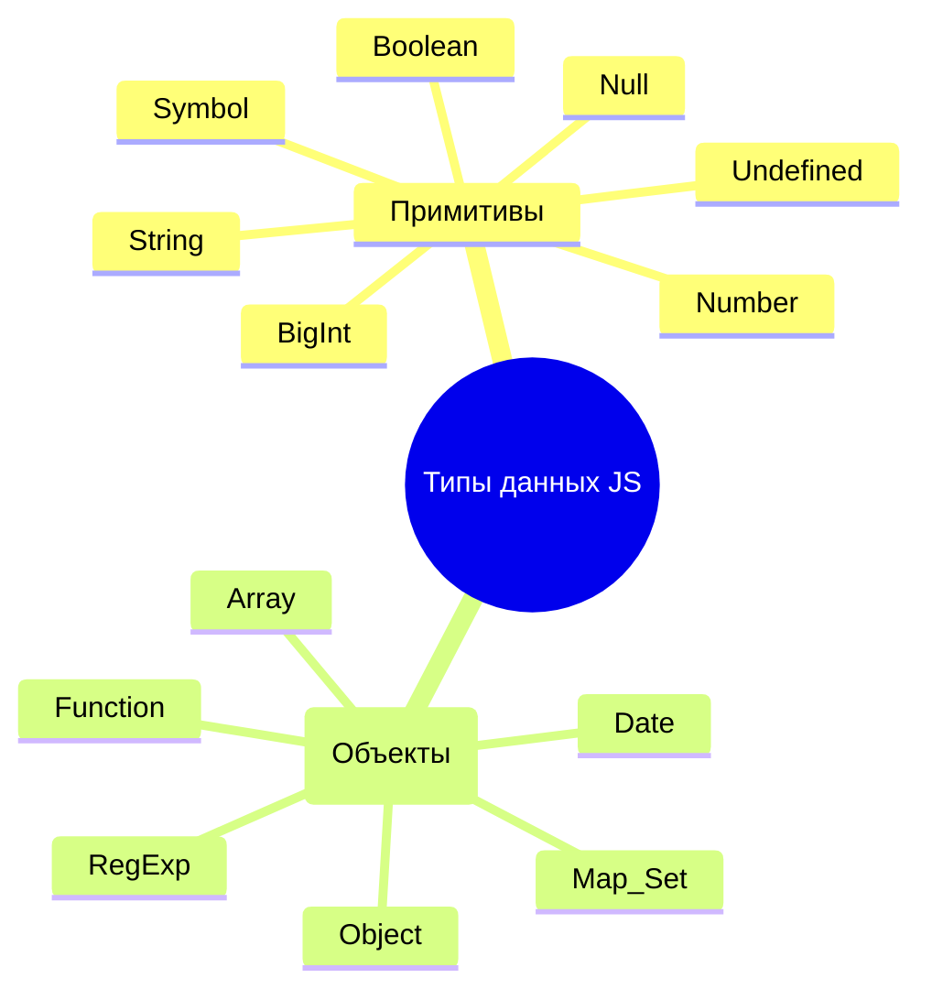

- ### [[Типы данных (Типы и значения)|Типы данных]]
- ### [[Ссылочные типы]]
- ### [[Frontend/JavaScript/Структура данных/Коллекции/Коллекции|Коллекции]]
- ### [[Преобразование типов (Типы данных)]]
- ### [[Бинарные данные (Типы данных)]]

---

## Иерархия типов данных в JavaScript

