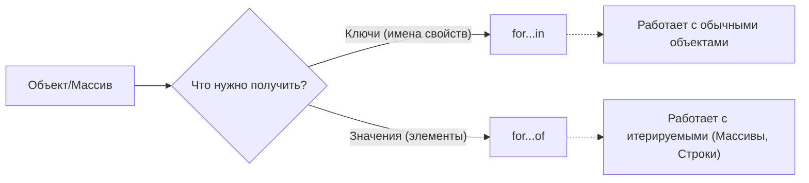

# Цикл for...in

`for...in` позволяет пройти в цикле по **перечисляемым свойствам (ключам)** объекта, в том числе по свойствам из его цепочки прототипов.

```javascript
const user = {
  name: "John",
  age: 30,
  isAdmin: true
};

for (let key in user) {
  console.log(`${key}: ${user[key]}`);
}
// Вывод:
// name: John
// age: 30
// isAdmin: true
```

## Особенности `for...in`

1. **Перечисляемые свойства**: Перечисляемые свойства – это те свойства, которые разработчик добавляет объекту (с флагом `enumerable: true`). Встроенные свойства, например `length` у массива или методы в `Object.prototype`, обычно не обходятся в цикле `for...in`.
2. **Прототипы**: Цикл перебирает не только собственные свойства объекта, но и свойства, унаследованные от прототипа. (Чтобы фильтровать их, используют `obj.hasOwnProperty(key)`).
3. **Порядок**: Порядок перебора свойств не гарантируется строго, хотя современные браузеры сначала выводят числовые ключи по возрастанию, а затем строковые в порядке добавления.

## `for...in` vs `for...of`

Частая путаница возникает между этими двумя циклами. Вот главное различие:



**Пример разницы на массиве:**

```javascript
let arr = ["Яблоко", "Апельсин", "Груша"];

// for...in возвращает ИНДЕКСЫ (ключи)
for (let key in arr) {
  console.log(key); // "0", "1", "2"
}

// for...of возвращает ЗНАЧЕНИЯ
for (let value of arr) {
  console.log(value); // "Яблоко", "Апельсин", "Груша"
}
```

> [!WARNING]
> Не рекомендуется использовать `for...in` для итерации по массивам, так как он может пройтись по лишним свойствам, добавленным в прототип `Array`, и работает медленнее, чем `for...of` или обычный `for`.

---

## Источник
- #### [mdn](https://developer.mozilla.org/ru/docs/Web/JavaScript/Reference/Statements/for...in)
