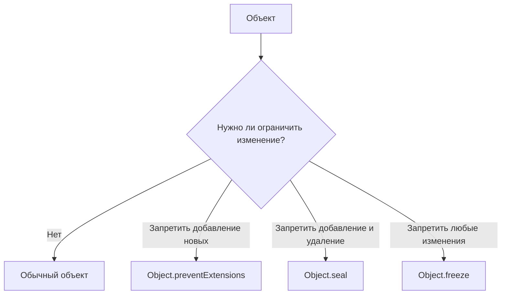

# Встроенные методы объектов

В JavaScript существует глобальный класс `Object`, который предоставляет множество полезных статических методов для работы с объектами.

## Перебор свойств

Вместо использования цикла `for...in` часто удобнее извлечь ключи или значения в виде массива и работать с ними (например, используя методы массивов `.map()`, `.filter()`).

### 1. `Object.keys(obj)`
Возвращает массив собственных перечисляемых **ключей** объекта.

```javascript
const user = { name: "Ivan", age: 30 };
console.log(Object.keys(user)); // ["name", "age"]
```

### 2. `Object.values(obj)`
Возвращает массив **значений** объекта.

```javascript
const user = { name: "Ivan", age: 30 };
console.log(Object.values(user)); // ["Ivan", 30]
```

### 3. `Object.entries(obj)`
Возвращает массив пар `[ключ, значение]`. Отлично подходит для деструктуризации в цикле `for...of`.

```javascript
const user = { name: "Ivan", age: 30 };

for (let [key, value] of Object.entries(user)) {
  console.log(`${key}: ${value}`);
}
// Вывод:
// name: Ivan
// age: 30
```

## Клонирование и слияние объектов

### `Object.assign(dest, [src1, src2...])`
Используется для копирования свойств из одного или нескольких объектов в целевой объект `dest`.

```javascript
const obj1 = { a: 1 };
const obj2 = { b: 2, c: 3 };

// Создаем новый объект и копируем туда свойства
const clone = Object.assign({}, obj1, obj2);
console.log(clone); // { a: 1, b: 2, c: 3 }
```

> [!NOTE]
> Сейчас вместо `Object.assign` чаще используют синтаксис **spread** (оператор расширения): `const clone = { ...obj1, ...obj2 };`

## Предотвращение изменений

JavaScript позволяет заморозить объект или запретить добавление новых свойств.



- **`Object.preventExtensions(obj)`**: Запрещает добавлять новые свойства.
- **`Object.seal(obj)`**: Запрещает добавлять и удалять свойства. Существующие свойства можно изменять.
- **`Object.freeze(obj)`**: Запрещает добавлять, удалять и изменять свойства. Объект становится полностью константным (только на один уровень вложенности, shallow freeze).
