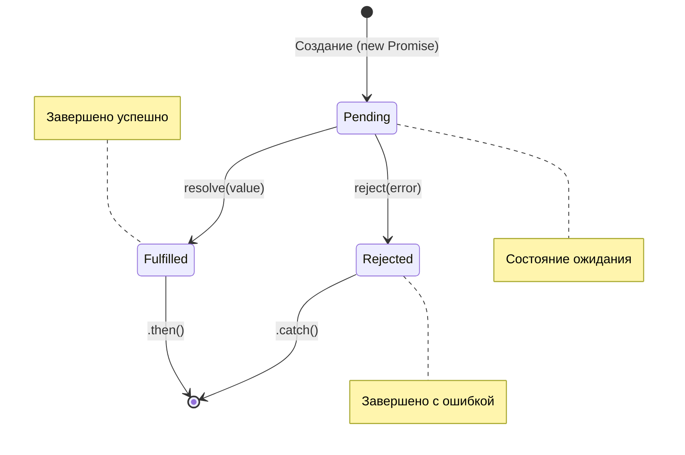

# Promise (Оглавление)

- ### [[Promise.all]]
- ### [[Promise.allSettled]]
- ### [[Promise.race]]
- ### [[Promise.any]]
- ### [[Promise.resolve и Promise.reject|Promise.resolve ~ reject]]

---

## Что такое Promise?

**Promise (Обещание)** — это специальный объект в JavaScript, который представляет собой результат успешного или неудачного завершения асинхронной операции.

### Основные состояния:
1. **Pending (ожидание)** — начальное состояние, операция еще не завершена.
2. **Fulfilled (исполнено успешно)** — операция завершена успешно, получен результат.
3. **Rejected (исполнено с ошибкой)** — операция завершена с ошибкой (например, сеть недоступна).

*Промис, который не находится в состоянии `pending`, называется **settled** (завершенным).*