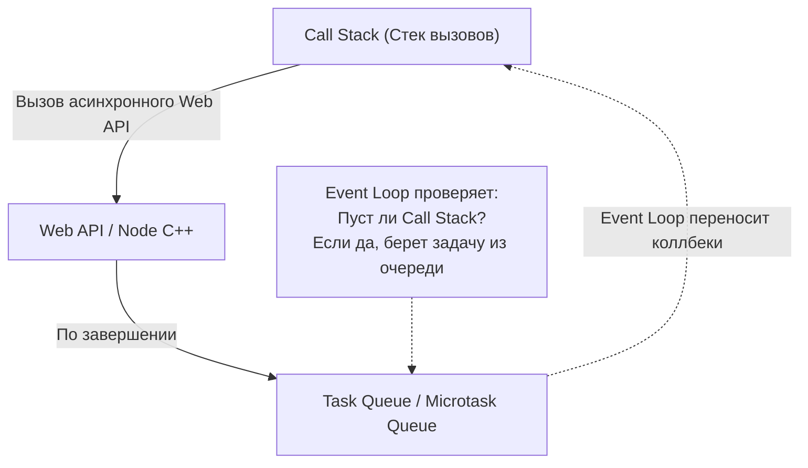

# Асинхронность (Оглавление)

- ### [[Promise]]
- ### [[async-await|async~await]]

---

## Визуализация асинхронности в JS (Event Loop)

JavaScript — однопоточный язык программирования. Чтобы не блокировать основной поток выполнения (например, при сетевых запросах или таймерах), он использует механизм **Event Loop (Цикл событий)**.

- **Microtasks** (Микрозадачи): `Promise.then`, `queueMicrotask`. Имеют наивысший приоритет.
- **Macrotasks** (Макрозадачи): `setTimeout`, `setInterval`, события DOM. Выполняются после очистки очереди микрозадач.