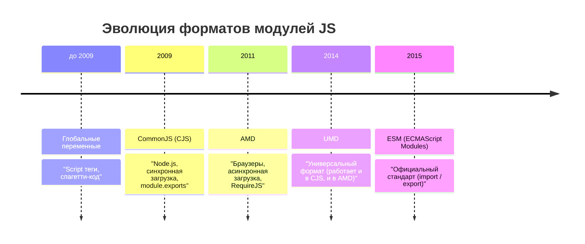

# Модули в JavaScript (Оглавление)

- ### [[ESM]]
- ### [[CommonJS|CJS]]
- ### [[ESM vs CommonJS]]
- ### [[AMD|AMD - Asynchronous Module Definition]]
- ### [[UMD|UMD - Universal Module Definition]]

---

## Краткий обзор эволюции модулей

Исторически в JavaScript не было встроенной поддержки модулей (разделения кода на файлы с импортом/экспортом). Поэтому сообщество создавало свои форматы, пока не появился официальный стандарт ESM.

> [!TIP]
> Сегодня новым стандартом де-факто является **ESM** (ECMAScript Modules). `CommonJS` все еще активно используется в старых Node.js проектах, а `AMD` и `UMD` считаются устаревшими (legacy).