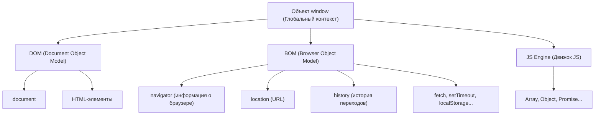

# Браузерное окружение (Оглавление)

- ### [[BOM]]
- ### [[DOM]]
- ### [[CSSOM]]
- ### [[CSS Typed OM]]

---

## Архитектура браузерного окружения

Когда JavaScript работает в браузере, он получает доступ к множеству дополнительных объектов и функций, которые предоставляет сама среда (браузер). Это называется **браузерным окружением (Web APIs)**.

> [!NOTE]
> `window` выполняет двойную роль:
> 1. Это глобальный объект для JavaScript в браузере (где лежат `setTimeout`, `Array`, и т.д.).
> 2. Это окно браузера (доступ к вкладке, её размерам, истории и т.д. — BOM).
