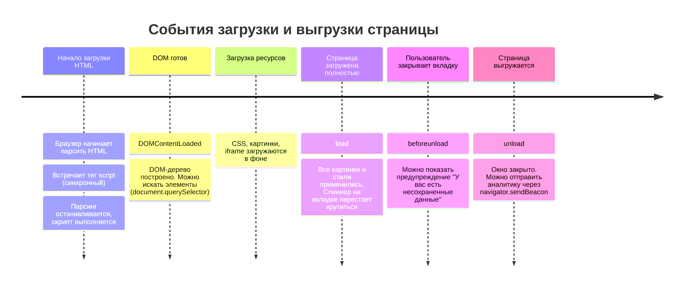

# Жизненный цикл страницы (Page Lifecycle)

Основные события загрузки, отображения и выгрузки документа в браузере.

## Ключевые события
1. `DOMContentLoaded` — DOM полностью построен, но внешние ресурсы (картинки, стили) могут быть еще не загружены.
2. `load` — документ и все внешние ресурсы полностью загружены.
3. `beforeunload` / `unload` — пользователь покидает страницу.
4. `visibilitychange` — изменение видимости вкладки ([[02. Браузерная платформа/02. События и жизненный цикл страницы/Page Visibility API|Page Visibility API]]).

---

## Визуализация жизненного цикла

### Разница между `DOMContentLoaded` и `load`

Частая ошибка новичков — ждать события `load`, чтобы просто повесить обработчики кликов. В 99% случаев для инициализации интерфейса достаточно `DOMContentLoaded`, так как ждать загрузки всех тяжелых картинок не нужно.
