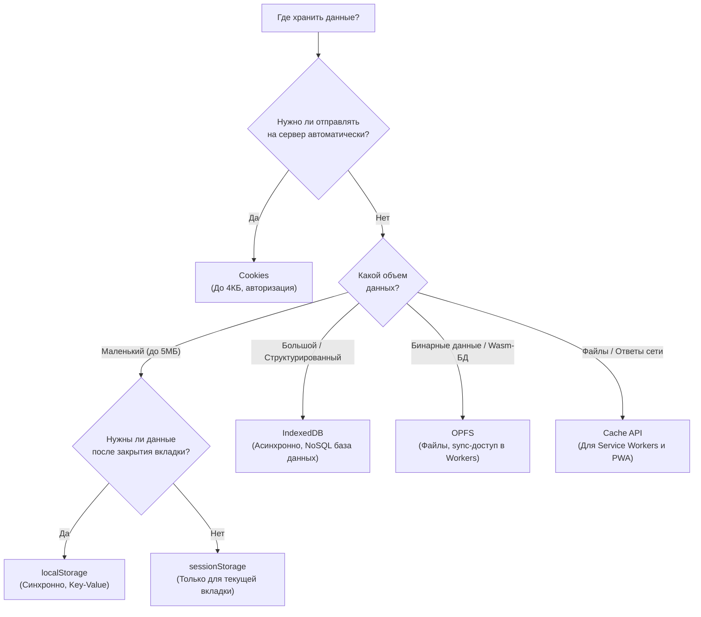

# Хранение данных в браузере (Оглавление)

- ### [[Сookie]]
- ### [[Web Storage]] (localStorage / sessionStorage)
- ### [[Indexed DB]]
- ### [[Origin Private File System (OPFS)]]

### 🔗 Несвязанные файлы (Unlinked Context)
- [[Cache Storage API]]
- [[Offline-first и CRDTs (Yjs, RxDB, WatermelonDB)]]
- [[Архитектура и стратегии клиентского хранения данных]]

---

## Сравнение механизмов хранения

Браузер предоставляет несколько способов хранения данных на клиенте. Выбор зависит от объема данных, требований к безопасности и необходимости отправлять данные на сервер с каждым запросом.

