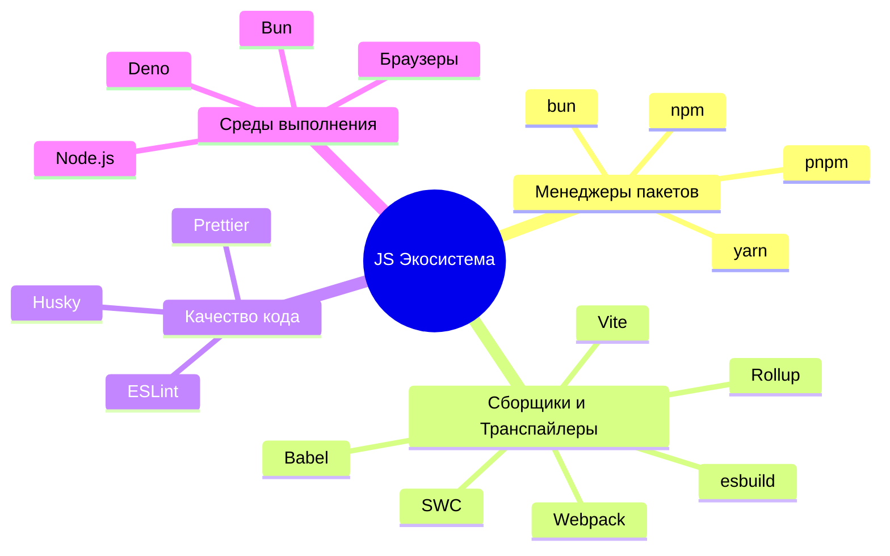

# Инженерные практики и инструменты (Оглавление)

- ### [[Сборщики модулей]]
- ### [[Средства загрузки модулей]]
- ### [[Средства компиляции и транспиляции]]
- ### [[Средства анализа и форматирования кода]]
- ### [[Пакетные менеджеры]]
- ### [[Редакторы]]

---

## Карта экосистемы JS-инструментов

Современная JavaScript разработка требует множества инструментов. Вот как они связаны между собой:

