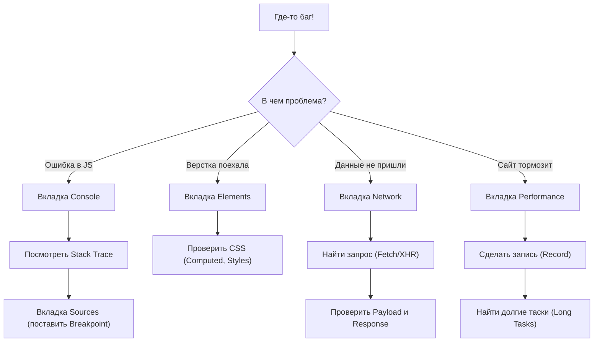

# Отладка в Chrome/Firefox DevTools

Инструменты разработчика для анализа, профилирования и отладки веб-приложений.

## Основные вкладки
- **Elements / Inspector:** Инспекция DOM и CSS.
- **Console:** Выполнение JS и логирование.
- **Sources / Debugger:** Точки останова (Breakpoints), Call Stack, Scope.
- **Network:** Сетевые запросы, тайминги, заголовки.
- **Performance:** Профилирование FPS, CPU и рендеринга.
- **Memory:** Снимки кучи (Heap Snapshots), поиск утечек памяти.

---

## Алгоритм поиска проблемы (Troubleshooting)

