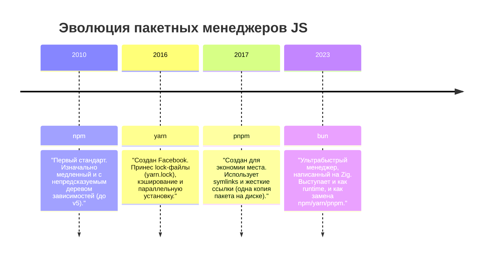

# Пакетные менеджеры (Оглавление)

- ### [[npm]]
- ### [[yarn]]
- ### [[pnpm]]
- ### [[bun]]

---

## Выбор пакетного менеджера

В мире JavaScript существует несколько популярных пакетных менеджеров. Все они решают одну задачу (установка и управление зависимостями из реестра `npm`), но делают это по-разному.

### Краткое сравнение:

- **npm**: Стандарт де-факто, поставляется вместе с Node.js. Надежный, но может быть медленнее конкурентов.
- **yarn**: Исторически быстрее npm, представил концепцию Workspaces (монорепозитории).
- **pnpm**: Идеален для экономии места на жестком диске. Очень строгий к зависимостям (нельзя импортировать то, чего нет напрямую в `package.json`).
- **bun**: Самый быстрый на данный момент, но все еще активно развивается.