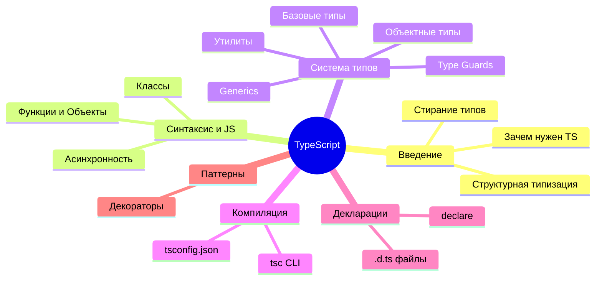

# Карта знаний TypeScript

Добро пожаловать в базу знаний по TypeScript! Здесь собраны все основные материалы для изучения языка.

## Архитектура знаний

## Основные разделы

- **[[01 Введение/TypeScript|01 Введение]]**: Базовые концепции, отличия от JS, почему TypeScript так популярен.
- **[[02 Синтаксис и базовый JavaScript/Переменные и области видимости|02 Синтаксис и базовый JS]]**: Фундамент JavaScript, на который ложатся типы.
- **[[03 Система типов/Система типов|03 Система типов]]**: Самый обширный раздел. От примитивов до продвинутых дженериков и утилитарных типов.
- **[[05 Компилятор и конфигурация/tsconfig json|05 Компилятор]]**: Как настраивать `tsconfig.json` и управлять поведением `tsc`.
- **[[06 Декларации и типы окружения/Декларационные файлы d ts|06 Декларации]]**: Интеграция с внешним миром, типы окружения.
- **[[07 Паттерны и продвинутые концепции/Декораторы|07 Паттерны]]**: Декораторы, архитектурные паттерны типизации.

## Полезные ссылки

- [Официальная документация TypeScript](https://www.typescriptlang.org/docs/)
- [DefinitelyTyped](https://github.com/DefinitelyTyped/DefinitelyTyped)
- [TypeScript глубокое погружение (ru)](https://igorfonin.gitbook.io/typescript-book-ru/)
- [TypeScript Challenges](https://github.com/type-challenges/type-challenges)
