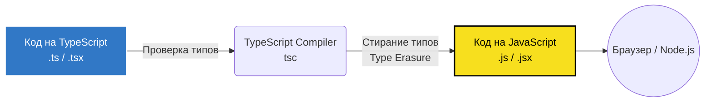

# TypeScript: Общий обзор

> [!info] 
> **TypeScript** — это строго типизированный язык программирования, который строится на базе JavaScript. Он добавляет статическую типизацию, позволяя находить ошибки на этапе компиляции, а не во время выполнения (рантайме).

## Как работает TypeScript?

TypeScript не выполняется в браузере или Node.js напрямую (без специальных лоадеров). Он должен быть **скомпилирован (транспилирован)** в обычный JavaScript. Этот процесс также включает "стирание типов" (Type Erasure) — после компиляции никаких интерфейсов и аннотаций типов в итоговом `.js` файле не остается.



## Главные преимущества

1. **Раннее обнаружение ошибок**: Многие опечатки, несовпадения типов и доступы к несуществующим свойствам отлавливаются прямо в редакторе кода.
2. **Продвинутый автокомплит**: Благодаря типам, IDE (например, VS Code) предоставляет мощные подсказки, рефакторинг и навигацию по коду.
3. **Самодокументируемый код**: Интерфейсы и типы служат отличной документацией для структур данных и контрактов функций.

## Ключевые концепции для старта

- [[01 Введение/Структурная типизация|Структурная типизация]]: В TS типы совместимы, если их структура совпадает (duck typing).
- [[05 Компилятор и конфигурация/tsconfig json|tsconfig.json]]: Конфигурационный файл, управляющий строгостью и правилами компиляции.
- [[06 Декларации и типы окружения/Декларационные файлы d ts|Файлы деклараций (.d.ts)]]: Способ описать типы для библиотек, написанных на чистом JavaScript.
- [[03 Система типов/01 Базовые типы/any|any и unknown]]: Спасательные круги, когда тип неизвестен (и почему `unknown` безопаснее).

## Пример

```typescript
// Определение интерфейса
interface User {
  id: number;
  name: string;
  isActive?: boolean; // Опциональное поле
}

// Функция с типизацией аргументов и возвращаемого значения
function greetUser(user: User): string {
  return `Привет, ${user.name}! Ваш ID: ${user.id}`;
}

const alice: User = { id: 1, name: "Alice" };
console.log(greetUser(alice));
```