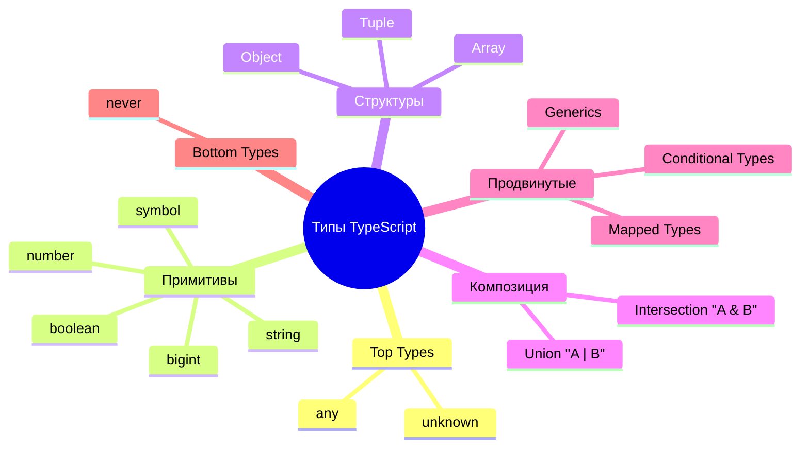

# Система типов TypeScript

> [!info]
> **Система типов TypeScript** — это мощный инструмент статического анализа, который позволяет описывать формы данных, контракты функций и сложные взаимосвязи между сущностями в коде.

## Иерархия и структура

Система типов в TS не плоская, она представляет собой графовую структуру (иерархию), где `unknown` находится на самом верху (Top Type), а `never` — в самом низу (Bottom Type).

## Основные категории

Эта директория содержит исчерпывающую информацию по всем аспектам системы типов:

- **[[03 Система типов/01 Базовые типы/Базовые типы|01 Базовые типы]]**: Примитивы, `any`, `unknown`, `never`, `void`.
- **[[03 Система типов/02 Литералы и неизменяемость/Литеральные типы|02 Литералы и неизменяемость]]**: Узкие типы (например, конкретная строка `"hello"`), ключевое слово `as const` и `readonly`.
- **[[03 Система типов/03 Объектные типы/Объектные типы|03 Объектные типы]]**: Интерфейсы (`interface`) и псевдонимы (`type`), индексы и подписи методов.
- **[[03 Система типов/04 Коллекции/Массивы|04 Коллекции]]**: Массивы и Кортежи (Tuples).
- **[[03 Система типов/05 Композиция типов/Union Types|05 Композиция типов]]**: Объединения (`|`) и пересечения (`&`), Exhaustiveness Checking.
- **[[03 Система типов/06 Enums/Enums|06 Enums]]**: Перечисления (строковые, числовые, константные).
- **[[03 Система типов/07 Assertions и проверки/Type Assertions|07 Assertions и проверки]]**: Приведение типов через `as`, Non-Null Assertion (`!`).
- **[[03 Система типов/08 Type Guards и Narrowing/Type Guards|08 Type Guards и Narrowing]]**: Сужение типов через `typeof`, `instanceof`, предикаты типов (`is`).
- **[[03 Система типов/09 Операторы типов/Операторы типов|09 Операторы типов]]**: `keyof`, `typeof`, Conditional Types, Mapped Types, Template Literals.
- **[[03 Система типов/10 Generics/Generics|10 Generics]]**: Обобщенное программирование, гибкие переиспользуемые типы.
- **[[03 Система типов/11 Утилитарные типы/Утилитарные типы|11 Утилитарные типы]]**: Встроенные хелперы вроде `Partial`, `Pick`, `Omit`, `Record`.

## Ключевая концепция: Структурная типизация

В отличие от языков вроде Java или C# (где типизация номинальная), TypeScript использует **структурную типизацию**. Это означает, что два типа считаются совместимыми, если их внутреннее строение (набор свойств) совпадает, даже если они не наследуются друг от друга явно.
