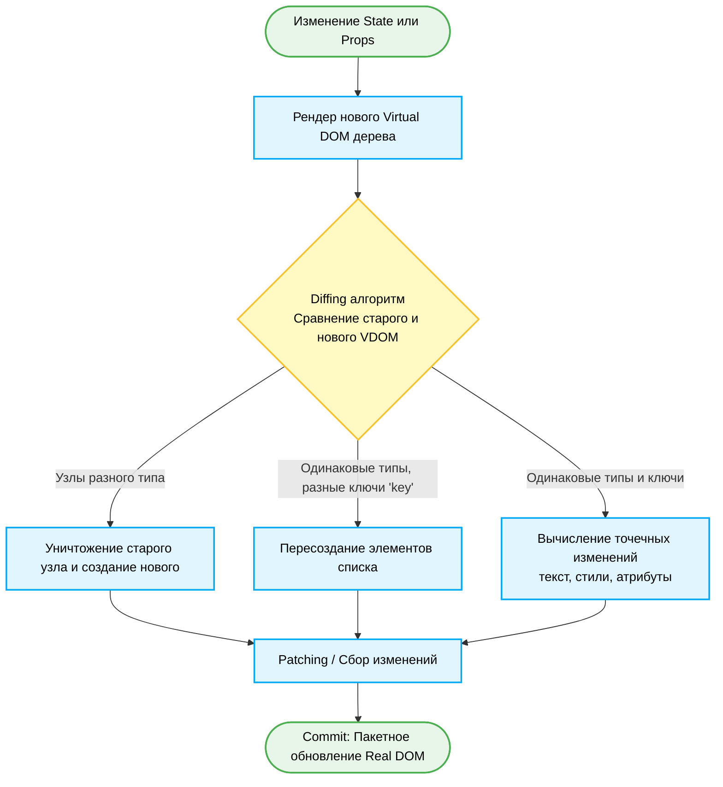
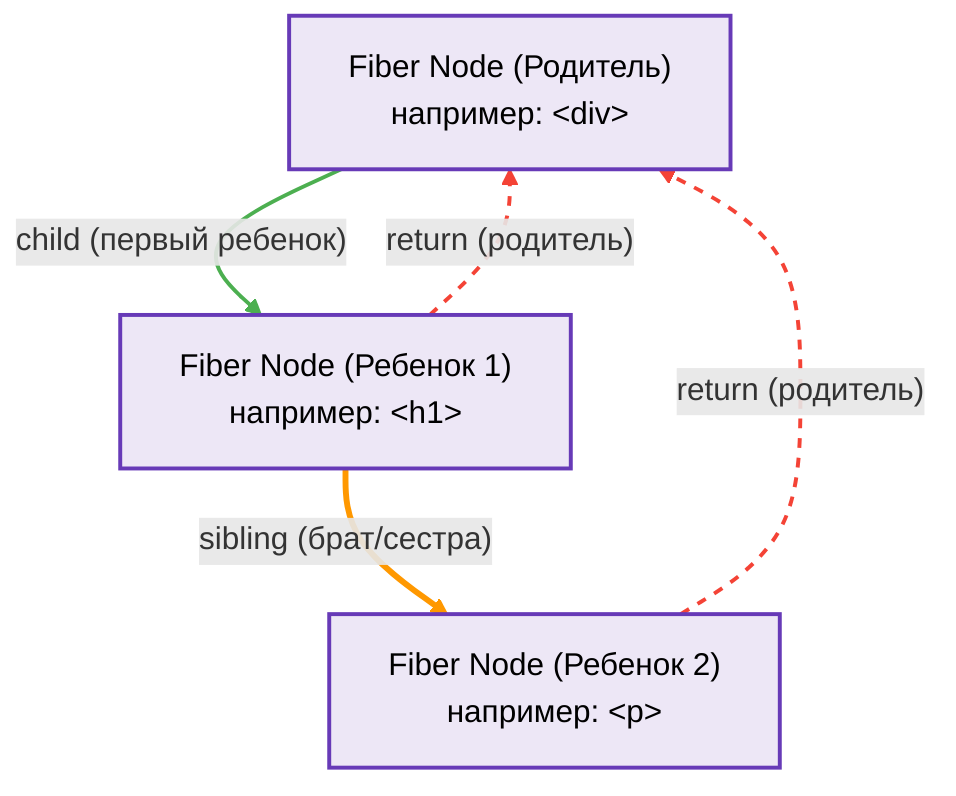
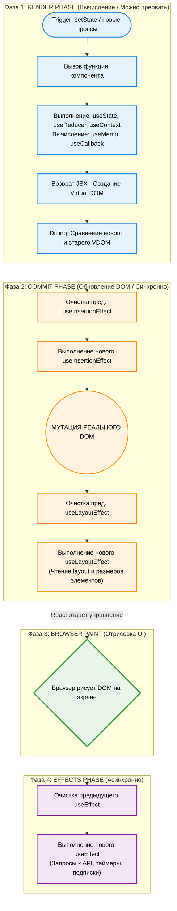

# Virtual DOM & Fiber Architecture

## 1. Virtual DOM (VDOM)
**Virtual DOM** — это концепция программирования, в которой идеальное (или «виртуальное») представление UI хранится в памяти и синхронизируется с реальным DOM с помощью библиотеки, такой как ReactDOM. Этот процесс называется **reconciliation (согласование)**.

### Проблема реального DOM
Прямое манипулирование реальным DOM — это дорогая операция. Когда вы изменяете элемент в DOM, браузеру приходится пересчитывать CSS, делать перекомпоновку (Reflow) и перерисовку (Repaint). Если изменений много, интерфейс начинает "тормозить".

### Как работает Virtual DOM
React создает легковесную копию реального DOM в виде JavaScript-объектов. 
1. **Render**: При изменении состояния или пропсов React создает новое виртуальное дерево.
2. **Diffing**: React сравнивает новое виртуальное дерево со старым (предыдущим).
3. **Patching (Commit)**: React вычисляет минимальный набор изменений и применяет их к реальному DOM разом (batching).

### Алгоритм Diffing (эвристики React)
Полное сравнение двух деревьев имеет сложность O(n³). React использует эвристики для снижения сложности до O(n):
1. **Два элемента с разными типами создают разные деревья.** Если `<div>` меняется на `<span>`, React уничтожит старый узел (и его детей) и создаст новый.
2. **Идентификация дочерних элементов через ключи (`key`).** 

> **Важный пример (Edge case): Отсутствие или неправильный `key`**
Если рендерить список элементов без уникальных ключей или использовать индексы массива в качестве `key`, при удалении элемента из начала списка React подумает, что изменились все элементы.
```jsx
// ❌ ПЛОХО: Использование индекса массива
{items.map((item, index) => <li key={index}>{item.text}</li>)}

// ✅ ХОРОШО: Уникальный ID
{items.map(item => <li key={item.id}>{item.text}</li>)}
```
*Необычная ситуация:* Если использовать `Math.random()` в качестве `key`, React будет уничтожать и пересоздавать элементы при каждом рендере, что убьет производительность и сбросит фокус полей ввода.

---

## 2. React Fiber
**Fiber** — это архитектура ядра React (внедрена в React 16), представляющая собой новый механизм согласования (reconciler).

### Зачем нужен Fiber?
До Fiber React использовал рекурсивный подход (Stack Reconciler). Если обновление начиналось, его нельзя было прервать до полного завершения. Если дерево компонентов было огромным, основной поток браузера блокировался — анимации лагали, инпуты подвисали.

**Главные цели Fiber:**
1. **Прерываемость (Pause/Resume)**: Способность приостановить работу над обновлением, чтобы браузер мог отрисовать кадр или обработать пользовательский ввод.
2. **Приоритизация**: Назначение разных приоритетов разным типам обновлений (анимации важнее, чем получение данных по сети).
3. **Concurrency (Конкурентность)**: Работа над несколькими обновлениями одновременно (основа для `useTransition` и `Suspense`).

### Как устроен Fiber технически?
Fiber — это просто JavaScript-объект (единица работы), который содержит информацию о компоненте, его входах и выходах.
Дерево Fiber представляет собой **связный список**, а не просто дерево детей. У каждого узла есть ссылки на:
- `child` (первый ребенок)
- `sibling` (следующий брат/сестра)
- `return` (родитель)

Такая структура позволяет React ставить обход дерева на паузу и возвращаться к нему позже.

### Double Buffering (Двойная буферизация)
React хранит в памяти два дерева Fiber:
1. **Current Tree**: Текущее дерево, которое уже отображено на экране.
2. **Work-In-Progress Tree (WIP)**: Дерево, которое строится в фоновом режиме на основе новых изменений.

Когда WIP-дерево полностью готово, React просто меняет указатель (pointer) текущего дерева на WIP-дерево. Этот процесс происходит мгновенно в фазе **Commit**.

### Фазы работы Fiber:
1. **Render Phase (Фаза рендера)**: Создание WIP-дерева и вычисление изменений. Эта фаза является **асинхронной** и может прерываться браузером.
2. **Commit Phase (Фаза фиксации)**: Применение вычисленных изменений к реальному DOM. Эта фаза является **синхронной** и не может быть прервана. Здесь же вызываются `useEffect` и `useLayoutEffect`.


## 1. Общий процесс Virtual DOM (Reconciliation)
Эта диаграмма показывает высокоуровневый процесс того, как React реагирует на изменения и обновляет реальный DOM.



---

## 2. Структура дерева React Fiber (Связный список)
Вместо обычного дерева с массивом детей (как было до React 16), Fiber использует структуру **связного списка**. Это позволяет ставить обход на паузу. На диаграмме показаны связи `child`, `sibling` и `return`.



---

## 3. Фазы работы Fiber и Двойная Буферизация (Double Buffering)
Эта диаграмма иллюстрирует, как Fiber разделяет работу на две фазы (асинхронную и синхронную), а также как происходит мгновенная подмена деревьев (Current -> WIP).



