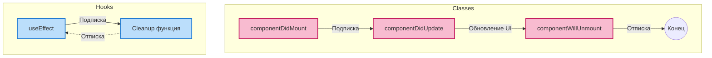
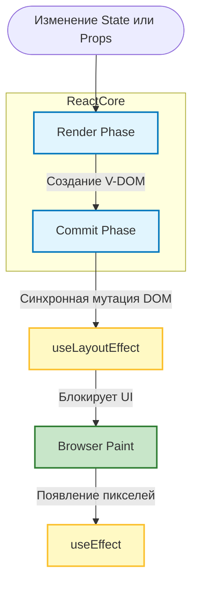
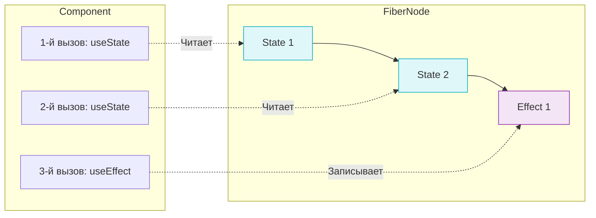
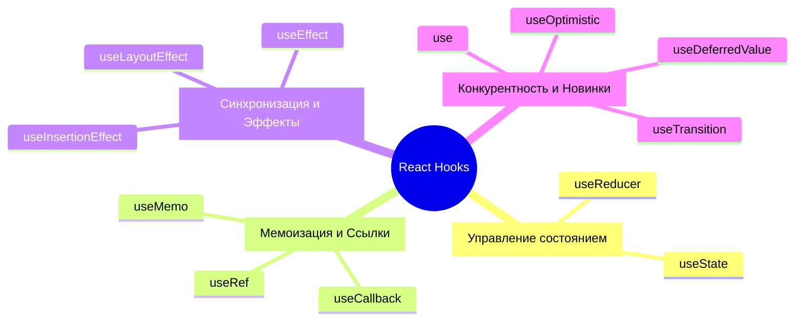

Исторически компоненты React (на базе классов) мыслились в терминах жизненного цикла (Lifecycle). С появлением хуков эта ментальная модель изменилась на парадигму **синхронизации**.

## 1. Старая ментальная модель: Lifecycle (Классы)
В классовых компонентах жизненный цикл был жестко привязан к этапам существования компонента в DOM:
1. **Mounting (Монтирование):** `constructor`, `render`, `componentDidMount`.
2. **Updating (Обновление):** `render`, `componentDidUpdate`.
3. **Unmounting (Размонтирование):** `componentWillUnmount`.

Разработчики были вынуждены размазывать логику по разным методам. Например, подписка на сокеты происходила в `componentDidMount`, а отписка — в `componentWillUnmount`. Логика одной сущности (сокетов) была разделена.

## 2. Новая ментальная модель: Синхронизация (Хуки)
В функциональных компонентах нет концепции "жизненного цикла" в том виде, в каком она была в классах. Вместо этого вы должны думать так: 
**Эффекты (`useEffect`) синхронизируют React-компонент с внешней системой (сеть, DOM, Web API), реагируя на изменения состояния.**

Хуки позволяют группировать логику *по назначению*, а не *по времени выполнения*.

*Визуальное сравнение подходов:*


```jsx
useEffect(() => {
  // Выполняется после рендера (аналог Mount + Update)
  const connection = connectToSocket(roomId); 

  return () => {
    // Cleanup-функция: Выполняется перед следующим эффектом или при размонтировании
    connection.disconnect(); 
  };
}, [roomId]); // Зависимость: эффект пересинхронизируется ТОЛЬКО если изменится roomId
```

### 3. Жизненный цикл рендера и эффектов

Порядок выполнения под капотом React при обновлении состояния строго регламентирован.

*Вот как выглядит полный цикл от изменения стейта до появления пикселей на экране:*


**1. Render Phase (Этап рендера)**
*   React вызывает функцию компонента.
*   Создает новый Virtual DOM.
*   Сравнивает новый V-DOM с предыдущим — этот процесс называется **Reconciliation (сверка)**. React вычисляет минимальный набор изменений.
*   *Важно:* Этот этап чистый (pure) и может быть прерван или перезапущен (в React 18+ с Concurrent Mode).

**2. Commit Phase (Этап фиксации)**
*   React синхронно применяет вычисленные изменения к реальному DOM.
*   На этом же этапе обновляются все `ref` (значения `ref.current` становятся актуальными).

**3. `useLayoutEffect` (Синхронный эффект)**
*   Запускается **синхронно** сразу после обновления DOM, но **ДО** того, как браузер отрисует экран (Paint).
*   **Блокирует отрисовку.**
*   *Когда использовать:* Только когда нужно измерить DOM-элемент (например, `getBoundingClientRect()`) и сразу же изменить состояние на основе этих размеров. Это гарантирует, что пользователь не увидит "прыжок" или мерцание (flickering) верстки.

**4. Browser Paint (Отрисовка браузером)**
*   Браузер пересчитывает стили и рисует пиксели на экране. Пользователь видит обновленный интерфейс.

**5. `useEffect` (Отложенный эффект)**
*   Запускается **после отрисовки (Paint)**, не блокируя основной поток браузера.
*   *Уточнение:* Лучше говорить не «асинхронно» (чтобы интервьюер не докопался до Event Loop или `async/await`), а **«отложенно, не блокируя UI» (deferred)**. 
*   *Когда использовать:* Для 99% побочных эффектов (fetch-запросы, подписки, аналитика, таймеры).

Если вы упомянете эти два пункта сами, интервьюер будет в восторге:

1. **Порядок очистки (Cleanups):** При повторном рендере (re-render) React сначала запускает функцию очистки (return в `useEffect`/`useLayoutEffect`) от **предыдущего** рендера, и только потом запускает сам эффект для **нового** рендера.
2. **SSR (Server-Side Rendering):** Ни `useEffect`, ни `useLayoutEffect` **не выполняются на сервере**. Они работают только в браузере.


## 4. Правила Хуков (Rules of Hooks)

Чтобы механизмы React работали корректно (под капотом хуки реализованы как связный список массивов внутри Fiber-узла), необходимо строго соблюдать два правила.

*Схема работы хуков под капотом (почему порядок важен):*

*Если один из хуков окажется в условии и не сработает, React "сдвинет" указатель, и `useEffect` получит данные от `useState`, что сломает приложение.*

### Правило 1: Вызывать хуки только на верхнем уровне
❌ **Нельзя** вызывать хуки внутри циклов, условий (`if/else`) или вложенных функций.

```jsx
// ❌ ПЛОХО: Из-за условия порядок вызова хуков может измениться
if (isReady) {
  useEffect(() => { ... });
}

// ✅ ХОРОШО: Эффект всегда на одном и том же месте, условие внутри
useEffect(() => {
  if (!isReady) return;
  ...
}, [isReady]);
```
**Почему это важно?** React полагается на *порядок вызова* хуков, чтобы сопоставить конкретное состояние с конкретным `useState`. Если порядок собьется, стейт перемешается и приложение сломается.

### Правило 2: Вызывать хуки только из функций React
✅ Хуки можно вызывать только в **React Компонентах** или в **Пользовательских (Custom) хуках** (функциях, начинающихся с `use...`). Обычные JS-функции не могут использовать хуки.

---

## 5. Введение в современные хуки (2026)

В процессе подготовки мы разберем эти хуки детальнее, но вот краткая карта:



**Управление состоянием:**
- `useState`: Локальный стейт.
- `useReducer`: Сложный стейт, зависящий от предыдущего (как Redux).

**Управление ссылками и мемоизация:**
- `useRef`: Ссылка на DOM-узел или мутабельное хранилище, **не вызывающее ре-рендер**.
- `useMemo`: Кеширование результатов тяжелых вычислений.
- `useCallback`: Кеширование самих функций.

**Конкурентность и новые фичи:**
- `useTransition`: Позволяет пометить обновление состояния как "неприоритетное" (чтобы интерфейс не блокировался).
- `useOptimistic`: (Новинка) Для оптимистичных обновлений UI при серверных мутациях.
- `use`: (Новинка) Чтение промисов (Promise) или Context прямо внутри условия или компонента.
