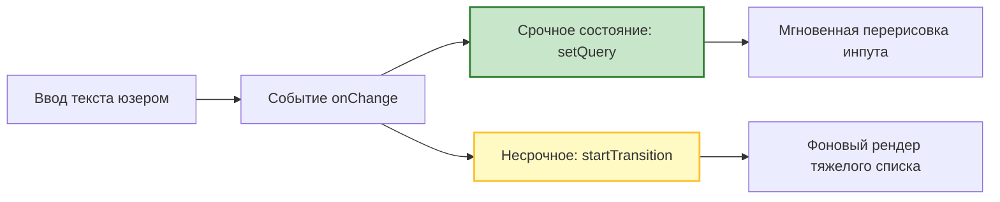
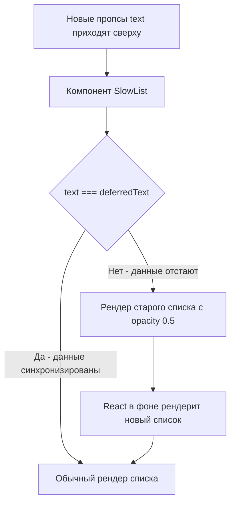
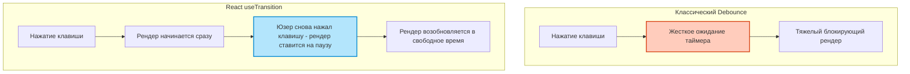

Эти хуки появились в React 18 в рамках **Concurrent React (Конкурентного режима)**. Они решают проблему блокировки интерфейса (когда тяжелые вычисления или долгий рендер "замораживают" анимации и ввод текста).

Идея: разделить обновления состояния на **срочные (Urgent)** и **несрочные (Transitions)**.

## 1. useTransition
Позволяет пометить обновление состояния как несрочное (переходное).
Возвращает кортеж `[isPending, startTransition]`.

**Кейс:** Представьте строку поиска, которая фильтрует огромный список из 10 000 элементов. Без конкурентности каждое нажатие клавиши будет вызывать тяжелый рендер списка, и ввод текста будет безбожно лагать.

*Как работает разделение приоритетов при вводе текста:*


```jsx
import { useState, useTransition } from 'react';

function SearchPage() {
  const [query, setQuery] = useState(''); // Срочное состояние (то, что в инпуте)
  const [filterText, setFilterText] = useState(''); // Несрочное состояние (для списка)
  
  const [isPending, startTransition] = useTransition();

  const handleChange = (e) => {
    // 1. Срочное обновление. Пользователь мгновенно увидит букву в инпуте.
    setQuery(e.target.value); 

    // 2. Несрочное обновление. React отрисует список "в фоновом режиме", 
    // не блокируя главный поток.
    startTransition(() => {
      setFilterText(e.target.value);
    });
  };

  return (
    <div>
      <input value={query} onChange={handleChange} />
      {/* Пока идет фоновый рендер списка, isPending будет true. Можно показать спиннер или заблюрить старый список */}
      {isPending && <span>Обновление списка...</span>}
      <SlowList text={filterText} /> 
    </div>
  );
}
```

## 2. useDeferredValue
Делает то же самое, что и `useTransition`, но применяется **не к функции обновления состояния (сеттеру), а к самим данным (пропсам)**.

Идеально подходит для случаев, когда вы получаете данные "сверху" (через пропсы) и не контролируете вызов `setState`.

*Механика работы useDeferredValue под капотом:*


```jsx
import { useDeferredValue, memo } from 'react';

function SlowList({ text }) {
  // deferredText будет "отставать" от text. 
  // React сначала отрендерит легкие части дерева с новым text,
  // а потом в фоновом режиме отрендерит этот тяжелый компонент с deferredText.
  const deferredText = useDeferredValue(text);
  
  // Можно определить, устарели ли данные на экране
  const isStale = text !== deferredText;

  return (
    <ul style={{ opacity: isStale ? 0.5 : 1 }}>
      {/* Рендеринг 10000 элементов на основе deferredText */}
    </ul>
  );
}
```

## 3. Важное отличие (Edge Case) от Debounce / Throttle
Частый вопрос на собеседованиях: *"Зачем useTransition, если есть старый добрый lodash.debounce?"*

*Разница подходов (искусственная задержка против умного планирования):*


- **Debounce:** Искусственно ждет фиксированное время (например, 300мс). Если компьютер пользователя мощный, он все равно будет ждать 300мс.
- **useTransition:** Вообще **НЕ ждет**. Он начинает фоновый рендер *сразу же*. Если устройство мощное, список обновится мгновенно. Если слабое — React будет рендерить список кусками (Fiber architecture), прерываясь на обработку ввода пользователя. `useTransition` динамически адаптируется под мощность устройства пользователя!
