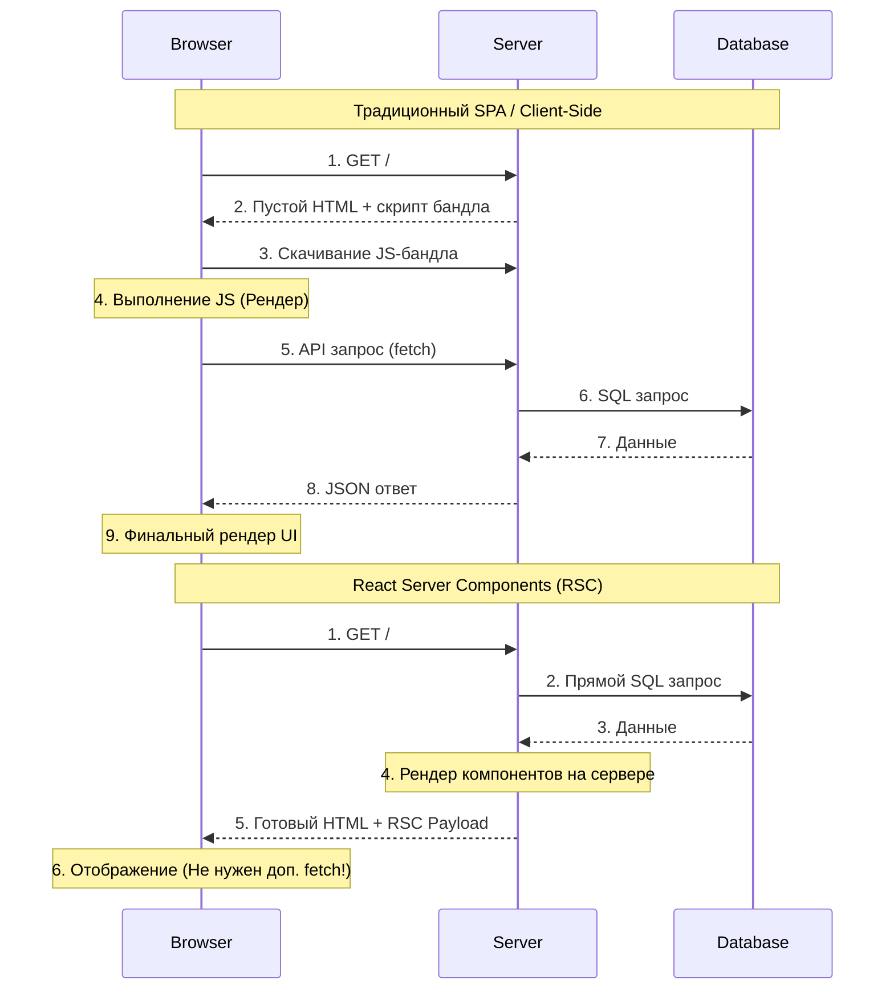
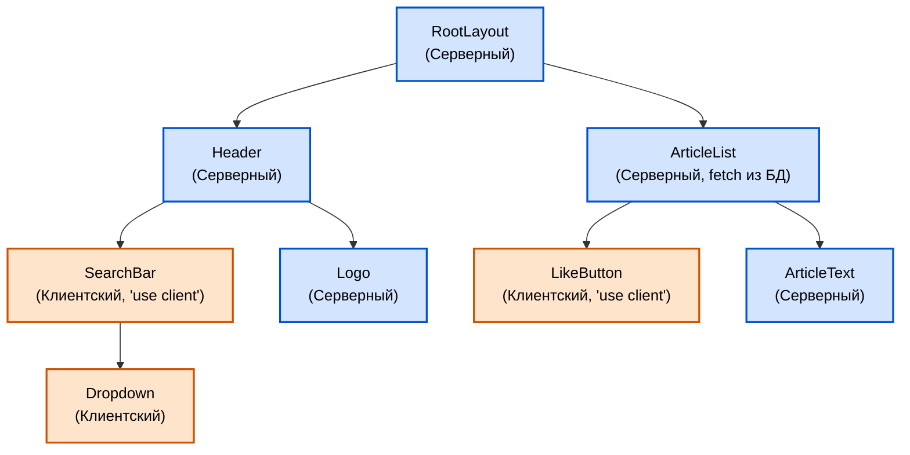

React Server Components (RSC) — это революционное изменение архитектуры React, представленное полноценно в React 18 и ставшее стандартом де-факто в современных мета-фреймворках (например, Next.js App Router) к 2026 году.

## 1. Зачем понадобились Server Components?
До RSC весь код компонентов (логика, импорты библиотек, форматирование дат) должен был скачиваться, парситься и выполняться в браузере пользователя. Это приводило к огромным JavaScript-бандлам и медленным телефонам.

**Ключевые преимущества RSC:**
1. **Zero Bundle Size (Нулевой размер бандла)**: Код серверных компонентов **вообще не отправляется в браузер**. Отправляется только готовый HTML и специальный JSON-формат (RSC Payload). Вы можете импортировать тяжелую библиотеку (например, `marked` для парсинга Markdown), и она не утяжелит клиентское приложение ни на байт!
2. **Прямой доступ к Backend**: Вы можете напрямую писать SQL-запросы к базе данных или обращаться к файловой системе прямо внутри компонента.
3. **Безопасность**: Ключи API и бизнес-логика навсегда остаются на сервере.

## 2. RSC vs SSR (В чем разница?)
Это один из самых частых вопросов на собеседованиях! Многие путают Server-Side Rendering (SSR) и Server Components.

- **SSR (Server-Side Rendering)**: Это техника **отображения**. Сервер берет ваши обычные клиентские компоненты, прогоняет их один раз, генерирует начальный HTML и отдает браузеру. Но потом браузер все равно должен скачать **весь код этих компонентов**, чтобы провести "Гидратацию" (Hydration) — привязать обработчики событий (`onClick`, `useEffect`).
- **RSC (React Server Components)**: Это новая **архитектура**. Серверный компонент выполняется ТОЛЬКО на сервере. Его код никогда не попадает в бандл. Гидратация для него не нужна.

**Резюме:** RSC дополняют SSR, а не заменяют его. Серверные компоненты рендерятся в статику, а клиентские компоненты проходят через классический SSR + Гидратацию.

## 3. Границы: `"use client"` и `"use server"`
Важно понимать значение директив:

### `"use client"`
Обозначает границу перехода от Сервера к Клиенту. Все компоненты в файле с этой директивой (и все их импорты) попадают в браузерный бандл.
**Ограничения:** Внутри клиентского компонента нельзя импортировать модули Node.js (`fs`, `child_process`).

### `"use server"` 
**⚠️ Распространенное заблуждение (Edge Case):** 
Директива `"use server"` **НЕ делает** компонент серверным! По умолчанию все компоненты и так серверные. 
Директива `"use server"` используется ТОЛЬКО для создания **Server Actions** (серверных функций, которые можно вызывать с клиента). Писать `"use server"` в начале файла с компонентом — семантическая ошибка.

## 4. Как RSC передаются в браузер (RSC Payload)
Когда серверный компонент рендерится, React превращает его не просто в HTML, а в специальный формат — **RSC Payload** (своего рода виртуальный DOM в виде JSON строки), где описаны узлы дерева.

Если в этом дереве встречается Клиентский компонент (Client Component), сервер вставляет туда "дырку" со ссылкой на JS-файл бандла. На клиенте React берет RSC Payload, подгружает нужные JS-куски и бесшовно "сшивает" серверные и клиентские компоненты вместе.
