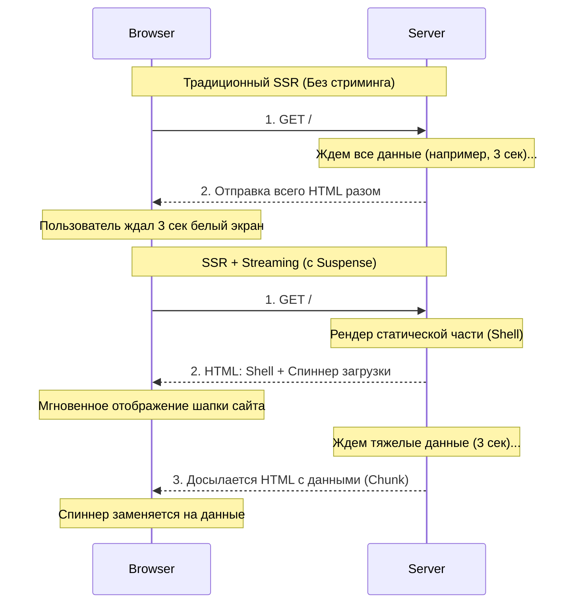

Исторически SSR (Server-Side Rendering) имел одну большую проблему — **правило "Все или ничего"**. 
Сервер должен был дождаться загрузки **всех** данных, чтобы сгенерировать HTML и отправить его клиенту. Если у вас на странице есть тяжелый график, который грузится 3 секунды, весь сайт (включая хедер и навигацию) будет висеть "белым экраном" эти 3 секунды.

**Streaming (Стриминг / Потоковая передача)** в React решает эту проблему.

## 1. Что такое Streaming?
Стриминг позволяет серверу отправлять HTML кусками (chunks) по мере их готовности.



- Сначала мгновенно отправляется статичная часть страницы (shell): хедер, сайдбар, футер.
- Пользователь сразу видит интерфейс и может нажимать на ссылки (если они клиентские).
- На месте тяжелых блоков (графика) изначально отображается спиннер загрузки.
- Как только сервер догружает данные для графика, он "досылает" новый кусок HTML в тот же открытый поток и автоматически заменяет спиннер на готовый контент с помощью маленького скрипта.

## 2. Роль `<Suspense>`
Чтобы React понял, как разделить страницу на потоки, используется компонент-граница `<Suspense>`.

Он принимает пропс `fallback` (то, что будет показано, пока идет ожидание).

```tsx
import { Suspense } from 'react';
import Header from './Header';
import SlowGraphComponent from './SlowGraphComponent'; // Делает долгий запрос к БД

export default function Dashboard() {
  return (
    <div>
      {/* Header отрендерится и отправится клиенту МГНОВЕННО */}
      <Header />
      
      <main>
        {/* React видит Suspense и понимает: 
            "Ага, этот блок медленный. Отправлю пока fallback (Loading...), 
             а сам продолжу ждать ответа в фоне". */}
        <Suspense fallback={<p>Загрузка аналитики...</p>}>
          <SlowGraphComponent />
        </Suspense>
      </main>
    </div>
  );
}
```

## 3. Интеграция с мета-фреймворками (Next.js)
В Next.js App Router паттерн Streaming возведен в абсолют благодаря специальным файлам:
- `loading.tsx`: Создает автоматическую границу `<Suspense>` вокруг файла `page.tsx`. Пока данные для страницы грузятся, мгновенно показывается содержимое `loading.tsx`.

## 4. Edge Cases: SEO и Streaming
Частый вопрос на собеседованиях: *"Если данные досылаются асинхронно, не навредит ли это SEO? Поисковый бот ведь получит пустую страницу со спиннерами?"*

**Ответ: Нет.**
Механизм стриминга очень умный. Когда запрос делает браузер (пользователь), React включает стриминг, чтобы улучшить UX (пользовательский опыт).
Когда запрос делает **Поисковый робот (Crawler)** (определяется по User-Agent, например `Googlebot`), React в большинстве фреймворков (типа Next.js) **отключает стриминг** и ждет полного разрешения всех Suspense-границ. Бот получает полностью готовый, собранный HTML со всеми данными.

### Streaming и Client Components
Важно понимать: компонент `<Suspense>` может оборачивать как асинхронные Серверные Компоненты (ждущие данные), так и "ленивые" Клиентские Компоненты (`React.lazy()`), которые ждут загрузки своего JS-бандла по сети. Механизм fallback работает идентично в обоих случаях.
