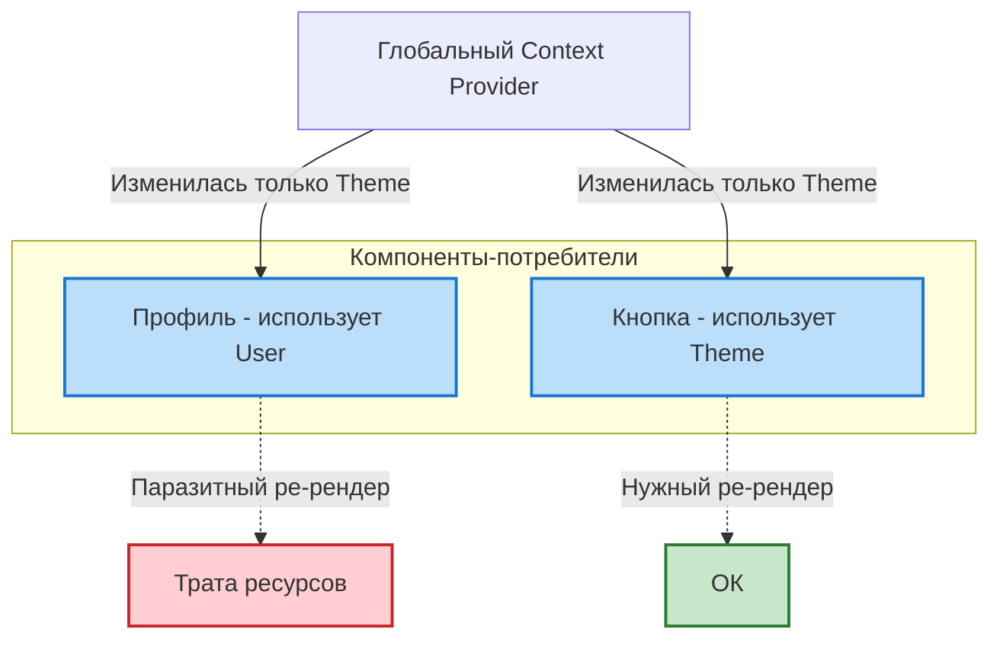
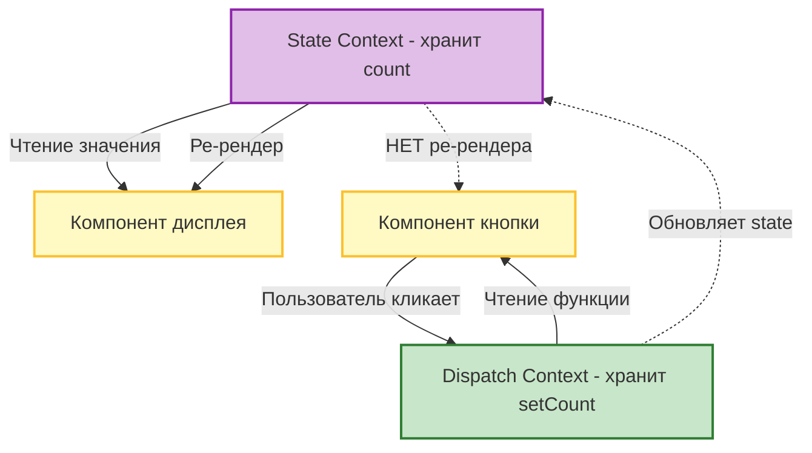

Часто разработчики (особенно новички) пытаются использовать встроенный `Context API` в качестве полноценной замены Redux или Zustand. На собеседованиях это может быть "красным флагом", если не понимать нюансов.

## 1. Context API — это НЕ State Manager
Строго говоря, Context API — это **механизм внедрения зависимостей (Dependency Injection)** для React-компонентов. Он решает только одну проблему: передачу данных вглубь дерева без Props Drilling.
Сам по себе Context не "управляет" состоянием. За управление состоянием отвечает `useState` или `useReducer`, которые вы передаете в `value` Провайдера.

## 2. Проблема производительности (O(n) рендеры)
Главный минус Context API при использовании в качестве глобального хранилища: **отсутствие селекторов (в классическом понимании)**.

*Как глобальный Context вызывает цепную реакцию лишних ре-рендеров:*


Если ваш `value` — это огромный объект `{ user, settings, ui, data }`, то **любое** изменение **любого** поля в этом объекте вызовет безусловный ре-рендер **ВСЕХ** компонентов, которые вызывают `useContext(MyContext)`. 

В Redux или Zustand компонент подписывается только на часть стейта (`useSelector(state => state.user.name)`) и игнорирует другие изменения. В Context API до выхода специальных экспериментальных фич (типа Context Selectors) это невозможно "из коробки".

## 3. Best Practices (Архитектурные паттерны)

### Разделение контекстов (Split Contexts)
Вместо одного гигантского `<GlobalProvider>`, создавайте узконаправленные провайдеры.
- `<ThemeProvider>` (редко меняется)
- `<AuthProvider>` (редко меняется)
- `<FormsProvider>` (часто меняется, используется только на определенных страницах)

### Паттерн "State + Dispatch Contexts"
Чтобы оптимизировать ре-рендеры компонентов, которые только *вызывают* функции (но не читают данные), разделяйте состояние и функции его обновления.

*Паттерн разделения: компонент кнопки никогда не перерисовывается при изменении счетчика:*


```jsx
// ❌ ПЛОХО: Изменение count вызовет ре-рендер кнопки, хотя кнопке нужен только setCount
const CountContext = createContext();
function App() {
  const [count, setCount] = useState(0);
  return <CountContext.Provider value={{ count, setCount }}>...</CountContext.Provider>;
}

// ✅ ХОРОШО: Разделение
const CountStateContext = createContext();
const CountDispatchContext = createContext(); // Никогда не меняется, так как setCount стабилен

function App() {
  const [count, setCount] = useState(0);
  return (
    <CountStateContext.Provider value={count}>
      <CountDispatchContext.Provider value={setCount}>
        <CounterDisplay /> {/* Подписан на State */}
        <CounterButton />  {/* Подписан на Dispatch, НЕ ре-рендерится при изменении count! */}
      </CountDispatchContext.Provider>
    </CountStateContext.Provider>
  );
}
```

## 4. Когда использовать?
- **Для низкочастотных обновлений**: Тема (светлая/темная), текущая локаль, данные авторизованного пользователя.
- **Для инкапсуляции состояния сложных компонентов**: Например, при создании UI-библиотек (вкладки, аккордеоны, модальные окна по паттерну Compound Components).
