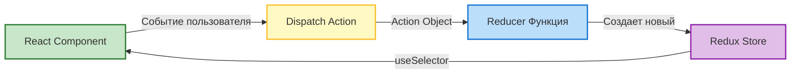
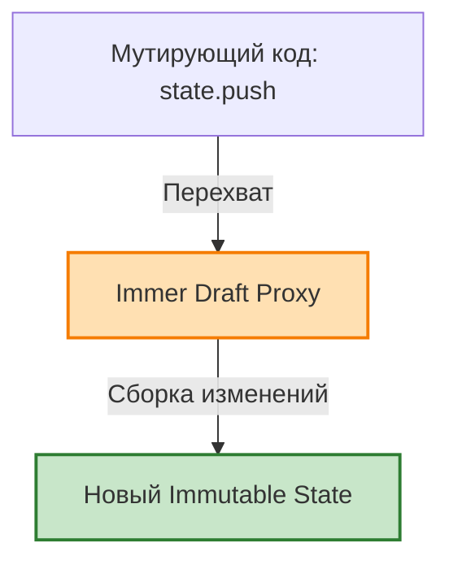
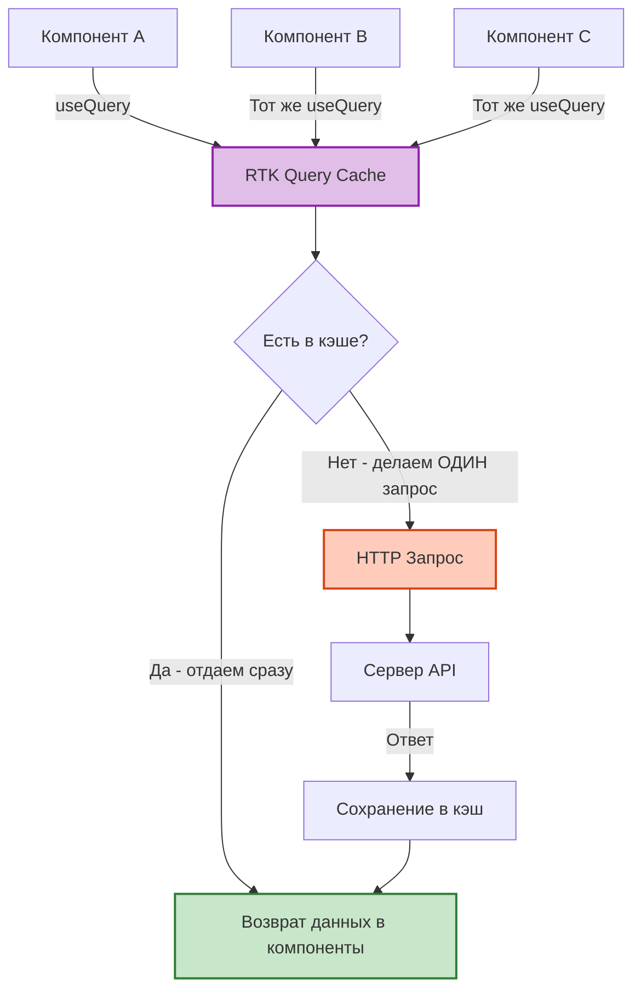

Redux — это пионер глобального управления состоянием, основанный на архитектуре Flux (Однонаправленный поток данных). 
К 2026 году писать классический Redux с `switch/case` редьюсерами и бойлерплейтом — это legacy. Индустриальный стандарт — **Redux Toolkit (RTK)**.

## 1. Базовые концепции (Flux)
1. **Store**: Единый источник истины (хранилище).
2. **Action**: Обычный JS-объект с полем `type` (и опционально `payload`), описывающий намерение.
3. **Reducer**: Чистая функция `(state, action) => newState`.
4. **Dispatch**: Функция отправки Action в Store.

*Классическая архитектура однонаправленного потока данных (Flux):*


## 2. Магия Redux Toolkit (Immer.js)
В классическом Redux вы обязаны были соблюдать строгую иммутабельность через spread-операторы. RTK использует под капотом библиотеку **Immer**.

*Как Immer.js превращает мутации в иммутабельность:*


**Edge Case / Необычная ситуация:** Вы *пишете* мутирующий код, но RTK *делает* его иммутабельным!
```javascript
import { createSlice } from '@reduxjs/toolkit';

const userSlice = createSlice({
  name: 'user',
  initialState: { name: 'Alex', age: 25, friends: [] },
  reducers: {
    addFriend: (state, action) => {
      // 😱 Выглядит как жесткая мутация! В обычном React/Redux это запрещено!
      state.friends.push(action.payload); 
      // Но Immer.js перехватывает это через Proxy и безопасно создает новую копию стейта.
    }
  }
});
```
*Важное правило:* В RTK редьюсерах вы должны ЛИБО "мутировать" `state`, ЛИБО возвращать новый объект. Нельзя делать и то, и другое одновременно.

## 3. Оптимизация с `useSelector`
Хук `useSelector` подписывает компонент на часть стора. 
**Тонкость:** По умолчанию `useSelector` использует строгое сравнение (`===`). 

```jsx
// ✅ ХОРОШО: Возвращает примитив. Рендер только если `age` изменится.
const age = useSelector(state => state.user.age); 

// ❌ ПЛОХО: Возвращает новый массив при КАЖДОМ вызове (метод .map). 
// Component будет ре-рендериться после ЛЮБОГО изменения в store!
const friendNames = useSelector(state => state.user.friends.map(f => f.name));
```
**Решение:** Использовать мемоизированные селекторы (например, встроенную функцию `createSelector` из библиотеки *Reselect*, которая поставляется вместе с RTK).

## 4. Антипаттерн: Несериализуемые данные в Store
**Redux Store должен содержать ТОЛЬКО сериализуемые данные (которые можно превратить в JSON).**
Если вы положите в Store:
- Классы (`new Date()`, `new Map()`)
- Функции
- Промисы
- DOM-элементы
...вы сломаете Redux DevTools (Time Travel Debugging) и возможности персистентности (сохранения стейта в localStorage). RTK по умолчанию выдаст ошибку в консоль при попытке это сделать.

---

## 5. RTK Query
RTK Query — это инструмент, встроенный в Redux Toolkit, предназначенный для **Data Fetching** и **Кэширования** (прямой конкурент React Query/TanStack Query).

Он автоматизирует процесс создания состояний: `isLoading`, `isFetching`, `data`, `error`.
Вместо того чтобы писать Thunks (`createAsyncThunk`), вы просто описываете эндпоинты API:

*Архитектура дедупликации и кэширования в RTK Query:*


```javascript
export const pokemonApi = createApi({
  reducerPath: 'pokemonApi',
  baseQuery: fetchBaseQuery({ baseUrl: 'https://pokeapi.co/api/v2/' }),
  endpoints: (builder) => ({
    getPokemonByName: builder.query({
      query: (name) => `pokemon/${name}`,
    }),
  }),
});

// RTK Query автоматически генерирует хук!
export const { useGetPokemonByNameQuery } = pokemonApi;
```
В компоненте это используется так:
```jsx
const { data, error, isLoading } = useGetPokemonByNameQuery('bulbasaur');
```
Он сам позаботится о кэшировании, дедупликации (отправке только одного запроса, если 5 компонентов просят одни данные) и инвалидации кэша.
