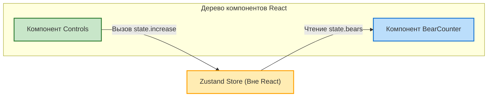
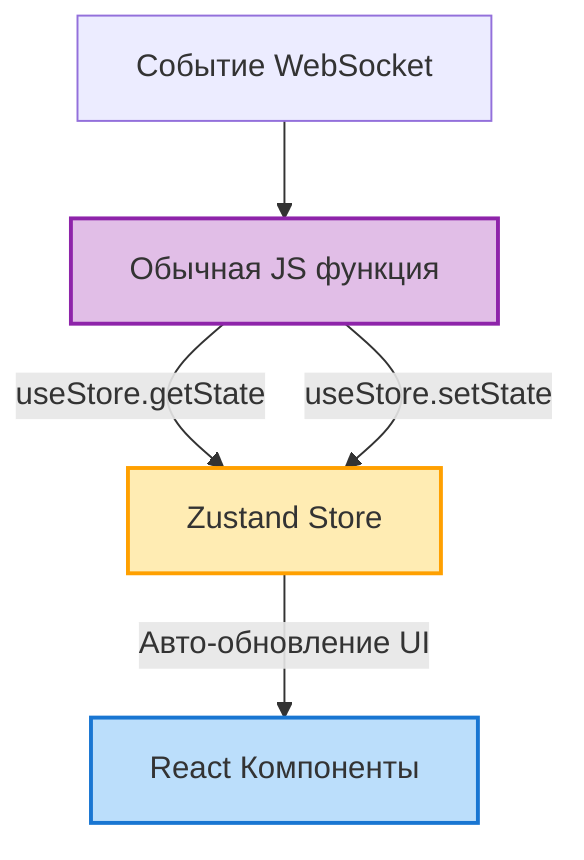
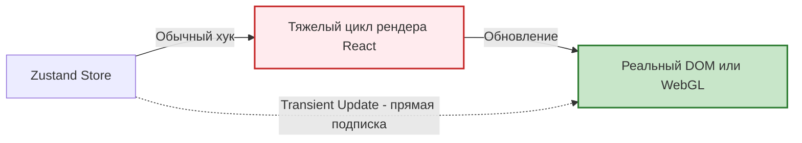

**Zustand** (в переводе с немецкого "Состояние") к 2026 году стал, вероятно, самым популярным выбором для локальных и глобальных стейтов в новых проектах. Причина — невероятная простота, отсутствие бойлерплейта и независимость от React Context.

## 1. Почему Zustand, а не Redux?
- Нет нужды в `<Provider>` обертках. Стор находится *вне* дерева React.
- Настройка занимает 3 строчки кода.
- Меньший размер бандла.
- По умолчанию поддерживает селекторы и предотвращает лишние ре-рендеры (через хук `useSyncExternalStore` под капотом).

## 2. Базовое использование

*Архитектура Zustand: Стор живет вне дерева React и связывается точечно через селекторы:*


**Создание стора:**
```javascript
import { create } from 'zustand';

// Хук useBearStore создается и сразу готов к использованию
export const useBearStore = create((set) => ({
  bears: 0,
  increasePopulation: () => set((state) => ({ bears: state.bears + 1 })),
  removeAllBears: () => set({ bears: 0 }),
}));
```

**Использование в компоненте:**
```jsx
function BearCounter() {
  // Компонент перерисуется ТОЛЬКО если изменится bears.
  const bears = useBearStore((state) => state.bears);
  return <h1>{bears} медведей</h1>;
}

function Controls() {
  // Извлекаем только функцию. Кнопка НЕ будет перерисовываться при изменении bears!
  const increase = useBearStore((state) => state.increasePopulation);
  return <button onClick={increase}>Добавить</button>;
}
```

## 3. Мощь Zustand: Доступ к стейту ВНЕ React
Поскольку Zustand стор не привязан к Context API, вы можете читать и обновлять данные **в обычных JavaScript функциях**, за пределами React-компонентов (например, в WebSocket-обработчиках или утилитах).

*Один стор для React и для ванильного JavaScript:*


```javascript
import { useBearStore } from './store';

// Эта функция не является React-компонентом!
function handleWebSocketMessage(msg) {
  if (msg.type === 'BEAR_SPAWNED') {
    // Прямой доступ к функции set стора
    useBearStore.getState().increasePopulation();
  }
}
```

## 4. Необычная ситуация (Edge Case): Transient Updates (Временные обновления)
Представьте, что вы делаете 3D игру на React Three Fiber или сложную анимацию на холсте. Если при каждом движении мыши вызывать `setState`, React умрет от количества ре-рендеров (60 раз в секунду).

Zustand позволяет **подписываться на изменения стора без ре-рендера React компонентов** (Transient Updates).

*Как Transient Updates обходят тяжелый цикл рендера React:*


```jsx
function AnimationController() {
  const meshRef = useRef();

  useEffect(() => {
    // subscribe позволяет слушать изменения стора напрямую, минуя цикл рендера React!
    const unsubscribe = useBearStore.subscribe(
      (state) => state.bears,
      (bears) => {
        // Мы мутируем 3D-объект или DOM напрямую!
        meshRef.current.position.x = bears * 10;
      }
    );
    return unsubscribe; // Отписка
  }, []);

  return <mesh ref={meshRef} />; // Сам компонент никогда не ре-рендерится!
}
```
Это делает Zustand абсолютным лидером для высокопроизводительных, анимационных и WebGL приложений в экосистеме React.
