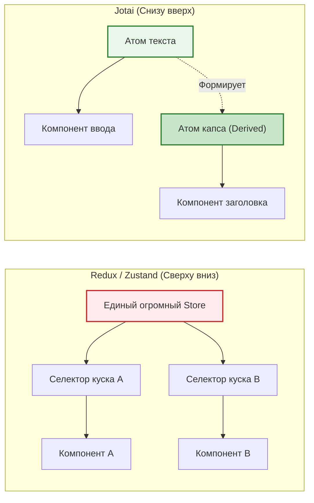
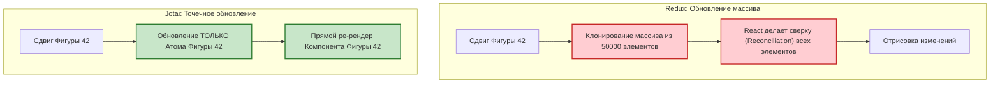

Redux и Zustand используют подход **"Сверху вниз" (Top-down)**. У вас есть один большой объект состояния, и компоненты "откусывают" (выбирают) из него нужные куски. 

**Jotai** и **Recoil** используют совершенно иной подход — **"Снизу вверх" (Bottom-up)**. Это атомарный State Management.

*(Примечание на 2026 год: Recoil, созданный внутри Facebook/Meta, практически перестал поддерживаться и устарел. **Jotai** является его современным, быстрым и активным преемником. Поэтому фокус здесь будет на Jotai).*

## 1. Что такое Атомы?
Атом (`atom`) — это минимальная единица состояния. Они независимы друг от друга. Вы можете создавать их динамически (например, в цикле).

*Сравнение монолитной архитектуры и атомарной композиции:*


```javascript
import { atom, useAtom } from 'jotai';

// Создаем атомы вне компонентов (они не хранят значение сами по себе, они описывают структуру)
export const textAtom = atom('Привет');
export const uppercaseAtom = atom(
  (get) => get(textAtom).toUpperCase() // Вычисляемый атом (Derived state)
);
```

```jsx
import { useAtom } from 'jotai';
import { textAtom, uppercaseAtom } from './atoms';

function Input() {
  // Синтаксис идентичен встроенному useState!
  const [text, setText] = useAtom(textAtom);
  return <input value={text} onChange={(e) => setText(e.target.value)} />;
}

function UppercaseLabel() {
  const [uppercase] = useAtom(uppercaseAtom);
  return <h1>{uppercase}</h1>;
}
```

## 2. Когда и зачем нужен Атомарный стейт?

Архитектура Jotai/Recoil сияет в приложениях со **сверхвысокой интерактивностью и огромным количеством независимых элементов**, которые нужно обновлять по отдельности.

**Классические примеры:**
- Графические редакторы (Figma-подобные интерфейсы, Canva).
- Конструкторы сайтов / Ноу-код платформы (Webflow).
- Табличные процессоры (Excel).

Представьте холст, на котором нарисовано 50 000 фигур (прямоугольники, круги). У каждой фигуры есть координаты `x, y` и `color`.
Если вы храните массив из 50 000 объектов в Redux, и пользователь двигает *одну* фигуру на 1 пиксель, Redux должен пересоздать массив (чтобы сработала иммутабельность), что вызовет проверку огромного дерева. 

В Jotai вы можете создать **Атом для каждой отдельной фигуры**.

*Почему Jotai выигрывает в высоконагруженных интерфейсах:*


Когда двигается фигура №42, обновляется только атом фигуры №42. Ре-рендерится только компонент, подписанный на фигуру №42. Остальные 49 999 компонентов даже не узнают об этом.

## 3. Edge Case: Утечки памяти (Memory Leaks)
Поскольку вы можете динамически плодить атомы в памяти тысячами (Family Atoms), вам нужно быть осторожными. Jotai использует `WeakMap` под капотом, чтобы удалять атомы из памяти, когда на них больше нет подписок (Garbage Collection). Но если вы где-то случайно сохраните глобальную ссылку на динамический атом, сборщик мусора не сможет его удалить, и приложение со временем упадет от нехватки памяти (Out Of Memory).
