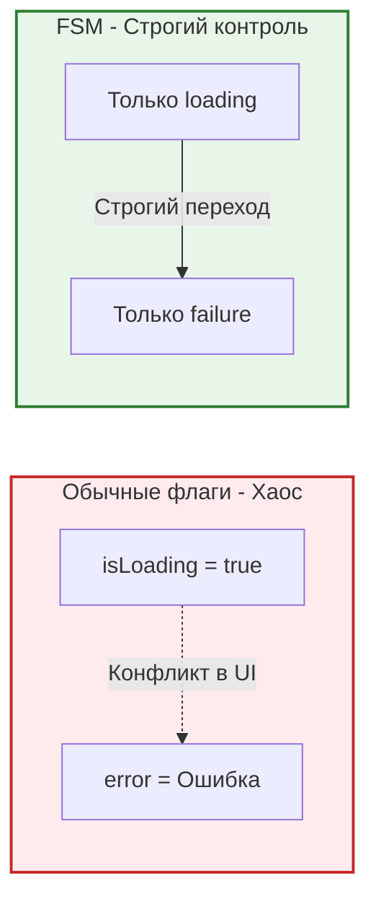
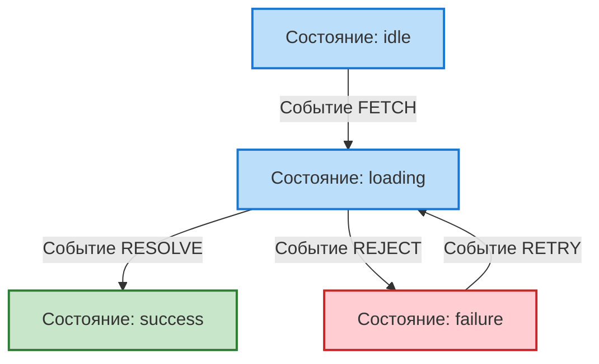

XState — это библиотека для создания **Конечных автоматов (Finite State Machines - FSM)** и стейтчартов (Statecharts).

Это инструмент не для простых счетчиков или форм. XState используется, когда логика вашего компонента становится настолько сложной, что вы начинаете путаться в комбинациях булевых флагов (`isLoading`, `isError`, `isSuccess`, `isEmpty`).

## 1. Проблема невозможных состояний
Посмотрите на типичный стейт запроса:
```javascript
const [isLoading, setIsLoading] = useState(false);
const [data, setData] = useState(null);
const [error, setError] = useState(null);
```
Что, если из-за бага в коде у нас окажется `isLoading: true` и `error: "Ошибка"` одновременно? Должны ли мы показывать спиннер или текст ошибки? Это **невозможное состояние**, которое ломает UI.

*Почему множество флагов — это плохо, и как FSM решает эту проблему:*


## 2. Подход XState
Конечный автомат говорит: система в любой момент времени может находиться строго в **ОДНОМ** конечном состоянии. Из каждого состояния есть строго определенные **переходы (transitions)** в другие состояния на основе **событий (events)**.

*Как выглядит наш конечный автомат загрузки данных:*


```javascript
import { createMachine } from 'xstate';
import { useMachine } from '@xstate/react';

const fetchMachine = createMachine({
  id: 'fetch',
  initial: 'idle', // Начальное состояние
  states: {
    idle: {
      on: { FETCH: 'loading' } // Из idle можно перейти в loading по событию FETCH
    },
    loading: {
      on: {
        RESOLVE: 'success', // Успех
        REJECT: 'failure'   // Ошибка
      }
    },
    success: {
      type: 'final' // Конечное состояние (из него никуда не уйти)
    },
    failure: {
      on: { RETRY: 'loading' } // Из ошибки можно вернуться в загрузку
    }
  }
});
```

В компоненте:
```jsx
function App() {
  const [state, send] = useMachine(fetchMachine);

  // Мы проверяем конкретное состояние машины, а не флаги!
  if (state.matches('idle')) {
    return <button onClick={() => send({ type: 'FETCH' })}>Загрузить</button>;
  }
  
  if (state.matches('loading')) return <Spinner />;
  if (state.matches('failure')) return <Error onClick={() => send({ type: 'RETRY' })} />;
  if (state.matches('success')) return <Data />;
}
```
**Преимущество:** Вы физически не можете отправить событие `FETCH`, если текущее состояние машины — `loading`. Машина просто проигнорирует его! Двойные сабмиты формы, гонки условий — всё это решается на уровне архитектуры автомата.

## 3. Инструментарий (Visualizer)
Главная "киллер-фича" XState — вы можете скопировать код машины, вставить в [XState Visualizer](https://stately.ai/viz) и получить **интерактивную блок-схему** всей логики компонента, которую поймет даже ваш менеджер продукта! К 2026 году это стало индустриальным стандартом для сложных бизнес-процессов (оформление заказа, многошаговые формы, авторизация).
