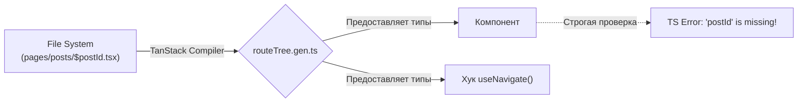

К 2026 году **TanStack Router** стал главным конкурентом React Router. Если React Router пошел по пути объединения с серверным фреймворком (Remix), то TanStack Router сделал ставку на **100% Typesafe (Типобезопасность)**.

## 1. Проблема: Отсутствие строгой типизации URL
В классическом роутере вы делаете навигацию через строки:
```tsx
// Опечатка в пути! TypeScript не выдаст ошибку, но приложение упадет в рантайме.
navigate('/profiel/123'); 

// Вы забыли передать обязательный Search Param `?sort=asc`
navigate('/users'); 
```

## 2. Решение TanStack Router: Генерация типов
TanStack Router анализирует вашу структуру файлов (если используется File-based routing) или дерево маршрутов и генерирует гигантский файл TypeScript с точными типами всех возможных URL в вашем приложении.



**Что вы получаете:**
- **Автодополнение (Autocomplete):** Когда вы пишете `<Link to="/... ">`, IDE предложит вам только существующие пути!
- **Безопасность параметров:** Если маршрут требует параметр `userId`, TypeScript подчеркнет красным компонент `<Link to="/users">`, если вы забыли передать `params={{ userId: 123 }}`.

```tsx
// Пример 100% безопасной навигации
import { Link } from '@tanstack/react-router';

function Nav() {
  return (
    <Link 
      to="/posts/$postId" 
      params={{ postId: '42' }} // Обязательно к заполнению!
      search={{ q: 'react' }} // Строго типизированные Query параметры!
    >
      Пост 42
    </Link>
  );
}
```

## 3. Search Params (Query параметры) как State Manager
Хранение состояния в URL (например, фильтры, сортировка, пагинация в таблице) — это Best Practice. Это позволяет делиться ссылкой с коллегой, и он увидит ту же самую таблицу.

В старых роутерах работа с `?page=2&sort=name` — это боль (приходится парсить строки, переводить `'2'` в число `2`).

**В TanStack Router валидация Search Params встроена "из коробки" (часто в паре с Zod):**

```tsx
import { z } from 'zod';
import { createFileRoute } from '@tanstack/react-router';

const searchSchema = z.object({
  page: z.number().catch(1), // Если в URL мусор (page=abc), поставит 1
  filter: z.string().optional(),
  sort: z.enum(['asc', 'desc']).catch('asc'),
});

export const Route = createFileRoute('/users')({
  validateSearch: searchSchema, // Магия начинается здесь!
});
```

Теперь в компоненте:
```tsx
function UsersPage() {
  // search - это строго типизированный объект!
  // page: number, filter: string | undefined, sort: 'asc' | 'desc'
  const search = Route.useSearch(); 

  return <div>Текущая страница: {search.page}</div>;
}
```

## 4. Встроенный Кэш и Интеграция с TanStack Query
Так как TanStack Router создан той же командой (Tanner Linsley), что и React Query, их интеграция безупречна. 
Вы можете использовать `loader` в роутере, чтобы заранее вызвать `queryClient.ensureQueryData(...)`. Это гарантирует, что к моменту рендера страницы все данные уже загружены и лежат в кэше React Query. Никаких спиннеров загрузки при переходе между страницами!
