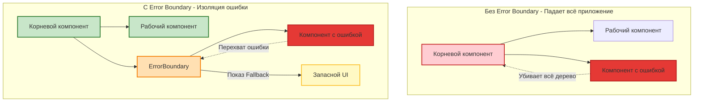
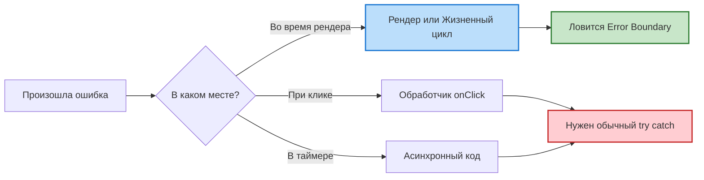
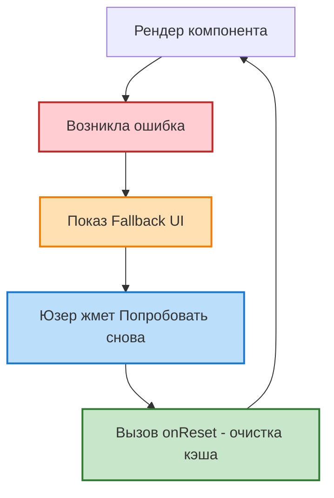

В React, если компонент выбрасывает необработанное исключение во время рендера, React "убивает" всё дерево компонентов, и пользователь видит белый экран смерти. **Error Boundaries** решают эту проблему, изолируя падение и показывая запасной интерфейс (Fallback UI).

## 1. Как это работает под капотом

*Разница между обычным падением приложения и использованием Error Boundary:*


К 2026 году Error Boundaries — это **единственный случай**, когда вам все еще приходится писать **Классовые компоненты** в React (если вы не используете сторонние библиотеки-обертки).

Для создания границы компонент должен реализовать хотя бы один из двух методов:
- `static getDerivedStateFromError(error)` — для обновления стейта и показа запасного UI.
- `componentDidCatch(error, errorInfo)` — для логирования ошибки в сервисы аналитики (например, Sentry).

```jsx
class ErrorBoundary extends React.Component {
  state = { hasError: false };

  static getDerivedStateFromError(error) {
    return { hasError: true }; // Следующий рендер покажет fallback
  }

  componentDidCatch(error, info) {
    logErrorToMyService(error, info.componentStack);
  }

  render() {
    if (this.state.hasError) {
      return this.props.fallback || <h1>Что-то пошло не так.</h1>;
    }
    return this.props.children; 
  }
}

// Использование:
<ErrorBoundary fallback={<p>Ошибка загрузки виджета</p>}>
  <ComplexWidget />
</ErrorBoundary>
```

## 2. ⚠️ Что Error Boundaries НЕ ловят (Важный Edge Case)
Это один из самых частых вопросов на собеседованиях. Error Boundaries ловят ошибки **только во время фазы рендера**, в методах жизненного цикла и в конструкторах дерева.

*Схема обработки ошибок в React: где нужен Error Boundary, а где классический try-catch:*


Они **НЕ ЛОВЯТ** ошибки в следующих местах:
1. **Обработчики событий (`onClick`, `onChange`):** Если ошибка произойдет при нажатии кнопки, приложение не упадет (потому что рендер уже завершен). Вам нужен обычный `try/catch`.
2. **Асинхронный код:** Ошибки внутри `setTimeout` или `requestAnimationFrame`.
3. **Server-Side Rendering (SSR):** На сервере Error Boundaries не работают.
4. **Ошибки в самой границе:** Если падает метод `render` самого ErrorBoundary, ошибка пробрасывается выше (к следующей границе).

## 3. Современное решение: `react-error-boundary`
Так как писать классы никто не хочет, индустрия использует библиотеку `react-error-boundary`.
Она предоставляет компонент-обертку и крутую фичу **Reset (Восстановление)**, позволяя пользователю нажать кнопку "Попробовать снова", которая сбрасывает состояние ошибки и пытается отрендерить упавший компонент заново.

*Цикл восстановления работы компонента после сбоя:*


```jsx
import { ErrorBoundary } from 'react-error-boundary';

function Fallback({ error, resetErrorBoundary }) {
  return (
    <div role="alert">
      <p>Произошла ошибка:</p>
      <pre>{error.message}</pre>
      {/* Кнопка сбросит ошибку и заново отрендерит children */}
      <button onClick={resetErrorBoundary}>Попробовать снова</button>
    </div>
  );
}

<ErrorBoundary 
  FallbackComponent={Fallback} 
  onReset={() => clearCache()} // Очищаем кэш перед повторным рендером
>
  <MyComponent />
</ErrorBoundary>
```
