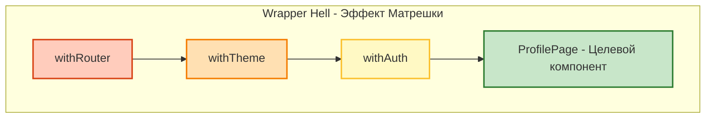
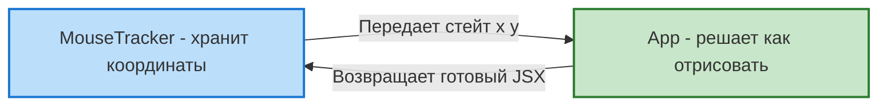
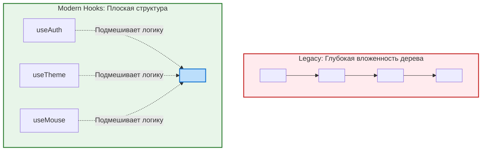

Эти два паттерна были фундаментом React до 2019 года (до появления Хуков). К 2026 году они считаются устаревшими (Legacy), но их **обязательно** нужно знать для собеседований и работы со старым кодом. 
Оба паттерна решали одну задачу: **переиспользование логики между компонентами**.

## 1. HOC (Higher-Order Component)
HOC — это не компонент, это **функция**, которая принимает компонент в качестве аргумента и возвращает **новый, расширенный компонент**.

*(По аналогии с функциями высшего порядка в JS, которые принимают другие функции).*

### Пример: `withAuth`
Вам нужно защитить 5 страниц от неавторизованных пользователей.
```jsx
// Сам HOC
function withAuth(WrappedComponent) {
  return function EnhancedComponent(props) {
    const user = useUser(); // Предположим, берем из контекста

    if (!user) {
      return <Redirect to="/login" />;
    }

    // Пробрасываем все исходные пропсы дальше
    return <WrappedComponent {...props} user={user} />;
  };
}

// Использование
const ProfilePage = (props) => <div>Привет, {props.user.name}</div>;
export default withAuth(ProfilePage); // Экспортируем обернутую версию!
```

### Главный минус HOC (Wrapper Hell)
Если вам нужно добавить авторизацию, тему, локализацию и роутер к одному компоненту, вы получаете матрешку:
`withRouter(withTheme(withAuth(ProfilePage)))`. 
Это создавало гигантское, нечитаемое дерево компонентов в React DevTools (Wrapper Hell) и порождало коллизии имен пропсов.

*Как выглядит дерево компонентов при использовании нескольких HOC:*


---

## 2. Render Props
Паттерн, при котором компонент принимает функцию, возвращающую React-элемент, и вызывает её внутри своего рендера, передавая ей свои данные.

*Инверсия контроля в Render Props: логика отделена от отображения:*


### Пример: Отслеживание мыши
```jsx
class MouseTracker extends React.Component {
  state = { x: 0, y: 0 };
  
  handleMouseMove = (e) => this.setState({ x: e.clientX, y: e.clientY });

  render() {
    return (
      <div onMouseMove={this.handleMouseMove}>
        {/* Вместо жесткого рендера UI, мы вызываем пропс `render` или `children` */}
        {this.props.render(this.state)}
      </div>
    );
  }
}

// Использование: Полный контроль над тем, КАК отобразить данные
function App() {
  return (
    <MouseTracker 
      render={({ x, y }) => (
        <h1>Мышка на координатах: {x}, {y}</h1>
      )} 
    />
  );
}
```

### Главный минус Render Props (Callback Hell)
Приводило к глубокой вложенности коллбэков (Пирамида смерти в JSX), если нужно было получить данные от трех разных компонентов с Render Props.

---

## 3. Как Хуки убили эти паттерны?
Хуки (`Hooks`) элегантно решили проблему переиспользования логики, не меняя дерево компонентов!

*Эволюция переиспользования логики:*


Вместо HOC `withAuth`, мы просто пишем `const user = useAuth()`.
Вместо компонента `<MouseTracker render={...}>`, мы пишем `const { x, y } = useMouse()`.

**Edge Case:** Когда Render Props все еще полезны?
Иногда Render Props незаменимы при создании высокопроизводительных виртуализованных списков (например, `react-window`), где родитель должен диктовать ребенку, какие стили (top, left) применить к конкретной строке таблицы.
