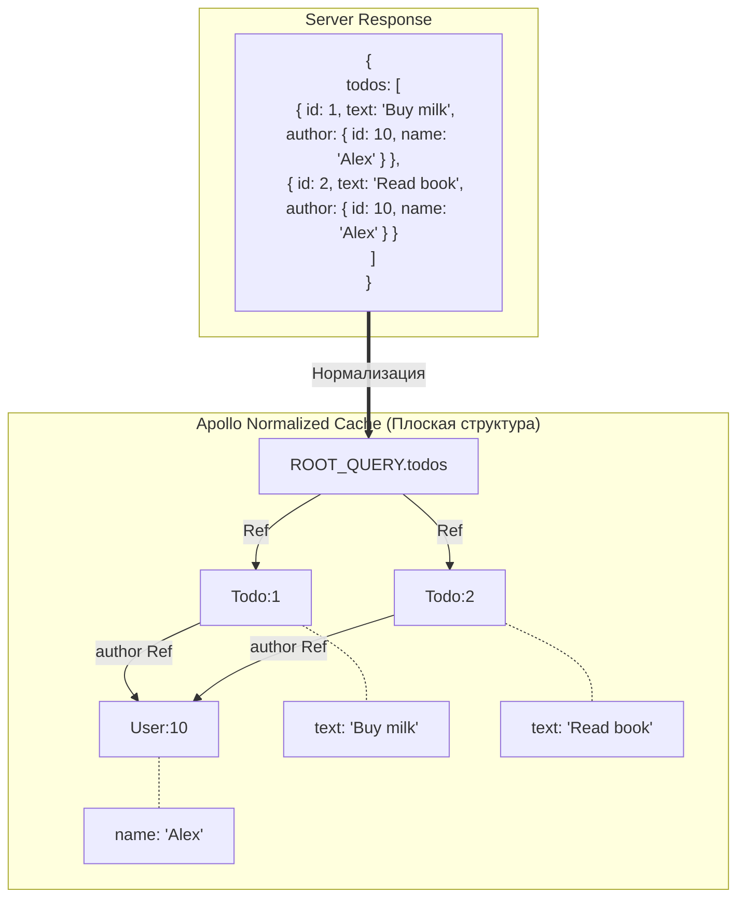

Apollo Client — это де-факто стандарт для работы с **GraphQL** в React-приложениях. Если TanStack Query и SWR в первую очередь предназначены для REST API (хотя могут работать и с GraphQL), то Apollo создавался специально и исключительно под GraphQL.

## 1. Нормализованный кэш (Normalized Cache)
Это **главная "киллер-фича"** и фундаментальное отличие Apollo от React Query.

Когда Apollo получает ответ от сервера, он не просто кладет JSON в память по ключу запроса. Он **парсит (нормализует)** его.



Каждый объект, у которого есть `__typename` и `id`, разделяется и кладется в плоскую таблицу (в памяти).

**Почему это гениально?**
Представьте, что у вас есть два запроса на странице:
1. `GetHeaderProfile` (возвращает `{ id: 1, name: "Alex" }`).
2. `GetComments` (возвращает список комментов, где у автора тоже `{ id: 1, name: "Alex" }`).

Если вы вызовете мутацию `UpdateProfile(name: "Alexander")`, сервер вернет обновленного пользователя с `id: 1`. 
Apollo увидит, что сущность `User:1` изменилась в нормализованном кэше. Он **АВТОМАТИЧЕСКИ** обновит и Хедер, и список комментариев, не делая никаких дополнительных сетевых запросов и инвалидаций!

## 2. Использование (useQuery & useMutation)
В Apollo вы работаете с GraphQL-запросами, обернутыми в тег `gql`.

```jsx
import { useQuery, useMutation, gql } from '@apollo/client';

const GET_TODOS = gql`
  query GetTodos {
    todos {
      id
      text
      completed
    }
  }
`;

const TOGGLE_TODO = gql`
  mutation ToggleTodo($id: ID!, $completed: Boolean!) {
    updateTodo(id: $id, completed: $completed) {
      id
      completed # Обязательно запрашиваем обновленные поля, чтобы Apollo обновил кэш!
    }
  }
`;

function TodoApp() {
  const { loading, error, data } = useQuery(GET_TODOS);
  const [toggleTodo] = useMutation(TOGGLE_TODO);

  // Вызываем мутацию, кэш обновится САМ благодаря совпадению ID сущности
  const handleToggle = (id, currentStatus) => {
    toggleTodo({ variables: { id, completed: !currentStatus } });
  };
  
  // ... render
}
```

## 3. ⚠️ Edge Case: Когда нормализованный кэш НЕ справляется
Автоматическое обновление кэша (которое описано выше) работает ТОЛЬКО при обновлении существующих полей сущности.

**Проблема:** Что если вы создаете НОВЫЙ объект (новую Todo)? Сервер вернет вам новую тудушку с `id: 5`. Apollo положит её в кэш под ключом `Todo:5`. **НО!** Список `GET_TODOS` ничего об этом не узнает, потому что массив не связан напрямую. Ваш UI не обновится, новая тудушка не появится в списке.

**Решение (Update Function):** 
Вам придется вручную сказать Apollo, как "вплести" новый объект в массив существующего запроса, используя коллбэк `update` внутри мутации:

```jsx
const [addTodo] = useMutation(ADD_TODO, {
  update(cache, { data: { createTodo } }) {
    // 1. Читаем старый список из кэша
    const { todos } = cache.readQuery({ query: GET_TODOS });
    
    // 2. Записываем новый массив, добавляя новый элемент
    cache.writeQuery({
      query: GET_TODOS,
      data: { todos: [...todos, createTodo] },
    });
  }
});
```
*На собеседовании знание того, когда кэш обновляется сам, а когда нужен `cache.writeQuery` — показатель того, что вы реально работали с Apollo.*
