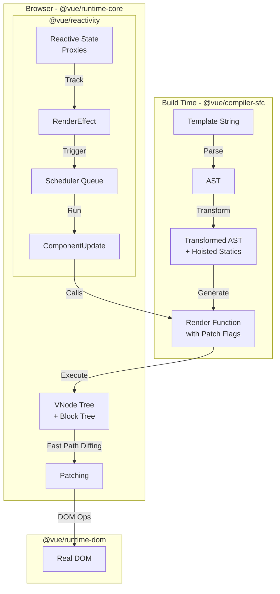

# Философия и Макроархитектура Vue: Compiler-Informed Runtime

## 1. Концепция и Архитектура (Mental Model)

На макроуровне архитектура Vue решает фундаментальную проблему UI-фреймворков: **как наиболее эффективно синхронизировать состояние приложения с DOM**.

Исторически фреймворки делились на два лагеря:
1. **Pull-модель (React):** Рендеринг сверху вниз. Стейт изменился -> перерисовываем всё поддерево -> диффаем (Diff) два больших графа VDOM. *Trade-off:* Дорогой процесс рендеринга, требующий ручной оптимизации (`useMemo`, `useCallback`).
2. **Push-модель (Solid, Svelte):** Точечная (fine-grained) реактивность. Изменение состояния напрямую вызывает заранее сгенерированные DOM-инструкции без использования VDOM. *Trade-off:* Сложность динамической генерации UI (например, рекурсивные компоненты или сложный JSX) и жесткая привязка к компилятору.

**Архитектурный выбор Vue — гибридная модель (Push-Pull):**
* На уровне компонентов Vue использует **Push-модель**. Реактивная система точно знает, *какой именно компонент* (вплоть до конкретного `effect`) нужно обновить. Перерисовки поддерева не происходит.
* Внутри самого компонента Vue использует **Pull-модель** (VDOM). Но это не классический VDOM. Vue реализует концепцию **Compiler-Informed Runtime**. Компилятор шаблонов на этапе сборки (AOT) анализирует статику шаблона и снабжает генерируемый код VDOM-узлов специальными подсказками (Patch Flags) и структурами (Block Tree). 
* Рантайм-рендерер, видя эти подсказки, полностью игнорирует статические узлы при diff-алгоритме, приближая скорость VDOM к прямым DOM-операциям.

Vapor Mode (в активной разработке) делает следующий шаг, полностью убирая VDOM для скомпилированных шаблонов, сводя работу к чистой Push-модели на базе сигналов и прямых манипуляций DOM, при этом сохраняя совместимость с VDOM-компонентами на границах.

## 2. Визуализация (Mermaid)

Диаграмма ниже описывает симбиоз компилятора, реактивности и рендерера (основа ядра).



## 3. Ссылки на исходный код (Source Code References)

* **Точка входа компилятора:** `packages/compiler-core/src/compile.ts` — оркестрация парсинга, трансформации и кодогенерации.
* **Связка Реактивности и Рендерера:** `packages/runtime-core/src/renderer.ts` — функция `setupRenderEffect` внутри `mountComponent`.
* **Флаги оптимизации:** `packages/shared/src/patchFlags.ts` и `packages/shared/src/shapeFlags.ts` — битовые маски для ускорения рантайма.

## 4. Разбор реализации (Code Deep Dive)

### Мост между Reactivity и Runtime (setupRenderEffect)
Суть гибридной модели скрыта в создании специального реактивного эффекта, оборачивающего функцию рендеринга компонента.

```typescript
// Упрощенный код из packages/runtime-core/src/renderer.ts
const setupRenderEffect = (
  instance: ComponentInternalInstance,
  initialVNode: VNode,
  container: RendererElement
) => {
  // Компонент обновляется через Reactive Effect
  const componentUpdateFn = () => {
    if (!instance.isMounted) {
      // Инициализация (Mount)
      const subTree = (instance.subTree = renderComponentRoot(instance))
      patch(null, subTree, container)
      instance.isMounted = true
    } else {
      // Обновление (Update/Patch)
      let { next, vnode } = instance
      if (next) {
        updateComponentPreRender(instance, next)
      }
      // Перегенерируем VDOM (выполняем render-функцию, которая отслеживает Proxy)
      const nextTree = renderComponentRoot(instance)
      const prevTree = instance.subTree
      instance.subTree = nextTree
      
      // Диффаем старое и новое дерево. 
      patch(prevTree, nextTree, hostParent, anchor)
    }
  }

  // ReactiveEffect (из @vue/reactivity) связывает чтение Proxy внутри render-функции с перерисовкой
  const effect = (instance.effect = new ReactiveEffect(
    componentUpdateFn,
    () => queueJob(update), // Scheduler (batching) - триггер не вызывает рендер синхронно!
    instance.scope // Привязка к effect scope компонента
  ))

  const update = (instance.update = () => effect.run())
  update()
}
```

### Compiler-Informed Runtime: Как это выглядит в коде
Допустим, у нас есть шаблон:
```html
<div>
  <span>Статика</span>
  <span>{{ dynamic }}</span>
</div>
```

Компилятор сгенерирует следующий JavaScript:
```typescript
import { createElementVNode as _createElementVNode, toDisplayString as _toDisplayString, openBlock as _openBlock, createElementBlock as _createElementBlock } from "vue"

export function render(_ctx, _cache) {
  return (_openBlock(), _createElementBlock("div", null, [
    _createElementVNode("span", null, "Статика"),
    _createElementVNode("span", null, _toDisplayString(_ctx.dynamic), 1 /* TEXT */)
  ]))
}
```
**Важные архитектурные детали здесь:**
1. `_openBlock()` и `_createElementBlock()` создают структуру, известную как **Block Tree**. Блок отслеживает только *динамические* узлы внутри себя.
2. `1 /* TEXT */` — это **Patch Flag**. Когда рантайм `patch` дойдет до этого VNode, он не будет проверять атрибуты, классы или дочерние элементы. Он сделает быстрый путь: `if (patchFlag & PatchFlags.TEXT) hostSetText(...)`.

## 5. Оптимизации и Edge Cases (Подводные камни)

### Битовые операции (Bitwise Flags)
Ядро Vue интенсивно использует побитовые маски (`ShapeFlags` и `PatchFlags`).
Вместо хранения объекта конфигурации `{ isElement: true, hasChildren: true, ... }`, тип и структура VNode кодируется одним числом (bitmap).
* **Причина:** Операция `vnode.shapeFlag & ShapeFlags.ELEMENT` выполняется процессором за один такт. Это в сотни раз быстрее, чем чтение свойства объекта (т.к. движок JS должен пройти по hidden classes / shape tree объекта в памяти).
* Это критически важно в цикле `patch`, который может вызываться тысячи раз за фрейм.

### Flat Arrays для Block Tree
Когда создается Block Tree, массив динамических потомков (`dynamicChildren`) строится как плоский массив (flat array), игнорируя реальную вложенность DOM.
* Узел-контейнер хранит прямую ссылку на *любого* глубоко вложенного динамического потомка.
* Во время обновления (re-render) Vue диффает только массив `dynamicChildren`, обходя 90% реального VDOM-дерева. Это решает проблему "налога на VDOM" (VDOM tax), за который часто критикуют React.

### Декомпозиция и Tree-Shaking
Каждая внутренняя сущность, будь то `keep-alive`, директивы `v-model` или специфичные хуки (например, `onMounted`), экспортируется как отдельная функция в ES-модуле (ESM).
* Ядро Vue спроектировано так, чтобы не иметь глобального объекта состояния `Vue`, в который "зашито" всё.
* Благодаря этому современные сборщики (Vite, Rollup, webpack) могут применять *Dead Code Elimination* (Tree-shaking). Если приложение не использует `<transition>`, код стейт-машины транзишенов вообще не попадет в финальный бандл.
