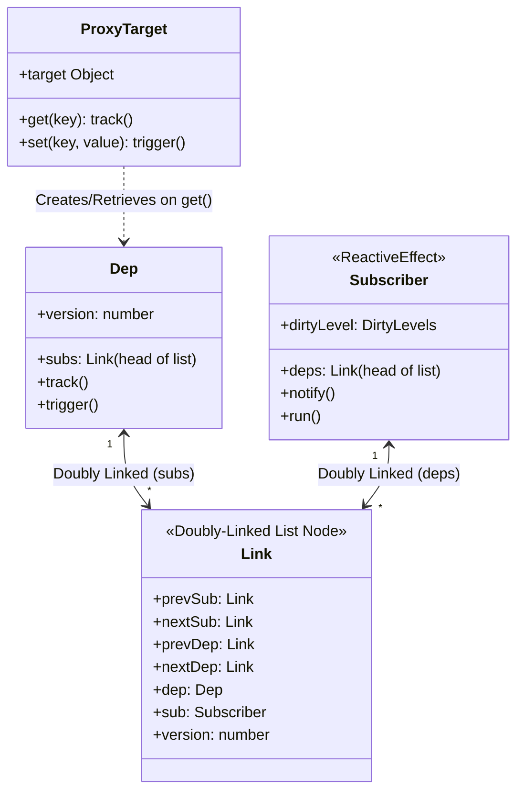

# Дизайн от Реактивности (Reactivity-First Design)

## 1. Концепция и Архитектура (Mental Model)

Фундаментальный принцип Vue заключается в том, что **реактивность — это независимый примитив**. Пакет `@vue/reactivity` полностью отвязан от платформы (браузера), DOM и даже от системы компонентов Vue. Он может использоваться как самостоятельная библиотека для управления состоянием в любом JS-окружении (Node.js, Canvas, WebGL).

Архитектурно Vue реализует **Transparent Dependency Tracking** (прозрачное отслеживание зависимостей) на базе ES6 Proxies. Разработчик просто мутирует объект, а система сама определяет, какие функции (эффекты, вычисляемые свойства, рендер-функции) зависят от измененных данных.

**Парадигма Vue 3.4+:**
До версии 3.4 зависимости хранились в структурах `Set` и `Map`. При каждом обновлении эффекта эти коллекции приходилось очищать и пересоздавать (cleanup), что создавало колоссальную нагрузку на сборщик мусора (GC) в больших графах. 
В Vue 3.4 Эван Ю переписал ядро реактивности. Теперь это **двусвязные списки (Doubly-Linked Lists)**, **глобальное версионирование (Version Counting)** и **уровни загрязнения (Dirty Levels)**. Эффекты больше не пересобирают зависимости "в лоб" — они обходят граф связей и сравнивают версии.

## 2. Визуализация (Mermaid)

Диаграмма демонстрирует граф связей Vue 3.4+, где узлами выступают `Dep` (свойства объектов) и `Subscriber` (эффекты), соединенные через объекты `Link`.



## 3. Ссылки на исходный код (Source Code References)

* **Обработчики прокси:** `packages/reactivity/src/baseHandlers.ts` — реализация ловушек `get`, `set`, `has` и др.
* **Связующие узлы (Links) и графы:** `packages/reactivity/src/dep.ts` — логика двусвязных списков и отслеживания версий.
* **Сущность Эффекта:** `packages/reactivity/src/effect.ts` — класс `ReactiveEffect` и система `DirtyLevels`.
* **Константы состояний:** `packages/reactivity/src/constants.ts` — енумы для `DirtyLevels`.

## 4. Разбор реализации (Code Deep Dive)

### Уровни "грязности" (DirtyLevels)
Для избежания лишних вычислений (особенно в `computed`), каждый эффект имеет состояние актуальности.

```typescript
// packages/reactivity/src/constants.ts
export enum DirtyLevels {
  NotDirty = 0,               // Данные актуальны
  QueryingDirty = 1,          // Проверка актуальности (обход зависимостей)
  MaybeDirty_ComputedSideEffect = 2, // Возможно грязный (зависит от computed, имеющего сайд-эффекты)
  MaybeDirty = 3,             // Возможно грязный (зависит от computed)
  Dirty = 4                   // Точно грязный (зависит от прямого изменения стейта)
}
```

### Отслеживание (Tracking) и Двусвязные списки
Когда срабатывает `get` у проксированного объекта, вызывается `track()`. Вместо добавления эффекта в `Set`, создается/обновляется структура `Link`, которая вплетается в два списка: список подписчиков для `Dep` и список зависимостей для `Subscriber` (эффекта).

```typescript
// Упрощенная логика из packages/reactivity/src/dep.ts
export function trackEffect(
  effect: ReactiveEffect,
  dep: Dep,
  debuggerEventExtraInfo?: DebuggerEventExtraInfo
) {
  // Ищем существующую связь (Link)
  let link = dep.subs;
  while (link) {
    if (link.sub === effect) return; // Уже отслеживается
    link = link.nextSub;
  }

  // Создаем новый Link для двусвязного списка
  const newLink = {
    dep,
    sub: effect,
    version: dep.version, // Запоминаем текущую версию свойства
    nextDep: undefined,
    prevDep: effect.depsTail,
    nextSub: undefined,
    prevSub: dep.subsTail
  };

  // Вплетаем в список зависимостей эффекта (по горизонтали)
  if (effect.depsTail) {
    effect.depsTail.nextDep = newLink;
  } else {
    effect.deps = newLink;
  }
  effect.depsTail = newLink;

  // Вплетаем в список подписчиков свойства (по вертикали)
  if (dep.subsTail) {
    dep.subsTail.nextSub = newLink;
  } else {
    dep.subs = newLink;
  }
  dep.subsTail = newLink;
}
```

### Триггеры и Version Counting
При `set` мутации вызывается `trigger()`. Версия `Dep` инкрементируется, и система уведомляет подписчиков.

```typescript
// packages/reactivity/src/dep.ts
export function trigger(dep: Dep) {
  dep.version++; // Инкремент локальной версии
  globalVersion++; // Инкремент глобальной версии (оптимизация)
  
  notify(dep);
}

function notify(dep: Dep) {
  let link = dep.subs;
  while (link) {
    const sub = link.sub;
    // Устанавливаем уровень Dirty в зависимости от того, прямой ли это стейт или computed
    if (sub.dirtyLevel < DirtyLevels.Dirty) {
      sub.dirtyLevel = DirtyLevels.Dirty;
      // Планируем выполнение эффекта (кидаем в микротаски)
      if (sub.scheduler) {
        sub.scheduler();
      }
    }
    link = link.nextSub;
  }
}
```

## 5. Оптимизации и Edge Cases (Подводные камни)

### Отказ от сборщика мусора (GC) через пулинг
Создание множества объектов `Link` может ударить по памяти. На практике Vue переиспользует старые ссылки (Link nodes) при повторном рендере. Когда эффект отрабатывает, он обходит старый список `deps`, помечает узлы сиротскими, а новые узлы накладывает поверх существующих, минимизируя аллокацию памяти. Это решает проблему фризов (GC spikes), на которые жаловались в Vue 3.2 при работе с таблицами на 10,000+ строк.

### Оптимизация Computed-цепочек (globalVersion)
Проблема старого Vue: если есть цепочка `C1 -> C2 -> C3` (где C — это computed), и стейт изменяется на то же самое значение (например, `count = 1` -> `count = 1`), вся цепочка могла запуститься вхолостую.
В Vue 3.4+ `computed` перед своим выполнением сравнивает `globalVersion`. Если ни один `Dep` в системе не изменил свою версию со времени последнего прохода, `computed` вернет кэшированное значение за `O(1)`, не обходя свой собственный граф зависимостей.

### Обход ограничений `Proxy` (Array Methods & Map/Set)
`Proxy` отлично работает с примитивными свойствами, но ломается на встроенных коллекциях (`Map`, `Set`, `Date`), так как их методы привязаны к внутренним слотам (internal slots) объекта `[[MapData]]`.
Для их поддержки во Vue есть отдельные "инструментации" (`packages/reactivity/src/collectionHandlers.ts`), которые перехватывают методы `get`, `has`, `add`, `set` и вручную вызывают `track()` или `trigger()`, делегируя выполнение к оригинальному `target` (raw object). Также переопределяются методы массивов `push/pop/splice`, чтобы их вызов не триггерил бесконечный цикл отслеживания свойства `length`.
