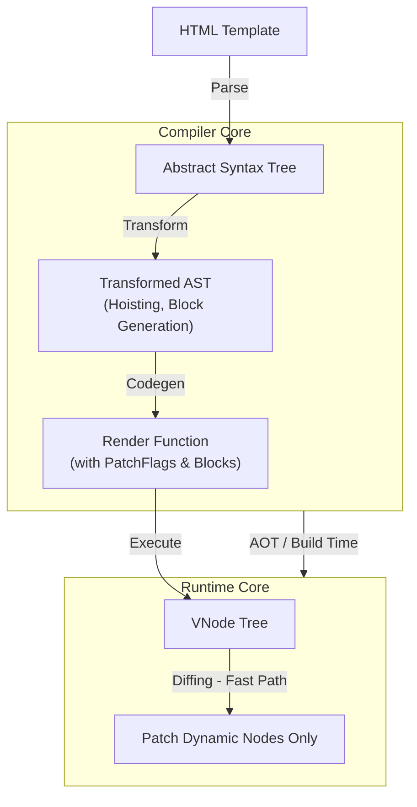

# Compiler-Informed Runtime

**Концепция и Архитектура (Mental Model)**

Классический Virtual DOM (VDOM) "слеп": при каждом обновлении состояния фреймворку приходится рекурсивно обходить два дерева (старое и новое), сравнивая каждый узел, чтобы найти изменения. Это дорогая операция, особенно если 90% шаблона — статика.

В Vue 3 этот подход был переосмыслен через концепцию **Compiler-Informed Runtime**. Компилятор (Compiler Core) парсит шаблон и "понимает" его семантику на этапе сборки (AOT). Он снабжает сгенерированные рендер-функции метаданными — "хинтами" для рантайма (Runtime Core). Благодаря этому рантайм больше не сравнивает узлы вслепую: он знает *где* и *что* именно может измениться, пропуская статические части и совершая точечные (Targeted) обновления. 

Такой симбиоз стирает границу между AOT-оптимизированными фреймворками (Svelte, Solid) и гибкостью VDOM.

**Визуализация (Mermaid)**



**Ссылки на исходный код**

- `packages/compiler-core/src/transform.ts` (Анализ AST и генерация подсказок)
- `packages/shared/src/patchFlags.ts` (Определение битовых флагов)
- `packages/runtime-core/src/renderer.ts` (Функция `patchElement` и работа с флагами)
- `packages/runtime-core/src/vnode.ts` (Создание VNode и Блоков `openBlock`, `createBlock`)

**Разбор реализации (Code Deep Dive)**

Ключевой механизм оптимизации — **PatchFlags**. Это битовые маски (Bitwise enum), которые компилятор присваивает динамическим узлам.

```typescript
// packages/shared/src/patchFlags.ts (упрощено)
export const enum PatchFlags {
  TEXT = 1,           // Динамический текст (1 << 0)
  CLASS = 1 << 1,     // Динамический класс (2)
  STYLE = 1 << 2,     // Динамический стиль (4)
  PROPS = 1 << 3,     // Динамические пропсы (8)
  FULL_PROPS = 1 << 4,// Ключи пропсов могут меняться (16)
  // ...
  HOISTED = -1,       // Статический узел (никогда не меняется)
  BAIL = -2           // Отключение оптимизации
}
```

Когда компилятор встречает шаблон:
```html
<div>
  <p>Static Text</p>
  <p :class="{ active: isActive }">{{ message }}</p>
</div>
```

Он генерирует рендер-функцию, где статика вынесена за пределы рендера (**Static Hoisting**), а корень оборачивается в **Block**. Block — это специальный VNode, который хранит плоский массив (`dynamicChildren`) всех своих динамических потомков.

```typescript
// Сгенерированный код (упрощенно)
import { createElementVNode as _createElementVNode, toDisplayString as _toDisplayString, openBlock as _openBlock, createElementBlock as _createElementBlock } from "vue"

// Статика поднята вверх: создается один раз
const _hoisted_1 = /*#__PURE__*/_createElementVNode("p", null, "Static Text", -1 /* HOISTED */)

export function render(_ctx, _cache) {
  return (_openBlock(), _createElementBlock("div", null, [
    _hoisted_1,
    _createElementVNode("p", {
      class: _normalizeClass({ active: _ctx.isActive })
    }, _toDisplayString(_ctx.message), 3 /* TEXT, CLASS */) // PatchFlag = 3 (1 | 2)
  ]))
}
```

В рантайме функция `patchElement` использует эти флаги для сверхбыстрых проверок:

```typescript
// packages/runtime-core/src/renderer.ts (упрощено)
const patchElement = (n1, n2, parentComponent, parentSuspense, isSVG, slotScopeIds, optimized) => {
  const el = (n2.el = n1.el)
  let { patchFlag, dynamicChildren } = n2

  if (patchFlag > 0) {
    if (patchFlag & PatchFlags.FULL_PROPS) {
      // Обновляем все пропсы
      patchProps(el, n2, oldProps, newProps, ...)
    } else {
      if (patchFlag & PatchFlags.CLASS) {
        if (oldProps.class !== newProps.class) {
          hostPatchProp(el, 'class', null, newProps.class, ...)
        }
      }
      // ... аналогично для STYLE и PROPS
    }
    if (patchFlag & PatchFlags.TEXT) {
      if (n1.children !== n2.children) {
        hostSetElementText(el, n2.children)
      }
    }
  }
}
```

**Оптимизации и Edge Cases (Подводные камни)**

1.  **Побитовые операции (Bitwise Masks):** Использование `1 << n` для PatchFlags позволяет комбинировать флаги (`TEXT | CLASS === 3`) и проверять их за доли миллисекунды `(flag & PatchFlags.TEXT)`. Это самая быстрая форма проверки условий в движках V8/SpiderMonkey.
2.  **Block Tree (Плоский массив):** Вместо рекурсивного обхода дерева при обновлении, рантайм итерируется по одномерному массиву `dynamicChildren` текущего блока (например, корня компонента или ветки `v-if`/`v-for`). Вся статика просто игнорируется O(1).
3.  **Vapor Mode (Эволюция):** Хотя Compiler-Informed Runtime значительно ускорил VDOM, создание VNode объектов все еще генерирует мусор для Garbage Collector (GC). **Vapor Mode** (экспериментальная фича Vue 3) делает следующий шаг — компилирует шаблоны напрямую в JS-вызовы DOM API (`document.createElement`, `el.textContent = ...`), полностью избавляясь от Virtual DOM для компонентов, которые поддерживают этот режим.
