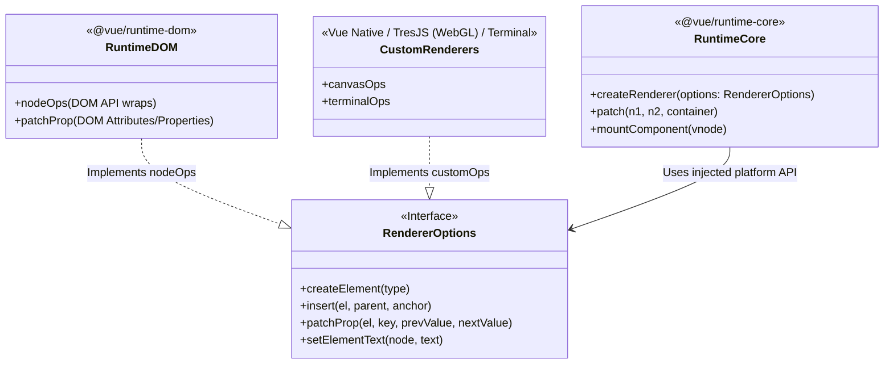

# Platform-Agnostic Design (Custom Renderers)

**Концепция и Архитектура (Mental Model)**

Исторически UI-фреймворки были жестко привязаны к браузерному DOM. В такой архитектуре ядро напрямую вызывает `document.createElement` или `el.setAttribute`. Это делает невозможным (или крайне болезненным) рендеринг в другие среды: Canvas, WebGL, нативные мобильные UI (iOS/Android) или терминал.

Архитектура Vue 3 спроектирована **Platform-Agnostic** (не зависящей от платформы). Ядро (`@vue/runtime-core`) оперирует исключительно абстрактными узлами (VNode) и управляет жизненным циклом компонентов, состоянием и реактивностью. Оно *вообще не знает* о существовании браузера. 

Взаимодействие с платформой происходит через механизм **Dependency Injection (Внедрение зависимостей)**. Платформа (например, `@vue/runtime-dom`) реализует интерфейс `RendererOptions` (набор CRUD-операций: создать узел, вставить узел, изменить текст, установить атрибут) и передает его в фабрику `createRenderer`. Ядро возвращает готовый инстанс рендерера (с методами `render` и `createApp`), специфичный для этой платформы.

**Визуализация (Mermaid)**



**Ссылки на исходный код**

- `packages/runtime-core/src/renderer.ts` (Фабрика `createRenderer` и основной алгоритм patch)
- `packages/runtime-dom/src/nodeOps.ts` (DOM-специфичные операции: `createElement`, `insert`, etc.)
- `packages/runtime-dom/src/patchProp.ts` (Обработка классов, стилей, атрибутов, событий для DOM)
- `packages/runtime-dom/src/index.ts` (Точка входа, создающая DOM-рендерер)

**Разбор реализации (Code Deep Dive)**

Пакет `runtime-core` экспортирует функцию `createRenderer`, которая принимает `options`. Внутри нее определяются сотни строк сложного кода VDOM diffing'а, которые изолированы в замыкании (Closure) для максимальной производительности:

```typescript
// packages/runtime-core/src/renderer.ts
export function createRenderer<HostNode, HostElement>(
  options: RendererOptions<HostNode, HostElement>
) {
  // Деструктуризация API платформы (Dependency Injection)
  const {
    insert: hostInsert,
    remove: hostRemove,
    createElement: hostCreateElement,
    createText: hostCreateText,
    patchProp: hostPatchProp,
    // ...
  } = options

  // Базовая функция рендеринга и diffing'а, ничего не знает про DOM
  const patch = (n1, n2, container, ...) => {
    if (n1 === n2) return
    // ...
    if (shapeFlag & ShapeFlags.ELEMENT) {
      processElement(n1, n2, container, ...)
    } else if (shapeFlag & ShapeFlags.COMPONENT) {
      processComponent(n1, n2, container, ...)
    }
  }

  const processElement = (n1, n2, container, ...) => {
    if (n1 == null) {
      // Использование инжектированного API
      const el = (n2.el = hostCreateElement(n2.type))
      hostInsert(el, container)
    } else {
      // ... patching
    }
  }

  return {
    render,
    hydrate,
    createApp: createAppAPI(render, hydrate)
  }
}
```

Пакет `runtime-dom` импортирует `createRenderer` и передает в него `nodeOps` (обертки над `document.createElement` и т.д.):

```typescript
// packages/runtime-dom/src/nodeOps.ts
export const nodeOps: Omit<RendererOptions<Node, Element>, 'patchProp'> = {
  insert: (child, parent, anchor) => {
    parent.insertBefore(child, anchor || null)
  },
  remove: child => {
    const parent = child.parentNode
    if (parent) {
      parent.removeChild(child)
    }
  },
  createElement: (tag, isSVG, is, props) => {
    const el = isSVG
      ? document.createElementNS(svgNS, tag)
      : document.createElement(tag, is ? { is } : undefined)
    return el
  },
  // ...
}
```

Затем `runtime-dom` кэширует созданный рендерер, чтобы не пересоздавать его при каждом вызове `createApp`:

```typescript
// packages/runtime-dom/src/index.ts
let renderer: Renderer<Element | ShadowRoot> | HydrationRenderer

function ensureRenderer() {
  return (
    renderer ||
    (renderer = createRenderer<Node, Element | ShadowRoot>(rendererOptions)) // rendererOptions = nodeOps + patchProp
  )
}

export const createApp = ((...args) => {
  const app = ensureRenderer().createApp(...args)
  // ... DOM специфичные переопределения (mount)
  return app
}) as CreateAppFunction<Element>
```

**Оптимизации и Edge Cases (Подводные камни)**

1.  **Мономорфность (Monomorphism) для V8:** Огромная фабрика `createRenderer` возвращает замыкание. Аргумент `options` используется внутри как локальные переменные (через деструктуризацию). Это помогает JavaScript-движкам вроде V8 (Chrome) и SpiderMonkey (Firefox) агрессивно инлайнить (inline) и оптимизировать эти функции, так как типы объектов не меняются (Monomorphic calls). Если бы `nodeOps` передавались при каждом вызове `patch(nodeOps, n1, n2)`, это привело бы к мегаморфности и снижению производительности JIT-компилятора.
2.  **Двойной Generic `createRenderer<HostNode, HostElement>`:** В TypeScript это обеспечивает строгую типизацию для Custom Renderers. Если вы пишете Canvas рендерер, `HostElement` будет вашим кастомным Canvas-объектом, и TS гарантирует, что методы `insert` и `createElement` будут работать именно с ним, а не с `HTMLElement`.
3.  **Изоляция платформы позволяет тестировать ядро в NodeJS:** `runtime-core` можно тестировать без JSDOM или Puppeteer, просто написав mock-объект `RendererOptions`, что делает тесты ядра молниеносными.
