# Tree-Shaking Mechanisms

**Концепция и Архитектура (Mental Model)**

Во Vue 2 был архитектурный изъян: глобальный объект `Vue`. Когда вы писали `import Vue from 'vue'`, вы импортировали весь фреймворк целиком. Даже если вы не использовали встроенные компоненты (например, `<transition>`) или директивы (например, `v-model`), они всё равно попадали в итоговый бандл, потому что висели на глобальном объекте или были его прототипами (`Vue.component`, `Vue.directive`). Бандлеры (Webpack, Rollup) не могли безопасно удалить их, так как это нарушило бы логику (потенциальный side-effect).

Vue 3 был спроектирован с нуля так, чтобы быть полностью **Tree-Shakable** (готовым к "встряхиванию дерева"). Вся магия строится на использовании модулей ES6 (ESM). Каждая фича ядра (наблюдатели, хуки жизненного цикла, директивы, встроенные компоненты) экспортируется как отдельная функция. Если компилятор или ваш код не импортирует эту функцию, бандлер (Vite/Rollup) видит "мертвый код" (Dead Code) и просто вырезает его из итогового файла.

**Визуализация (Mermaid)**

```mermaid
flowchart TD
    subgraph Vue3 ["Vue 3 Source Code"]
        Core[Core Runtime]
        VModel[vModel Directive]
        Trans[Transition Component]
        Watch[watch API]
    end

    subgraph Compiler ["Vue Compiler SFC"]
        SFC["<input v-model='text'>"] -->|Compiles to| ImportStmt["import { vModelText, withDirectives } from 'vue'"]
    end

    subgraph Bundler ["Vite / Rollup (Tree Shaking)"]
        ImportStmt -->|Uses| VModel
        ImportStmt -->|Uses| Core
        Note1["Trans and Watch are NOT imported"] -.-> |Dead Code Elimination| Dropped
    end
    
    Bundler --> ProdBundle["Production Bundle (Only Core + vModel)"]
```



**Ссылки на исходный код**

- Практически каждый файл ядра, например `packages/runtime-core/src/apiWatch.ts` (`export function watch`)
- `packages/compiler-core/src/transforms/vModel.ts` (Трансформер компилятора, добавляющий импорт `vModelText`)
- `rollup.config.js` (Настройка генерации ESM билдов)

**Разбор реализации (Code Deep Dive)**

В Vue 3 нет глобального объекта. Вместо него вы используете `createApp`:

```typescript
// Плохо (Vue 2 стиль)
// import Vue from 'vue'
// Vue.component('MyComp', {}) 

// Хорошо (Vue 3 стиль)
import { createApp } from 'vue'
const app = createApp({})
```

Компилятор играет важнейшую роль в Tree-Shaking. Когда он парсит SFC (Single File Component) и видит специфичную директиву, он генерирует `import` только для неё:

Шаблон:
```html
<input v-model="text">
```

Сгенерированный код:
```typescript
import { vModelText as _vModelText, createElementVNode as _createElementVNode, withDirectives as _withDirectives, openBlock as _openBlock, createElementBlock as _createElementBlock } from "vue"

export function render(_ctx, _cache) {
  return _withDirectives((_openBlock(), _createElementBlock("input", {
    "onUpdate:modelValue": $event => ((_ctx.text) = $event)
  }, null, 8 /* PROPS */, ["onUpdate:modelValue"])), [
    [_vModelText, _ctx.text]
  ])
}
```

Здесь `vModelText` импортируется напрямую из ядра. Если в вашем приложении нет `<input v-model>`, импорт `vModelText` никогда не сгенерируется, и Rollup безопасно удалит код обработки форм (а это несколько килобайт) из бандла.

Для того чтобы бандлеры могли эффективно вырезать код, Vue использует специальные аннотации для чистых функций:

```typescript
// packages/runtime-core/src/vnode.ts (упрощено)
export const createVNode = (
  __DEV__ ? createVNodeWithArgsTransform : _createVNode
) as typeof _createVNode

// Использование /*#__PURE__*/ (Магический комментарий)
export const Fragment = Symbol.for('v-fgt') as any as {
  __isFragment: true
  new (): {
    $props: VNodeProps
  }
}
// /*#__PURE__*/ указывает Rollup/Terser, что вызов Symbol.for не имеет сайд-эффектов
// Если Fragment не используется, весь блок будет удален.
```

**Оптимизации и Edge Cases (Подводные камни)**

1.  **Проблема Side Effects (Сайд-эффекты):** Чтобы Tree-Shaking работал, модули не должны иметь сайд-эффектов на уровне корня (например, вызов `console.log` или изменение глобального `window` просто при импорте файла). Исходный код Vue написан с жестким правилом: никакой логики исполнения на уровне модуля. Вся логика инкапсулирована внутри функций. В `package.json` пакетов Vue установлен флаг `"sideEffects": false`, что является зеленым светом для бандлеров дропать целые файлы.
2.  **`/*#__PURE__*/` Аннотации:** Инструменты минификации (Terser, esbuild) могут сомневаться, является ли вызов функции безопасным для удаления (вдруг функция внутри меняет глобальную переменную?). Добавление комментария `/*#__PURE__*/` перед вызовом функции заставляет бандлер доверять разработчику и агрессивно вырезать код, если результат вызова не присвоен используемой переменной.
3.  **Ограничения Tree-Shaking для CSS и Assets:** Tree-shaking отлично работает для JavaScript, но когда дело доходит до SFC, стили и шаблоны компилируются по-другому. Однако сам факт того, что JS-часть неиспользуемых компонентов (и их стили в конфигурации CSS-in-JS или через специфичные плагины Vite) не подтягивается, делает итоговый бандл Vue 3 одним из самых маленьких среди современных фреймворков (около 16kb min+gzip для базового "Hello World").
