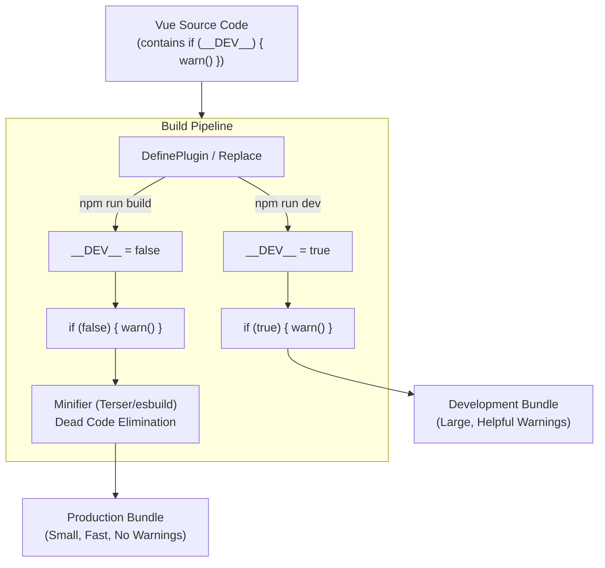

# Dev vs. Prod Builds (Окружения)

**Концепция и Архитектура (Mental Model)**

От фреймворка ожидаются две противоположные вещи:
1. Максимальная дружелюбность к разработчику (Developer Experience — DX): понятные ошибки, предупреждения (warnings), интеграция с Vue Devtools, проверка типов пропсов в рантайме.
2. Максимальная производительность и минимальный размер в продакшене (UX): нулевой оверхед на проверки, удаление всего отладочного кода.

Vue решает это через систему "умных сборок" (Builds), базирующуюся на флаге среды окружения. В исходном коде щедро разбросаны проверки вроде `if (__DEV__) { ... }`. На этапе компиляции приложения (через Vite или Webpack) плагины-заменители (Replacement plugins) хардкодят эти переменные в `true` или `false` в зависимости от `NODE_ENV`. Затем минификаторы (Terser, esbuild) видят конструкцию `if (false)` и полностью вырезают (Dead Code Elimination) весь блок из Production-бандла.

**Визуализация (Mermaid)**



**Ссылки на исходный код**

- `packages/shared/src/environment.ts` (или глобальные декларации в TypeScript: `declare var __DEV__: boolean`)
- `packages/runtime-core/src/warning.ts` (Система логирования)
- `packages/runtime-core/src/componentProps.ts` (Проверка типов пропсов в рантайме)
- `scripts/build.js` (Настройки Rollup, генерирующие `.global.js`, `.esm-browser.js`, `.prod.js` сборки)

**Разбор реализации (Code Deep Dive)**

В исходном коде фреймворка вы повсеместно встретите использование глобальных констант:

```typescript
// packages/runtime-core/src/vnode.ts (упрощено)
export function createVNode(type, props, children, patchFlag) {
  // ... базовая логика создания VNode ...

  // Код отладки, который будет вырезан в Production
  if (__DEV__) {
    // Валидация пропсов
    if (isVNode(type)) {
      warn(`Invalid vnode type when creating vnode...`)
    }
    // Интеграция с Vue Devtools (отслеживание создания компонента)
    vnode.__v_isVNode = true
    Object.preventExtensions(vnode) // Защита от мутаций VNode пользователем
  }
  
  return vnode
}
```

Как это работает на уровне TypeScript? В проекте объявлены глобальные переменные, чтобы TS не ругался на неопределенную переменную `__DEV__`.

```typescript
// global.d.ts
declare var __DEV__: boolean
declare var __TEST__: boolean
declare var __BROWSER__: boolean
```

При сборке через Rollup (для публикации npm-пакета) или Vite (в пользовательском приложении) используется плагин замены:

```javascript
// Конфигурация Vite/Rollup (концептуально)
import replace from '@rollup/plugin-replace'

export default {
  plugins: [
    replace({
      __DEV__: process.env.NODE_ENV !== 'production',
      preventAssignment: true
    })
  ]
}
```

Когда код проходит через минификатор для Production:

```javascript
// Было:
if (__DEV__) { warn("Error"); }
// Стало после replace:
if (false) { warn("Error"); }
// Стало после Terser/esbuild:
// (пустота)
```

**Оптимизации и Edge Cases (Подводные камни)**

1.  **Гарантия Dead Code Elimination:** Чтобы минификатор гарантированно мог вырезать блок, условие должно быть абсолютно статичным на этапе сборки (`false`). Нельзя писать `if (process.env.NODE_ENV !== 'production')` прямо в критическом рантайме, так как доступ к `process.env` в Node.js / браузере (если полифилится) медленный, и минификатор не всегда может безопасно развернуть это выражение, если оно не было заменено плагином.
2.  **Vue ESM-Browser сборка:** Vue поставляет специальную сборку `vue.esm-browser.js` (используется через `<script type="module">` в браузере без бандлера). В ней `process.env` недоступен. Поэтому Vue прекомпилирует этот файл так, чтобы `__DEV__` вычислялось динамически в браузере (обычно всегда включено, а для прода используется `vue.esm-browser.prod.js`).
3.  **Заморозка объектов (Object.preventExtensions/freeze):** В Dev-режиме Vue часто замораживает внутренние объекты (например, `VNode` или `props`), чтобы выбросить ошибку, если разработчик попытается их напрямую мутировать. В Prod-режиме эта заморозка отключена, так как `Object.freeze` имеет пенальти производительности и замедляет работу приложения.
