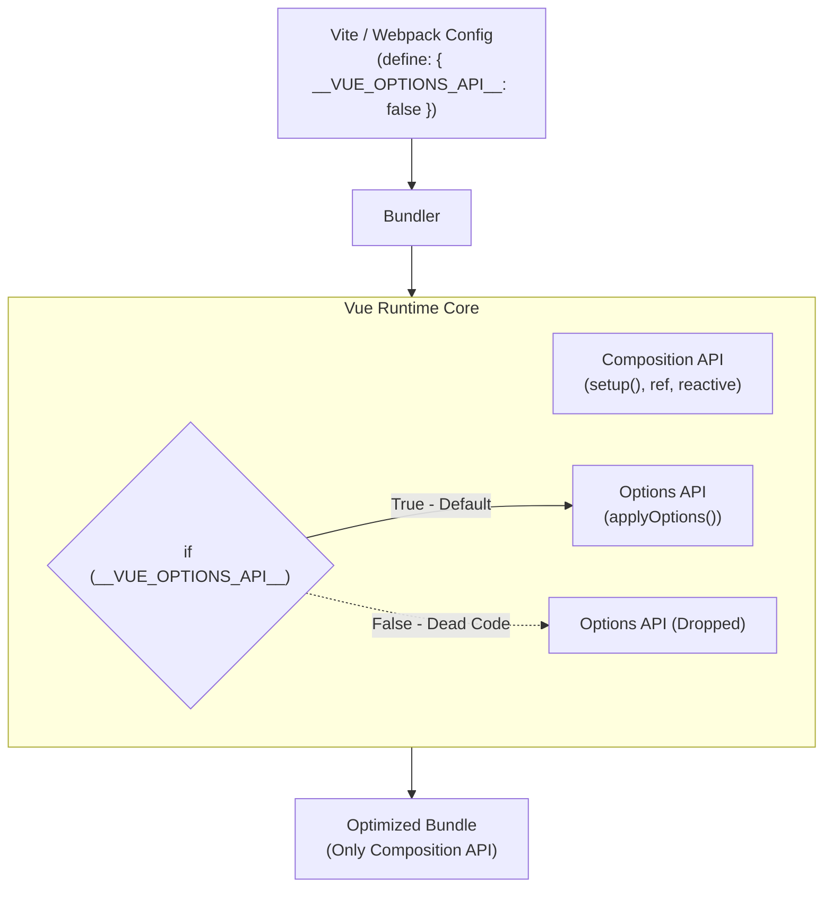

# Feature Flags Architecture

**Концепция и Архитектура (Mental Model)**

С переходом на Vue 3 появился новый способ написания компонентов — Composition API. Однако для обратной совместимости фреймворк обязан был сохранить поддержку старого Options API (`data`, `methods`, `computed`, `watch`, хуки). Код, обслуживающий Options API, весит несколько килобайт. 

Если вы пишете современное приложение исключительно на Composition API, зачем вам тащить в Production-бандл код парсинга Options API? Vue решает эту проблему через **Build-time Feature Flags (Флаги сборки)**. Это глобальные булевые константы, которые разработчик может переопределить в конфигурации своего бандлера (Vite/Webpack). Если вы явно отключаете фичу (например, `__VUE_OPTIONS_API__ = false`), весь связанный с ней код фреймворка становится "мертвым" (Dead Code) и безвозвратно удаляется из итогового бандла.

**Визуализация (Mermaid)**



**Ссылки на исходный код**

- `packages/vue/compat.ts` (Настройки совместимости)
- `packages/runtime-core/src/componentOptions.ts` (Метод `applyOptions`, где парсятся `data`, `methods` и т.д.)
- Глобальные декларации типов (`global.d.ts` для `__VUE_OPTIONS_API__`, `__VUE_PROD_DEVTOOLS__`, `__VUE_PROD_HYDRATION_MISMATCH_DETAILS__`)

**Разбор реализации (Code Deep Dive)**

В исходном коде `runtime-core` логика инициализации компонента разделена. В функции `setupStatefulComponent` сначала выполняется функция `setup` (Composition API), а затем применяется Options API:

```typescript
// packages/runtime-core/src/component.ts (упрощено)
export function setupStatefulComponent(instance: ComponentInternalInstance, isSSR: boolean) {
  const Component = instance.type
  const { setup } = Component

  // 1. Инициализация Composition API
  if (setup) {
    const setupResult = callWithErrorHandling(setup, instance, ...)
    handleSetupResult(instance, setupResult, isSSR)
  } else {
    finishComponentSetup(instance, isSSR)
  }
}

export function finishComponentSetup(instance: ComponentInternalInstance, isSSR: boolean) {
  const Component = instance.type
  
  // 2. Инициализация Options API оборачивается во Feature Flag
  if (__VUE_OPTIONS_API__ && !(__COMPAT__ && ...)) {
    applyOptions(instance) // Эта огромная функция парсит data, methods, watch и т.д.
  }
}
```

Если в конфигурации `vite.config.ts` вы задаете:
```typescript
import { defineConfig } from 'vite'
import vue from '@vitejs/plugin-vue'

export default defineConfig({
  plugins: [vue()],
  define: {
    __VUE_OPTIONS_API__: false, // Отключаем Options API
    __VUE_PROD_DEVTOOLS__: false // Отключаем Devtools в проде
  }
})
```

Бандлер (esbuild/Terser) превратит условие `if (__VUE_OPTIONS_API__)` в `if (false)` и полностью вырежет функцию `applyOptions` из бандла, сэкономив драгоценные килобайты.

**Оптимизации и Edge Cases (Подводные камни)**

1.  **Постепенная миграция (Graceful Degradation):** По умолчанию `__VUE_OPTIONS_API__` установлено в `true`. Это гарантирует, что миллионы существующих Vue-проектов не сломаются при обновлении. Оптимизация является опциональной (Opt-in) для продвинутых команд.
2.  **Зависимость библиотек от флагов:** Если вы отключаете Options API (`false`), вы должны быть уверены на 100%, что ни одна из используемых вами UI-библиотек (например, Vuetify или старые версии компонентов) не использует `data` или `methods` под капотом. Если библиотека скомпилирована в бандл, который полагается на Options API, а в вашем рантайме он отключен, компонент просто не отрендерится или упадет с ошибкой (инициализация стейта будет пропущена).
3.  **Гибкость Hydration Mismatch Details:** В Vue 3.4+ был добавлен флаг `__VUE_PROD_HYDRATION_MISMATCH_DETAILS__`. Ошибки гидратации (SSR mismatch) очень сложны в отладке. По умолчанию в продакшене Vue просто пишет `Hydration Mismatch`, экономя место на огромных строках с объяснениями. Если вам нужно отладить гидратацию на живом проде, вы можете включить этот флаг в конфиге, и Vue заинлайнит полные тексты ошибок в Prod-бандл.
