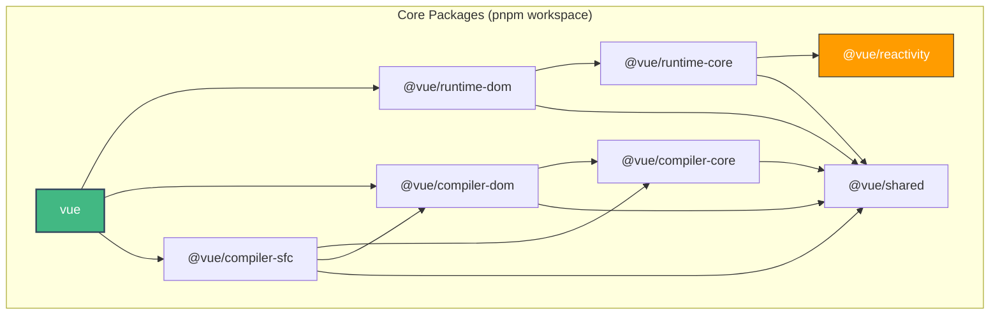

# PNPM Workspaces & Monorepo Graph

## Концепция и Архитектура (Mental Model)

Vue 3 изначально проектировался как модульная архитектура (monorepo). В отличие от Vue 2, который представлял собой монолит, ядро Vue 3 разбито на независимые пакеты. Это решает сразу несколько задач:
1. Ослабление связности: пакет `@vue/reactivity` можно использовать вообще без Vue (например, для реактивного состояния в Node.js или других фреймворках).
2. Гранулярный контроль размеров: разработчики могут импортировать только нужные части (Tree-Shaking).
3. Удобство тестирования и версионирования.

Для управления монорепозиторием Vue использует **PNPM Workspaces**. Выбор PNPM продиктован его алгоритмом жесткой изоляции зависимостей (в отличие от плоского `node_modules` в npm/Yarn), что гарантирует отсутствие "фантомных зависимостей", когда пакет случайно использует библиотеку, которую не объявлял в своем `package.json`.

## Визуализация (Mermaid)



## Ссылки на исходный код
- `pnpm-workspace.yaml` — определение рабочих пространств.
- `package.json` в корне — скрипты сборки и управления.
- `packages/*/package.json` — конфигурация отдельных пакетов с использованием `workspace:*`.

## Разбор реализации (Code Deep Dive)

Внутри `pnpm-workspace.yaml` мы видим:
```yaml
packages:
  - 'packages/*'
```

При этом внутренние зависимости между пакетами резолвятся через протокол `workspace:*`. Это гарантирует, что локальная сборка всегда использует актуальный код из соседних директорий, а не скачивает его из реестра.

Пример из `packages/runtime-dom/package.json`:
```json
{
  "name": "@vue/runtime-dom",
  "dependencies": {
    "@vue/runtime-core": "workspace:*",
    "@vue/shared": "workspace:*"
  }
}
```
При публикации (publish) PNPM автоматически заменяет `workspace:*` на актуальные версии пакетов. 

Для сборки используется кастомный скрипт `scripts/build.js`, который обходит графы зависимостей и вызывает сборку пакетов в правильном порядке (топологическая сортировка), либо используются встроенные фильтры PNPM: `pnpm run build --filter @vue/runtime-dom...` (знак `...` включает все зависимости пакета).

## Оптимизации и Edge Cases (Подводные камни)

- **Фантомные зависимости (Phantom Dependencies):** PNPM использует симлинки. Если `@vue/runtime-core` нужен `lodash`, он должен быть явно указан. Иначе Node.js его не найдет. Это жестко дисциплинирует поддержание корректных `package.json`.
- **Hoisting (Поднятие зависимостей):** В корне `package.json` есть `devDependencies` (Rollup, TypeScript, Vitest), которые нужны всем пакетам. Благодаря PNPM, они устанавливаются один раз в корень, а дочерние пакеты имеют к ним доступ (через настройку `.npmrc` или механизмы локального резолва), что радикально экономит место и время `pnpm install`.
