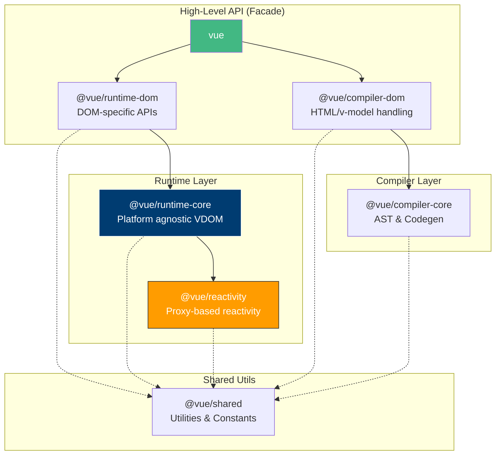

# Package Boundaries & Architecture Layers

## Концепция и Архитектура (Mental Model)

Архитектура ядра Vue.js строится на принципе строгого разделения зон ответственности (Separation of Concerns). Ядро — это не монолитный блок, а набор слоев (layers), каждый из которых абстрагирован от платформы (браузер, сервер, native-среда).

Ключевой архитектурный паттерн — **инверсия зависимостей** на уровне среды исполнения. Например, `runtime-core` не знает ничего о DOM-операциях (создание `div`, `addEventListener`). Он работает с абстрактным узлом (VNode) и принимает методы для мутации среды извне через внедрение зависимостей (Dependency Injection) на этапе создания рендерера (Custom Renderer API).

## Визуализация (Mermaid)



## Ссылки на исходный код
- `packages/vue/src/index.ts` — фасад (точка сборки).
- `packages/runtime-core/src/renderer.ts` — платформо-независимый движок VDOM.
- `packages/runtime-dom/src/index.ts` — имплементация DOM-методов и вызов `createRenderer`.

## Разбор реализации (Code Deep Dive)

В `packages/runtime-core` определен интерфейс рендерера. Он принимает объект `NodeOps`, который описывает, как работать с реальным окружением:

```typescript
// packages/runtime-core/src/renderer.ts
export interface RendererOptions<HostNode = RendererNode, HostElement = RendererElement> {
  insert(el: HostNode, parent: HostElement, anchor?: HostNode | null): void
  remove(el: HostNode): void
  createElement(type: string, isSVG?: boolean, isCustomizedBuiltIn?: string): HostElement
  // ... другие методы
}

export function createRenderer<HostNode, HostElement>(
  options: RendererOptions<HostNode, HostElement>
) {
  const render = (vnode, container) => { /* логика патчинга vdom */ }
  return { render, createApp: createAppAPI(render) }
}
```

Слой `runtime-dom` передает реальные DOM API в этот генератор:

```typescript
// packages/runtime-dom/src/nodeOps.ts
export const nodeOps: Omit<RendererOptions<Node, Element>, 'patchProp'> = {
  insert: (child, parent, anchor) => {
    parent.insertBefore(child, anchor || null)
  },
  remove: child => {
    const parent = child.parentNode
    if (parent) parent.removeChild(child)
  },
  createElement: (tag, isSVG, is, props) => {
    return isSVG 
      ? document.createElementNS(svgNS, tag)
      : document.createElement(tag, is ? { is } : undefined)
  }
}

// Создание конкретного DOM-рендерера
const renderer = createRenderer(nodeOps)
```

## Оптимизации и Edge Cases (Подводные камни)

- **Пакет `@vue/shared`:** Содержит хелперы вроде `isObject`, `hasOwn` и словари флагов (ShapeFlags). Он не собирается в отдельный npm-пакет (хотя существует физически), а инлайнится (bundling) во все остальные пакеты с помощью Rollup. Это избавляет от накладных расходов на импорты мелких функций при выполнении в браузере.
- **Предотвращение циклических зависимостей:** Разделение `runtime-core` и `reactivity` жестко контролируется. Реактивность не может вызывать функции VDOM. Для связи (например, вызова обновления компонента при мутации реактивного состояния) используется механизм `ReactiveEffect` (эффекты передаются из `runtime-core` в `reactivity` как коллбеки).
- **Custom Renderers:** Благодаря такому разделению созданы библиотеки типа `vue3-pixi` (Canvas/WebGL рендеринг), `nativescript-vue` (мобильная разработка) или `vue-termui` (рендеринг в терминале) — они просто предоставляют свои `nodeOps` в `createRenderer`.
