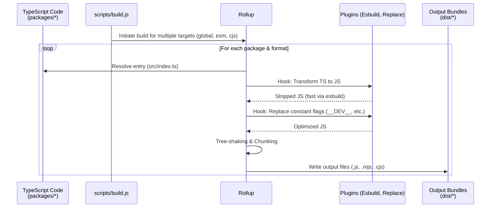

# Rollup Build Pipeline

## Концепция и Архитектура (Mental Model)

Так как Vue — это монорепозиторий, поставляющий код для множества различных сред (браузеры напрямую, сборщики вроде Webpack/Vite, Node.js для SSR), ему нужна мощная и гибкая система сборки.

Vue использует **Rollup** как основной бандлер ядра из-за его превосходной поддержки ECMAScript модулей (ESM) и эффективного алгоритма Tree-Shaking. Однако чистый TypeScript -> Rollup пайплайн может быть медленным. Поэтому для трансформации TypeScript используется **Esbuild** через плагин `rollup-plugin-esbuild`, что ускоряет сборку в десятки раз.

## Визуализация (Mermaid)



## Ссылки на исходный код
- `scripts/build.js` — точка входа для сборки всех пакетов (координатор).
- `rollup.config.js` — динамическая генерация конфигураций Rollup для конкретного пакета.

## Разбор реализации (Code Deep Dive)

В корневом `rollup.config.js` конфигурация не является статичным объектом. Это фабрика `createConfig`, которая генерирует массив конфигов на основе списка `formats`, переданных из CLI-аргументов.

```javascript
// Упрощенный rollup.config.js
import replace from '@rollup/plugin-replace'
import esbuild from 'rollup-plugin-esbuild'

export default packageFormats.map(format => createConfig(format, outputConfigs[format]))

function createConfig(format, output) {
  const isGlobalBuild = /global/.test(format)
  const isNodeBuild = format === 'cjs'
  const isBrowserBuild = /esm-browser/.test(format)

  return {
    input: `packages/${pkg}/src/index.ts`,
    output,
    plugins: [
      esbuild({
        target: 'es2019',
        minify: false // Минификация происходит отдельно, если нужно
      }),
      replace({
        preventAssignment: true,
        // Замена "магических" констант во время сборки
        __DEV__: isBrowserBuild ? `false` : `process.env.NODE_ENV !== 'production'`,
        __VUE_PROD_DEVTOOLS__: isBrowserBuild ? `false` : `__VUE_PROD_DEVTOOLS__`,
        __BROWSER__: isBrowserBuild
      })
    ]
  }
}
```

## Оптимизации и Edge Cases (Подводные камни)

- **Мертвый код (Dead Code Elimination):** Использование `@rollup/plugin-replace` — ключевой механизм. Переменные вроде `__DEV__` заменяются на `true` или `false`. Затем терсер или бандлер пользователя (Vite/Webpack) при визите `if (false) { ... }` полностью удаляет этот блок (Tree-Shaking). Таким образом, отладочные предупреждения (warnings) Vue никогда не попадают в production-бандл пользователя.
- **Rollup vs Vite для ядра:** Несмотря на то, что Эван Ю создал Vite, само ядро Vue собирается Rollup. Vite — это инструмент для сборки *приложений*, а Rollup — идеальный инструмент для сборки *библиотек*. 
- **Type Definitions (`.d.ts`):** Rollup с esbuild только удаляет типы. Для генерации деклараций (`.d.ts`) запускается отдельный процесс `api-extractor` (инструмент от Microsoft), который собирает все типы в один плоский файл (dts rollup), скрывая внутренние неэкспортируемые типы.
