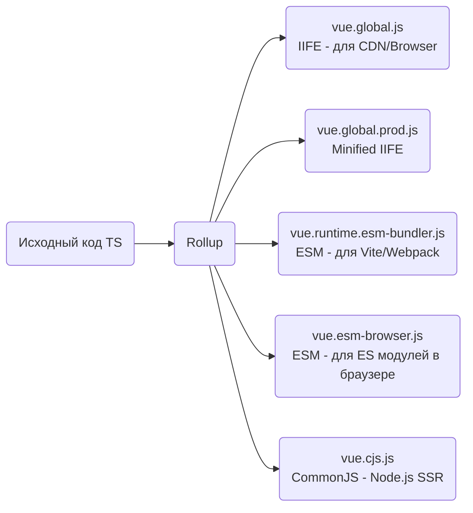

# Bundle Formats: ESM, CJS, IIFE

## Концепция и Архитектура (Mental Model)

Исторически экосистема JavaScript страдала от зоопарка форматов модулей: глобальные переменные (через `<script src>`), CommonJS (Node.js), AMD, UMD, и, наконец, нативный ES Modules (ESM).

Фреймворк уровня Vue не может диктовать пользователям, как им работать. Поэтому Vue генерирует **множество различных сборок (bundles)** из одного и того же исходного кода. Это обеспечивает совместимость с любой средой исполнения: от старой HTML-страницы без сборщика до современных SSR-приложений на базе Vite и Node.js.

## Визуализация (Mermaid)



## Ссылки на исходный код
- `packages/vue/package.json` — поля `main`, `module`, `exports`, определяющие резолв модулей.
- `packages/vue/dist/` — директория со сгенерированными файлами (после запуска build).

## Разбор реализации (Code Deep Dive)

В `package.json` пакета `vue` используется поле `exports` (современный способ Node.js для условного экспорта), чтобы направить сборщик или среду в нужный файл:

```json
{
  "name": "vue",
  "main": "index.js",
  "module": "dist/vue.runtime.esm-bundler.js",
  "exports": {
    ".": {
      "import": {
        "node": "./index.mjs",
        "default": "./dist/vue.runtime.esm-bundler.js"
      },
      "require": "./index.js"
    },
    "./server-renderer": {
      "import": "./server-renderer/index.mjs",
      "require": "./server-renderer/index.js"
    }
  }
}
```

Рассмотрим ключевые форматы:

1. **`esm-bundler` (для Webpack/Vite/Rollup):**
   Содержит сырые проверки `process.env.NODE_ENV !== 'production'`. Сборщик пользователя (Vite) сам заменит это выражение и удалит мертвый код при production сборке.
   
2. **`esm-browser` (для `<script type="module">`):**
   Браузер не понимает `process.env`. В этой сборке Rollup жестко заменяет `process.env.NODE_ENV` на `'development'` или `'production'` (есть два файла).

3. **`global` (IIFE):**
   Оборачивает код в самовызывающуюся функцию (Immediately Invoked Function Expression) и кладет результат в глобальную переменную `window.Vue`. Также имеет dev и prod (minified) версии.

4. **`cjs` (CommonJS):**
   Используется `require` и `module.exports`. Предназначен исключительно для Node.js среды (в основном для Vue SSR - Server-Side Rendering).

## Оптимизации и Edge Cases (Подводные камни)

- **Tree-Shaking Флаги:** Во Vue 3 ввели глобальные флаги конфигурации (Feature Flags) во время сборки для сборщиков (bundlers), например `__VUE_OPTIONS_API__` и `__VUE_PROD_DEVTOOLS__`. Если разработчик пишет только на Composition API, он может выключить поддержку Options API в конфиге Vite/Webpack. Сборка `esm-bundler` содержит `if (__VUE_OPTIONS_API__)`, и если флаг ложный, огромный кусок кода Options API удаляется из бандла, делая вес Vue меньше.
- **Dual Package Hazard:** Node.js позволяет загружать один и тот же пакет через `require` и `import`. Если это произойдет с Vue, в памяти появится два независимых экземпляра реактивности (символы, контексты), что сломает работу `inject`/`provide` и реактивность. Поле `exports` настроено так, чтобы Node.js корректно направлял запросы и избегал изоляции инстансов.
