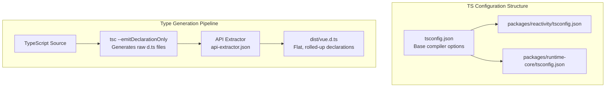

# TypeScript Internal Setup

## Концепция и Архитектура (Mental Model)

Vue 3 изначально написан на TypeScript (в отличие от Vue 2, где использовался Flow). Это решение не только улучшило DX (Developer Experience) для конечных пользователей за счет точных типов, но и упростило разработку самого фреймворка.

В архитектуре монорепозитория Vue TypeScript решает две задачи:
1. **Type Checking (Проверка типов):** Осуществляется через нативный `tsc` в режиме `--noEmit` (или через среды разработки).
2. **Type Declarations Generation (Генерация `.d.ts`):** Исходный код компилируется в бандлы через `esbuild`, который *удаляет* все типы, так как он не умеет их проверять и объединять. Поэтому для генерации чистых и плоских файлов `.d.ts` (поставляемых пользователю в npm) используется связка из `tsc --emitDeclarationOnly` и утилиты **API Extractor** от Microsoft.

## Визуализация (Mermaid)



## Ссылки на исходный код
- `tsconfig.json` (корень) — базовые настройки компилятора (`strict`, `target`, `moduleResolution`).
- `packages/*/tsconfig.json` — конфигурация пакетов с использованием Project References.
- `api-extractor.json` в корне или пакетах — конфиг для сворачивания типов.

## Разбор реализации (Code Deep Dive)

В базовом `tsconfig.json` задаются строгие правила. Vue использует `paths` для резолва внутренних пакетов в монорепозитории без предварительной сборки:

```json
{
  "compilerOptions": {
    "baseUrl": ".",
    "paths": {
      "@vue/compat/*": ["packages/vue-compat/src/*"],
      "@vue/*": ["packages/*/src"]
    },
    "strict": true
  }
}
```

Для того чтобы TypeScript-компилятор понимал, что он работает с изолированными пакетами, Vue использует **Project References** (`"references": [{ "path": "./packages/reactivity" }]`).

Интересно, как устроен **API Extractor**. В исходниках Vue много внутренних интерфейсов и функций, которые экспортируются из модулей, но не предназначены для публичного API (например, для использования в другом пакете монорепы). Чтобы спрятать их от пользователей, используется JSDoc-тег `@internal`. API Extractor парсит код, объединяет все экспорты в один файл и вырезает всё, что помечено как `@internal`.

## Оптимизации и Edge Cases (Подводные камни)

- **Avoid Classes для минификации:** В коде Vue вы редко встретите ES6 классы (`class VNode {}`). Вместо этого используются простые объекты или замыкания. Причина: TypeScript-классы (их методы и свойства) очень плохо переименовываются минификаторами (Terser). А вот ключи обычных объектов в связке с локальными переменными минифицируются отлично.
- **Generic-ад:** В `runtime-core` интерфейс `VNode` использует generics для того, чтобы оставаться независимым от платформы (браузер это или сервер).
  ```typescript
  export interface VNode<HostNode = any, HostElement = any, ExtraProps = { [key: string]: any }> {
    el: HostNode | null;
    // ...
  }
  ```
  Это позволяет `runtime-dom` подставить `Node` и `Element` вместо `any`, обеспечивая строгую типизацию DOM-операций без прямого импорта DOM API в слой ядра.
