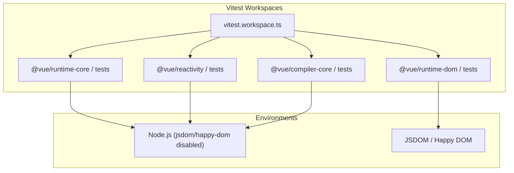

# Vitest Testing Setup

## Концепция и Архитектура (Mental Model)

Тестирование такого сложного механизма, как UI-фреймворк, требует колоссальной надежности и скорости. Долгое время ядро Vue 3 тестировалось с использованием **Jest**. Однако по мере роста экосистемы Vite и появления **Vitest** (который создали члены команды Vue/Vite), ядро было мигрировано на Vitest.

Преимущества Vitest для Vue:
1. **Нативная поддержка ESM:** Jest исторически имел проблемы с ESM, требуя сложных транспиляций Babel. Vitest из коробки понимает ESM и TypeScript.
2. **Скорость:** За счет использования esbuild (наследуемого от Vite) или Tinypool для многопоточности, тесты выполняются в разы быстрее.
3. **Единый pipeline:** Конфигурация тестов использует тот же конвейер резолва, что и сборка (Vite config).

## Визуализация (Mermaid)



## Ссылки на исходный код
- `vitest.config.ts` в корне проекта (базовые настройки).
- `vitest.workspace.ts` — конфигурация для монорепозитория.
- `packages/*/tests/` — директории с тестами (unit-тесты лежат рядом с исходниками, но в папке `__tests__` или `tests`).

## Разбор реализации (Code Deep Dive)

Настройка тестовой среды во Vue разбита по пакетам. Не всем пакетам нужен DOM. Например, реактивность (`@vue/reactivity`) и компилятор (`@vue/compiler-core`) — это чистый JavaScript/TypeScript. Выполнять их в тяжелом JSDOM (симуляторе браузера) бессмысленно и медленно.

Пример подхода (в конфигурации Vitest):

```typescript
// vitest.config.ts
import { defineConfig } from 'vitest/config'

export default defineConfig({
  test: {
    // Включаем изоляцию для чистых стейтов
    isolate: true,
    // Настраиваем алиасы, чтобы тесты резолвили TS-исходники из монорепы
    alias: {
      '@vue/shared': '/packages/shared/src/index.ts',
      // ...
    }
  }
})
```

Тестирование `runtime-dom` требует JSDOM. В Vitest это настраивается прямо в конфиге конкретного workspace или через прагмы в начале файла:
```typescript
// packages/runtime-dom/__tests__/patchAttrs.spec.ts
/**
 * @vitest-environment jsdom
 */
import { patchAttr } from '../src/modules/attrs'

describe('patchAttrs', () => {
  it('should set element attribute', () => {
    const el = document.createElement('div')
    patchAttr(el, 'id', null, 'test')
    expect(el.id).toBe('test')
  })
})
```

## Оптимизации и Edge Cases (Подводные камни)

- **Проверка Memory Leaks (Утечек памяти):** В системе реактивности Vue активно используются структуры `WeakMap` для хранения связей (Proxy -> Target). Для тестирования того, что сборщик мусора (GC) действительно очищает память при удалении компонента, используются специальные тесты, которые триггерят `global.gc()` (запуск Node.js с флагом `--expose-gc`) и проверяют объем памяти.
- **Mocking Таймеров:** Для тестирования планировщика Vue (Scheduler), который управляет очередями рендеринга (`nextTick`), Vitest предоставляет `vi.useFakeTimers()`. Это позволяет синхронно "перематывать" время и тестировать асинхронный процесс обновления DOM без реальных задержек (flaky tests).
- **Snapshot Testing в компиляторе:** Пакеты `compiler-core` и `compiler-dom` активно используют `expect().toMatchSnapshot()` для проверки сгенерированного AST (Абстрактного синтаксического дерева) и финального JS-кода. Это лучший способ поймать регрессию в генераторе кода.
