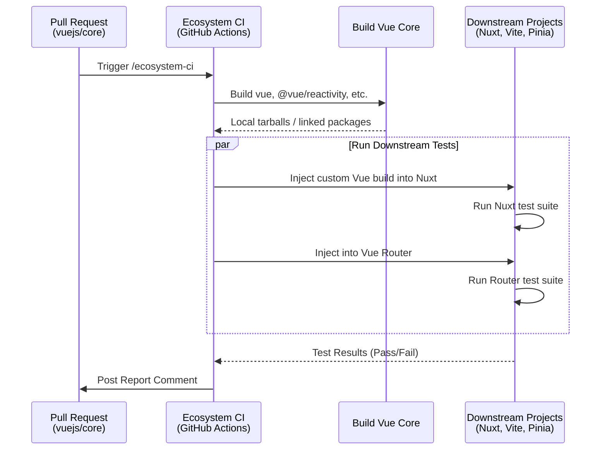

# Ecosystem CI

## Концепция и Архитектура (Mental Model)

Vue.js — это не просто библиотека, это фундамент огромной экосистемы. Инструменты вроде Vite, Nuxt, Vue Router, Pinia и VueUse зависят от внутренних механизмов Vue (особенно от системы реактивности и VDOM).

Если разработчики Vue случайно внесут "ломающее" (breaking) изменение или регрессию в ядро, это может сломать тысячи проектов по всему миру. Чтобы предотвратить это до релиза, команда внеднила **Vue Ecosystem CI**. 

Ecosystem CI — это отдельный конвейер непрерывной интеграции (CI), который берет *незарелиженный код* Vue (например, из PR или ветки `main`), собирает его и прогоняет через тестовые наборы (Test Suites) ключевых проектов экосистемы.

## Визуализация (Mermaid)

## Ссылки на исходный код
- `.github/workflows/ecosystem-ci.yml` (или аналогичный workflow).
- Репозиторий `vuejs/ecosystem-ci` — отдельный репозиторий, который оркестрирует эту логику.

## Разбор реализации (Code Deep Dive)

Технически это работает через подмену зависимостей в пакетных менеджерах. Когда запускается Ecosystem CI для, например, Nuxt, скрипт выполняет примерно следующие шаги (упрощенно):

1. **Сборка Vue:** В ветке с PR запускается `pnpm build`, создавая свежие версии пакетов.
2. **Клонирование Downstream:** Клонируется репозиторий `nuxt/nuxt` (ветка `main`).
3. **Overrides/Resolutions:** В `package.json` клонированного Nuxt модифицируются поля `pnpm.overrides` (или используются механизмы `npm link` / `yarn resolutions`), чтобы принудительно направить разрешения `@vue/runtime-core`, `vue` и др. на только что собранные локальные директории ядра.
4. **Запуск тестов:** Выполняется `pnpm install` и `pnpm test` внутри репозитория Nuxt.

## Оптимизации и Edge Cases (Подводные камни)

- **Ложные срабатывания (False Positives):** Иногда тесты в Nuxt или Vite падают не из-за изменений во Vue, а потому что их ветка `main` сломана в данный момент. CI-скрипты спроектированы так, чтобы сначала проверять базовый статус проекта (работают ли тесты со стабильным Vue), и только если они зеленые — прогонять с тестовым Vue.
- **On-Demand Запуск:** Этот процесс очень ресурсоемкий. Он не запускается на каждый push. Обычно core-контрибьютор пишет комментарий `/ecosystem-ci run` в PR на GitHub, что триггерит GitHub Actions webhook.
- **Обратная связь:** Если тест Pinia падает из-за рефакторинга в `@vue/reactivity`, разработчик ядра сразу видит, *какой именно* паттерн использования сломался, и может либо поправить ядро, либо предупредить автора Pinia об изменении недокументированного поведения.
