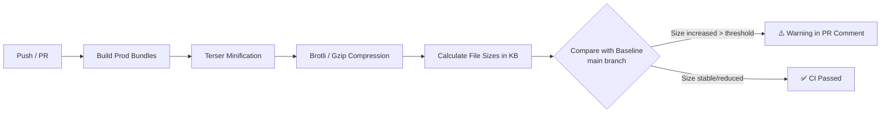

# Size Regression Checks

## Концепция и Архитектура (Mental Model)

Одной из главных точек гордости Vue 3 (по сравнению с Vue 2) является его размер. Благодаря строгой модульности и ориентации на Tree-Shaking, базовое приложение (Composition API + базовый рендеринг) весит около ~16kb (min + gzip/brotli).

Для контроля над размером бандла фреймворка в монорепозиторий встроен процесс **Size Regression Checks** (проверка на регрессию размера). Он предотвращает случайное раздувание кода (bundle bloat). Если разработчик добавит новую фичу, которая увеличит размер базового бандла на условные 2kb, CI немедленно подсветит это.

## Визуализация (Mermaid)



## Ссылки на исходный код
- `scripts/build.js` — секция вывода статистики (checkSize).
- `scripts/check-size.js` (или аналогичный скрипт в тулинге) — скрипт для расчета размеров.
- `.github/workflows/size-report.yml` — CI workflow.

## Разбор реализации (Code Deep Dive)

Во время сборки скрипт берет итоговые файлы (например, `packages/vue/dist/vue.global.prod.js`), пропускает их через алгоритм сжатия и вычисляет размер.

Упрощенный пример логики (как это делает Vue под капотом):

```javascript
import fs from 'node:fs'
import zlib from 'node:zlib'

export function checkSize(file) {
  const content = fs.readFileSync(file)
  // Размер минифицированного файла
  const minSize = (content.length / 1024).toFixed(2) + 'kb'
  // Размер после сжатия (Brotli используется как современный стандарт вместо Gzip)
  const compressed = zlib.brotliCompressSync(content)
  const brotliSize = (compressed.length / 1024).toFixed(2) + 'kb'
  
  console.log(`${file}: ${minSize} / brotli: ${brotliSize}`)
}
```

В CI эта статистика сравнивается с "эталонными" размерами из ветки `main`. Специальный бот (size-report) оставляет комментарий в Pull Request в виде таблицы, показывая изменения в байтах (Δ).

## Оптимизации и Edge Cases (Подводные камни)

- **Brotli vs Gzip:** Vue сместил фокус на метрику размера Brotli, так как большинство современных CDN и браузеров используют именно его. Brotli сжимает JavaScript эффективнее Gzip примерно на 15-20%.
- **Микрооптимизации кода (Micro-optimizations):** Из-за строгого лимита размера код Vue часто содержит конструкции, которые могут показаться "грязными" (dirty hacks).
  Например:
  - Использование побитовых операторов (Bitwise flags) для хранения состояния узлов (ShapeFlags) вместо объектов с булевыми свойствами. Это экономит десятки байт на каждом узле и быстрее парсится.
  - Сокращение имен внутренних констант.
  - Избегание ES-классов (`class`), так как методы классов нельзя безопасно переименовать (mangle) минификатором, в отличие от функций и ключей локальных объектов.
- **Tree-Shaking Baseline:** Проверяется не только глобальная сборка, но и минимальная рабочая сборка (базовый импорт `createApp`). Создается минимальный fixture-файл, прогоняется через Rollup + Terser, и оценивается реальный вес кода, который "уйдет" в production пользователя.
