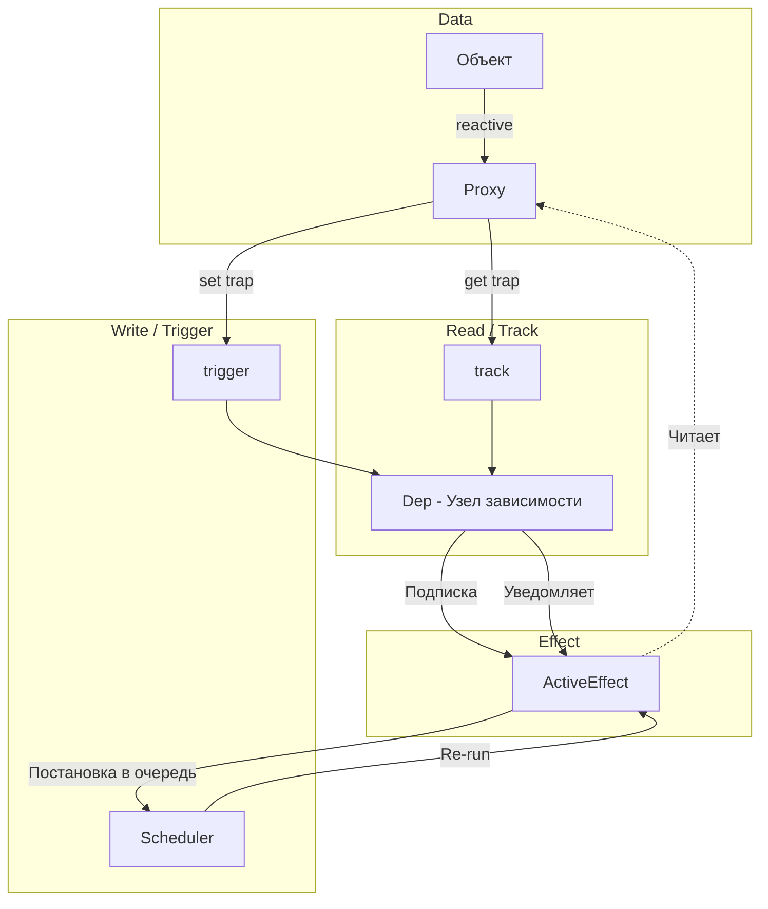

# Архитектура Реактивности (Reactivity Architecture)

## 1. Концепция и Архитектура (Mental Model)

Реактивность — это бьющееся сердце Vue. Это механизм, который позволяет декларативно связывать состояние приложения с побочными эффектами (рендеринг DOM, вычисляемые свойства, вотчеры). 

Во Vue 3 архитектура основана на паттерне **"Observer"**, реализованном через нативные JS `Proxy` (в отличие от `Object.defineProperty` во Vue 2). Главная задача ядра реактивности — узнать **кто** (какой эффект) читает данные, и **кого** (какие эффекты) нужно оповестить при изменении этих данных. 

Архитектура разделена на три столпа:
1. **Observable (Целевой объект):** Обернут в Proxy (`reactive`, `ref`).
2. **Dependency (Dep):** Сущность, представляющая свойство объекта. Хранит список подписчиков.
3. **ReactiveEffect (Эффект):** Обёртка над функцией (например, render-функцией компонента), которая подписывается на зависимости (Deps) во время выполнения.

## 2. Визуализация (Mermaid)



## 3. Ссылки на исходный код
- `packages/reactivity/src/reactive.ts` — Точка входа для создания реактивных объектов.
- `packages/reactivity/src/effect.ts` — Класс `ReactiveEffect` и функции трекинга/триггеринга.
- `packages/reactivity/src/dep.ts` — Структура `Dep` (зависимости).

## 4. Разбор реализации (Code Deep Dive)

На уровне ядра концепция сводится к глобальной переменной `activeSub` (ранее `activeEffect`), которая указывает на выполняющийся в данный момент эффект.

```typescript
// Упрощенная модель из packages/reactivity/src/effect.ts
export let activeSub: Subscriber | undefined

export class ReactiveEffect<T = any> implements Subscriber {
  // Связи с зависимостями (в 3.4+ это двусвязный список, см. след. разделы)
  deps?: Link = undefined
  
  constructor(public fn: () => T) {}

  run() {
    const prevSub = activeSub
    activeSub = this // Устанавливаем себя глобально
    try {
      return this.fn() // При выполнении триггерятся get-ловушки Proxy
    } finally {
      activeSub = prevSub // Восстанавливаем предыдущий
    }
  }
}

// При чтении (get)
export function track(target: object, type: TrackOpTypes, key: unknown) {
  if (activeSub) {
    let depsMap = targetMap.get(target)
    let dep = depsMap.get(key)
    // Связываем activeSub и dep (создаем Link)
    dep.track() 
  }
}

// При записи (set)
export function trigger(target: object, type: TriggerOpTypes, key: unknown) {
  const depsMap = targetMap.get(target)
  const dep = depsMap.get(key)
  if (dep) {
    dep.trigger() // Оповещаем все эффекты (вызываем effect.trigger())
  }
}
```

## 5. Оптимизации и Edge Cases (Подводные камни)

- **Динамический сбор зависимостей:** Зависимости собираются заново при **каждом** запуске эффекта. Это нужно для корректной работы условного рендеринга (`v-if`). Если ветка меняется, старые зависимости должны быть отброшены (Clean-up), иначе будут утечки памяти и ложные срабатывания (zombie effects).
- **Размер `targetMap`:** Это `WeakMap<any, KeyToDepMap>`. Использование `WeakMap` гарантирует, что как только реактивный объект удаляется, сборщик мусора (GC) автоматически очищает все связанные с ним `depsMap`, предотвращая утечки.
- **Batched Updates:** Сам модуль reactivity синхронен. Асинхронность и батчинг (объединение изменений) добавляет `scheduler`, который живёт в `runtime-core`. Эффекты реактивности просто говорят "я грязный" (dirty), а шедулер решает, *когда* именно перерисовать компонент.
