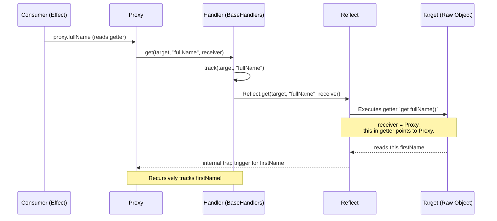

# Proxy и Reflect (Under the Hood)

## 1. Концепция и Архитектура (Mental Model)

До Vue 3 реактивность работала через перехват геттеров/сеттеров с помощью `Object.defineProperty()`. Это имело фатальные ограничения: невозможность отследить добавление новых свойств, удаление свойств (`delete`) или индексы массивов. 

Vue 3 перешёл на **ES6 Proxy**. `Proxy` позволяет перехватывать *вообще любые* операции с объектом на уровне виртуальной машины (движка JS). Однако сам по себе `Proxy` лишь перехватывает операцию. Чтобы корректно выполнить оригинальное действие и, самое главное, сохранить правильный контекст (`this`), в паре с ним всегда используется **`Reflect`**.

`Reflect` гарантирует, что геттеры внутри объекта, обращающиеся к другим свойствам этого же объекта через `this`, будут читать их через Proxy, а не через сырой объект, тем самым инициируя `track`.

## 2. Визуализация (Mermaid)



## 3. Ссылки на исходный код
- `packages/reactivity/src/reactive.ts` — Создание `Proxy`.
- `packages/reactivity/src/baseHandlers.ts` — Перехватчики (traps) для `Proxy`.

## 4. Разбор реализации (Code Deep Dive)

Ключевой момент — использование `receiver` в `Reflect.get`. `receiver` — это инстанс Proxy. Если у нас есть вычисляемое свойство `get foo() { return this.bar }`, использование `Reflect.get(target, key, receiver)` пробросит `Proxy` в качестве `this`. Если бы мы использовали просто `target[key]`, `this` указывал бы на сырой объект, и обращение к `this.bar` не затрекалось бы!

```typescript
// packages/reactivity/src/baseHandlers.ts

class MutableReactiveHandler implements ProxyHandler<object> {
  get(target: object, key: string | symbol, receiver: object) {
    // 1. Возвращаем флаги ядра без трекинга (полезно для isReactive)
    if (key === ReactiveFlags.IS_REACTIVE) {
      return true
    }

    // 2. Трекаем зависимость (запоминаем, кто читает свойство)
    track(target, TrackOpTypes.GET, key)

    // 3. Возвращаем значение через Reflect с пробросом receiver (Proxy)
    const res = Reflect.get(target, key, receiver)

    // 4. Ленивая реактивность: вложенные объекты становятся реактивными
    // ТОЛЬКО в момент обращения к ним. 
    if (isObject(res)) {
      return reactive(res) 
    }

    return res
  }

  set(target: object, key: string | symbol, value: unknown, receiver: object): boolean {
    const oldValue = (target as any)[key]
    
    // 1. Выполняем установку через Reflect
    const result = Reflect.set(target, key, value, receiver)

    // 2. Если значение реально изменилось - триггерим
    if (target === toRaw(receiver) && hasChanged(value, oldValue)) {
      trigger(target, TriggerOpTypes.SET, key, value, oldValue)
    }

    return result
  }
}
```

## 5. Оптимизации и Edge Cases (Подводные камни)

- **Ленивая инициализация вложенных Proxy:** В Vue 2 все вложенные объекты рекурсивно обходились при старте (O(n) времени). Во Vue 3 вложенные объекты оборачиваются в Proxy **только при доступе к ним** (через `get`). Это делает `reactive(hugeData)` практически бесплатным (O(1)).
- **Проблема `target === toRaw(receiver)`:** Проверка в сеттере нужна для обработки прототипного наследования. Если один реактивный объект прототипно наследует другой реактивный объект, сеттер сработает дважды. Эта проверка отсекает дублирование вызовов `trigger`, гарантируя, что мы триггерим только сам объект, а не его прототип.
- **Встроенные объекты (Map, Set):** Для них `Proxy` не может перехватывать операции вроде `Map.prototype.get` напрямую через `baseHandlers`. Требуются специальные обработчики `collectionHandlers`, которые подменяют методы (monkey-patching) и вручную вызывают `track` и `trigger`.
