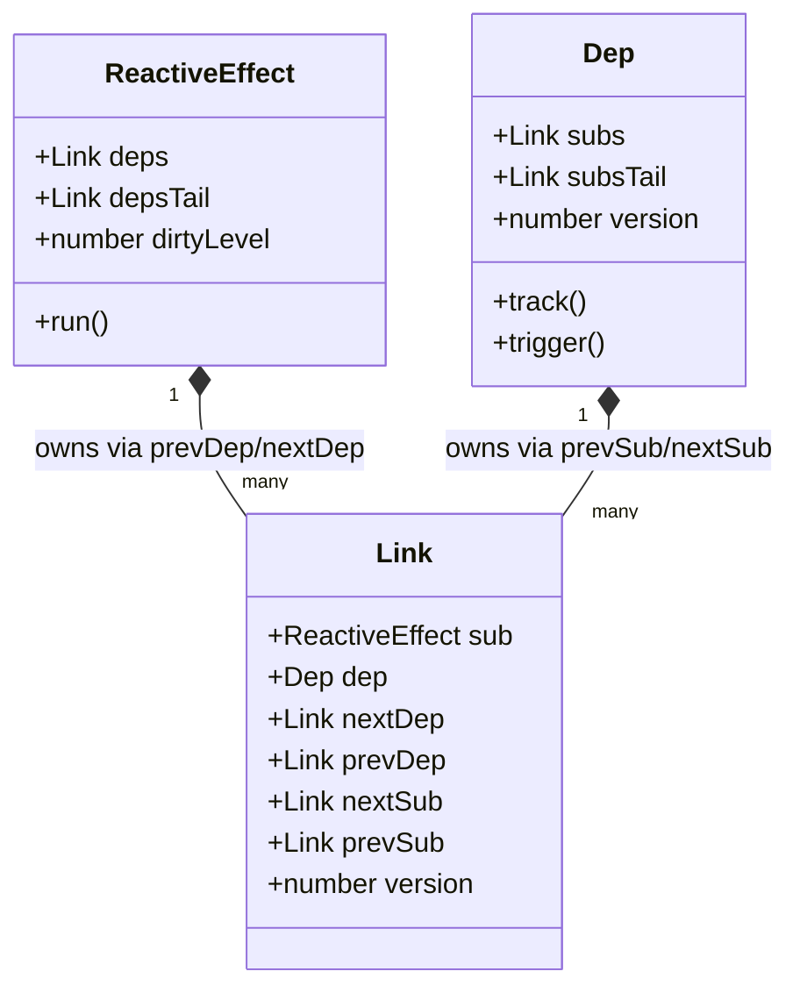

# Dependency Tracking (Vue 3.4+)

## 1. Концепция и Архитектура (Mental Model)

Исторически во Vue 3.0–3.3 отслеживание зависимостей работало на базе структур `Set`. У `Dep` (свойства) был `Set<ReactiveEffect>`, а у `ReactiveEffect` был массив с зависимостями `Dep[]`. Каждый раз, когда эффект перезапускался (например, при ререндере), нужно было удалить эффект из всех старых `Set`-ов (очистка, clean-up), а в процессе выполнения собрать новые. 

Эта архитектура создавала **много мусора (Garbage Collection overhead)**:
1. Постоянное создание и очистка `Set` массивов/итераторов.
2. Проблема памяти и падения производительности на огромных графах зависимостей.

**В Vue 3.4 был представлен колоссальный рефакторинг.** Evan You переписал трекинг на **двусвязные списки (Doubly Linked Lists)** и систему **версионирования / грязных уровней (Dirty Levels)**. Теперь зависимости не удаляются и не создаются с нуля каждый раз. Они сохраняют ссылки (`Link`) между собой, которые помечаются как неактивные, и переиспользуются, что сводит работу GC при обновлениях практически к нулю.

## 2. Визуализация (Mermaid)



*Диаграмма классов:* Каждое чтение реактивного свойства создает структуру `Link`, которая вшита одновременно в два двусвязных списка (горизонтально для `Dep`, вертикально для `ReactiveEffect`).

## 3. Ссылки на исходный код
- `packages/reactivity/src/dep.ts` — Структура списка и ссылки.
- `packages/reactivity/src/effect.ts` — Алгоритмы обхода и синхронизации (prepare/cleanup).

## 4. Разбор реализации (Code Deep Dive)

Вместо `Sets`, теперь у нас есть класс (в рантайме это просто объект-узла, чтобы JS-движкам было легко создавать Hidden Classes).

```typescript
// packages/reactivity/src/dep.ts

// Узел, соединяющий Эффект и Зависимость
export class Link {
  // Pointers для двусвязного списка внутри ReactiveEffect (все Dep, которые читает Эффект)
  prevDep?: Link
  nextDep?: Link

  // Pointers для двусвязного списка внутри Dep (все Эффекты, подписанные на этот Dep)
  prevSub?: Link
  nextSub?: Link

  constructor(
    public sub: Subscriber, // Эффект
    public dep: Dep         // Источник данных
  ) {}
}

export function track(dep: Dep) {
  if (activeSub) {
    let link = dep.activeLink
    if (link === undefined || link.sub !== activeSub) {
      // Создаем новую связь только если её не существовало!
      link = new Link(activeSub, dep)
      // Встраиваем link в списки... (O(1) операция добавления)
      activeSub.depsTail.nextDep = link
      // ...
    } else {
      // Переиспользуем старый линк (спасаем GC!)
      link.version = dep.version
    }
  }
}
```

## 5. Оптимизации и Edge Cases (Подводные камни)

- **Отказ от Set и массивов:** Операции с `Set` (например, `Set.prototype.clear()`, добавление/удаление) в V8 медленнее, чем простое перекидывание указателей (pointer manipulation) в объектах. Двусвязный список позволяет удалять и добавлять связи за **O(1)** без аллокации новой памяти.
- **Побитовые флаги (Bitwise operations):** До 3.4 Vue активно использовал побитовые операции (`trackOpBit`) для отслеживания рекурсивных эффектов. Новая модель с `dirtyLevels` (см. следующую заметку) оказалась более элегантной и масштабируемой.
- **Отложенная очистка (Lazy Cleanup):** Во время вызова `effect.run()`, старые ссылки помечаются как "ожидающие" (через свойство версии/флагов). Если в процессе рендеринга мы снова обратились к этому `Dep`, ссылка "оживает". Те ссылки, которые не ожили к концу рендеринга, аккуратно открепляются от списков (pruned), и движок сам собирает их как мусор.
