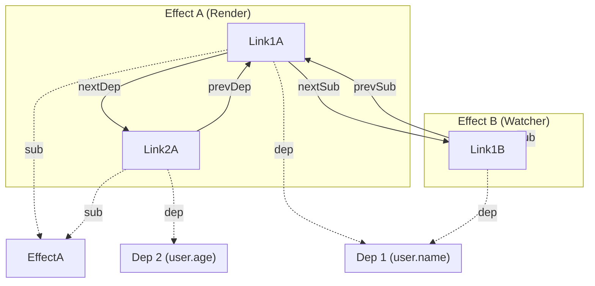

# Linked List Subscribers (Двусвязные списки)

## 1. Концепция и Архитектура (Mental Model)

Суть Vue 3.4 Reactivity — это ортогональные (пересекающиеся) двусвязные списки. 
У нас есть две сущности:
1. `Dep` — свойство (например, `user.name`). Оно хочет знать всех своих "подписчиков" (эффекты), чтобы пнуть их при изменении.
2. `Effect` — рендер-функция или вотчер. Она хочет знать все свои "зависимости" (`Dep`), чтобы отписаться от них перед следующим запуском (чтобы не реагировать на свойства из мёртвых веток `v-if`).

Узел соединения (`Link`) принадлежит сразу **обоим** спискам. Это "много ко многому", реализованное на чистых ссылках, без массивов.

## 2. Визуализация (Mermaid)



## 3. Ссылки на исходный код
- `packages/reactivity/src/dep.ts`

## 4. Разбор реализации (Code Deep Dive)

Вставка узла в двусвязный список — это базовая алгоритмика, но во Vue она оптимизирована для конкретного юзкейса: `track` всегда добавляет новые зависимости в **хвост** списка эффекта (так как код выполняется линейно).

```typescript
// packages/reactivity/src/effect.ts

function insertDep(sub: Subscriber, dep: Dep) {
  const link = new Link(sub, dep)
  
  // 1. Встраиваем в Effect (горизонтальный список)
  if (sub.depsTail) {
    link.prevDep = sub.depsTail
    sub.depsTail.nextDep = link
  } else {
    sub.deps = link // Head
  }
  sub.depsTail = link // Tail сдвигается на новый узел

  // 2. Встраиваем в Dep (вертикальный список подписчиков)
  if (dep.subsTail) {
    link.prevSub = dep.subsTail
    dep.subsTail.nextSub = link
  } else {
    dep.subs = link // Head
  }
  dep.subsTail = link // Tail сдвигается на новый узел
}
```

Чтобы отписаться от зависимости (unlink), нужно просто перебросить `next`/`prev` указатели у соседей узла.

## 5. Оптимизации и Edge Cases (Подводные камни)

- **Мгновенная сборка мусора (O(1) Unlink):** Когда компонент демонтируется (unmount), Vue просто пробегается по списку `deps` у его главного эффекта и делает "Unlink" из списков `subs` для каждого `Dep`. Узел `Link` теряет все ссылки на себя и моментально съедается GC.
- **Megamorphic ICs vs Monomorphic:** Исторически массивы могли деоптимизироваться в V8, если в них клали объекты разных шейпов. Класс `Link` жестко зафиксирован (имеет один Hidden Class). Создание тысяч инстансов `Link` движок оптимизирует феноменально быстро благодаря inline-аллокации.
- **Порядок обхода:** Эффекты обходятся от `head` до `tail`. Порядок гарантрует стабильность выполнения дочерних компонентов или множественных вотчеров, что важно для предсказуемости UI.
