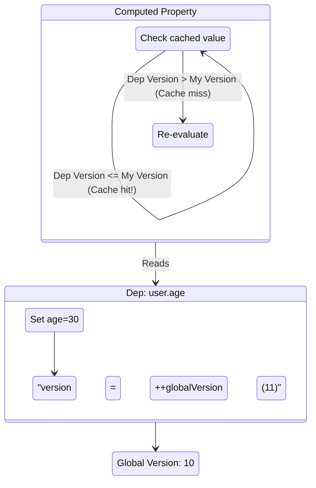

# Версионирование (Version Counting)

## 1. Концепция и Архитектура (Mental Model)

Даже имея идеальные двусвязные списки, выполнение `track` и `trigger` может быть дорогостоящим. Часто компоненты читают данные, которые **не изменились**. 

Во Vue 3.4+ введена парадигма **глобального версионирования (Global Versioning)**.
Есть глобальный счетчик: `globalVersion`. 
Каждый раз, когда реактивное свойство (любое) меняет свое значение, `globalVersion` увеличивается на 1, и конкретный `Dep` записывает эту новую версию себе.

**Зачем?** Это дает невероятно быструю "быструю проверку" (fast path). Эффекты (особенно Computed) могут мгновенно понять: "С момента моего последнего выполнения ни одна из моих зависимостей не обновилась? Отлично, я не буду выполнять ререндер или перерасчет!".

## 2. Визуализация (Mermaid)



## 3. Ссылки на исходный код
- `packages/reactivity/src/dep.ts` (`globalVersion`)
- `packages/reactivity/src/computed.ts`

## 4. Разбор реализации (Code Deep Dive)

В файле `dep.ts` определена глобальная переменная:

```typescript
// packages/reactivity/src/dep.ts
export let globalVersion = 0

export class Dep {
  version = 0 // Локальная версия свойства

  trigger() {
    // При изменении свойства - апаем глобальную версию и присваиваем себе
    this.version = ++globalVersion
    // Дальше идет оповещение (dirty levels)
  }
}
```

Внутри `ComputedRefImpl`:

```typescript
// packages/reactivity/src/computed.ts
class ComputedRefImpl {
  public _value: any
  public _version = 0 // Версия последнего успешного вычисления

  get value() {
    // Если мы знаем, что глобально что-то менялось...
    // мы опрашиваем наши зависимости, поменялась ли ИХ версия?
    if (this._isDirty || hasDependenciesChanged(this)) {
      this._value = this.effect.run()!
      // Запоминаем текущую версию после вычисления
      this._version = globalVersion 
      this._isDirty = false
    }
    return this._value
  }
}
```

## 5. Оптимизации и Edge Cases (Подводные камни)

- **Решение проблемы "Diamond Problem" для Computed:** Если `C` зависит от `A` и `B`. А `A` и `B` зависят от `Source`. При изменении `Source`, `A` и `B` триггерят `C`. В старых системах `C` мог вычислиться дважды. С помощью системы версий и Dirty Levels (см. далее), `C` посмотрит на версии `A` и `B` и поймет, что нужно перевычислиться лишь один раз.
- **Неявное переиспользование кэша:** Даже если эффект пометился как "возможно грязный" (MaybeDirty), если при обходе его зависимостей выяснится, что их версия не выросла (например, сеттер записал то же самое значение или изменения откатились), эффект "успокоится" (становится Clean) и не вызовет перерендер компонента. Это колоссальная экономия CPU в сложных формах.
