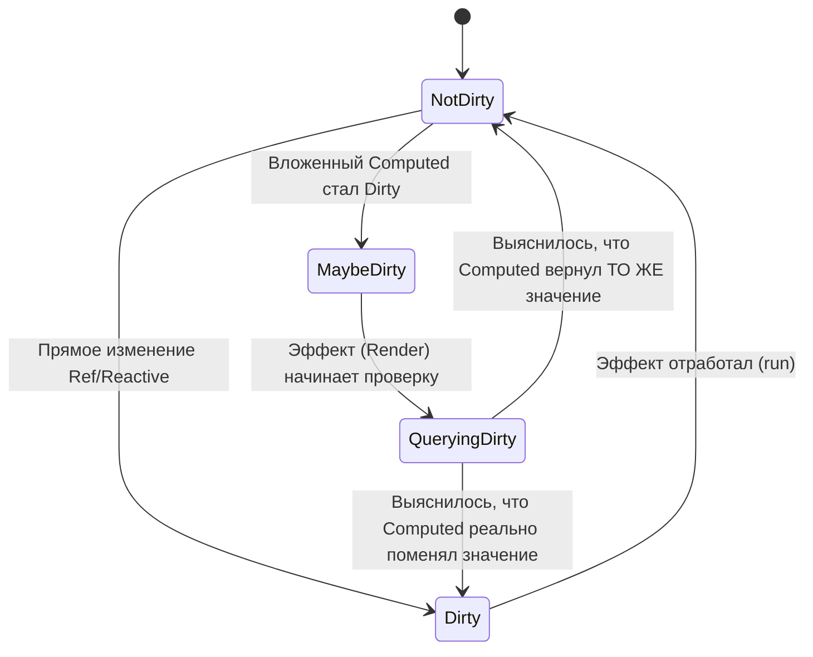

# Dirty Levels (Стейт-машина состояний)

## 1. Концепция и Архитектура (Mental Model)

До Vue 3.4 эффекты и computed-свойства опирались на простые boolean-флаги (например, `_dirty: boolean`), чтобы понимать, нужно ли их перевычислять. Однако для глубоких графов зависимостей (особенно каскадов Computed) бинарного состояния не хватает.

Встречайте **Dirty Levels** — конечный автомат (стейт-машину), который имеет 4 состояния:
1. **NotDirty (0):** Значение чистое, кэш валиден.
2. **QueryingDirty (1):** Эффект прямо сейчас проверяет свои зависимости.
3. **MaybeDirty (2):** Одна из зависимостей (скорее всего Computed) сообщила: "Я возможно поменяюсь, повиси пока".
4. **Dirty (3):** Зависимость точно изменилась, 100% нужен пересчет.

Эта система тесно работает в связке с "Версионированием", позволяя элегантно отменять излишние вычисления.

## 2. Визуализация (Mermaid)



## 3. Ссылки на исходный код
- `packages/reactivity/src/constants.ts` (`DirtyLevels` enum)
- `packages/reactivity/src/effect.ts`

## 4. Разбор реализации (Code Deep Dive)

В коде это реализовано как Enum, что позволяет использовать быстрые математические сравнения (например, `if (dirtyLevel >= DirtyLevels.MaybeDirty)`).

```typescript
// packages/reactivity/src/constants.ts
export enum DirtyLevels {
  NotDirty = 0,
  QueryingDirty = 1,
  MaybeDirty = 2,
  Dirty = 3
}

// packages/reactivity/src/effect.ts
export class ReactiveEffect {
  dirtyLevel: DirtyLevels = DirtyLevels.Dirty // Изначально грязный (нужен первый ран)

  trigger() {
    if (this.dirtyLevel < DirtyLevels.Dirty) {
      this.dirtyLevel = DirtyLevels.Dirty
      // Только сейчас добавляем в очередь планировщика (scheduler)
      this.scheduler()
    }
  }
}
```

Что происходит при `MaybeDirty`? 
Когда триггерится Computed, он не говорит своим подписчикам "Я грязный". Он говорит "Я *возможно* грязный" (триггерит их с уровнем `MaybeDirty`). Когда планировщик доберется до рендер-эффекта, тот посмотрит на этот уровень и скажет Computed: "А ну-ка, проверь себя!". Computed проверит, и если значение не изменилось, рендер-эффект сбросит свой уровень до `NotDirty` и рендер компонента будет **пропущен**.

## 5. Оптимизации и Edge Cases (Подводные камни)

- **Решение проблемы ложных рендеров:** Vue 3.4 значительно сократил количество холостых вызовов `render` благодаря `MaybeDirty`. В старых версиях изменение любой зависимости внутри `computed`, даже если сам `computed` в итоге возвращал тот же результат, неминуемо вело к срабатыванию эффектов, подписанных на этот `computed`.
- **Быстрые выходы (Bailout):** Использование чисел вместо объектов состояний позволяет движку JIT компилировать проверки стейт-машины в простейшие процессорные инструкции сравнения.
